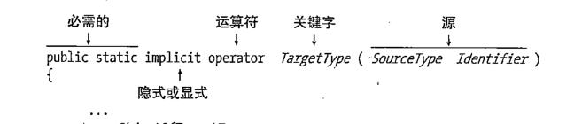

## 转换
+ 各种转换的形式
    + 隐士转换 意思默认支持 short 转long
    + 显示转换  long转short 当然有损失
+ 提供了两种溢出检查函数
    + checked( (short)abc)   溢出报错
    + unchecked( (short)abc)   忽略
    + 我的vscode并没有警报
+ 显示转换的合法性
    + 如果父类是null类型,那么在化成子类时候不会报错

---
## 装箱和拆箱
+ 这里我们不去分析他的内部内存分配
+ 装箱是值类型转换成引用类型通常使用Object承担
    + 为什么引入装箱概念
    + 因为装箱是用Object承接,所以相当于隐士装换!
    + 因为我们有值直接转换成引用类型的需求
    + 比如参数传递时,函数的多次调用我们需要保存值的状态,不断计算,而不是像值
    + 装箱其实减免了一个动作,C++中如果我们需要绑定一个值到引用对象上去,我们通常会利用值来new一个新的对象,非常麻烦
```C#
int io=100;
Object ma=io;  //简单省事
```
+ 拆箱是显示转换 你需要用显示转换的强制转换方式
```C#
io =(int)ma;//强制转换的方式.
```

## 自定义隐士转换 和显示转换
+ 首先这里不接受 父类和子类的显示隐士转换,接口等转换(某明奇妙)
+ 所以转换基本上在于不同类型之间的转换
+ 最多一次转三个 ,Person -  int- float - double
+ 标准写法
   +  implicit 隐士转换  explicit 显示转换 使用后者当然你要使用强制转换符号
   +  TargetType 你要转换的类型 所以你得return这个type
   +  SourceType 要被exchange type

```C#
 public static implicit operator int(Person i)    //为什么使用static 因为你要独立于类出来啊,没听说过你要类型转换的时候,
 // 先new一个对象出来,然后再用(type) comple exchange
        {
            return i.Age;
        }

public static explicit operator Person(int i)
        {
            return new Person("Nemo", i);
        }
```
+ 最后 is 和as 用法
    + is: 转换失败的话 Exception    | Sytle: variable is type (such as :int)
    + as: exchange fail will turn get null  | Sytle: variable as type (such as :int)