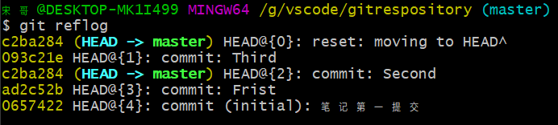

## 英语才是未来
* 1. [添加文件到 git本地仓库](#git)
* 2. [提交git文件到本地仓库](#git-1)
* 3. [查看git仓库状态](#git-1)
* 4. [查看文件更改的内容](#)
* 5. [查看git仓库提交的日志](#git-1)
* 6. [回退到文件是一个提交版本](#-1)
* 7. [查看文件内容](#-1)
* 8. [查看我们输入git 命令的日志(回退到想要的文件版本)](#git-1)
* 9. [本地库连接远程库](#-1)
* 10. [想要删除远程库](#-1)
* 11. [根据名字删除，比如删除origin](#origin)
* 12. [gitee 设置代理和取消代理](#gitee)


###  1. <a name='git'></a>添加文件到 git本地仓库
> git add 文件名

###  2. <a name='git-1'></a>提交git文件到本地仓库 
> git commit -m"填写你想要提交的提交后的备注"

###  3. <a name='git-1'></a>查看git仓库状态
+ 如果更改文件后,还没有添加add 和提交commit,我们调用时 文件会显示红色
> git status 

###  4. <a name=''></a>查看文件更改的内容
> git diff 文件名

###  5. <a name='git-1'></a>查看git仓库提交的日志
> git log 文件名  //不加文件名 查看整个仓库日志

###  6. <a name='-1'></a>回退到文件是一个提交版本
> git reset --hard HEAD^

###  7. <a name='-1'></a>查看文件内容
> cat 文件名

###  8. <a name='git-1'></a>查看我们输入git 命令的日志(回退到想要的文件版本)
> git reflog 
+ 第一个就是 对于的ID ,前面我们提到过,回退到上一个版本,这个是用于反悔的.


###  9. <a name='-1'></a>本地库连接远程库
1. 把你的公钥给网站 
2. GitHub创建一个仓库,下面有一个连接本地仓库的提示

###  10. <a name='-1'></a>想要删除远程库
+ 看一下远程库的信息
> git remote -v

###  11. <a name='origin'></a>根据名字删除，比如删除origin
> git remote rm origin

###  12. <a name='gitee'></a>gitee 设置代理和取消代理
```C++
// 设置代理
git config --global https.proxy http://127.0.0.1:1080

git config --global https.proxy https://127.0.0.1:1080
//
git config --global --unset http.proxy

git config --global --unset https.proxy


npm config delete proxy

```