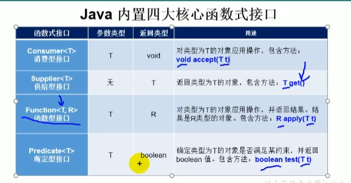

# 特性
+ 只有一个抽象方法的接口叫做函数式接口
+ lambda 的本质是作为函数式接口的实例.所有lambda传回来的依旧是一个对象
+ lambda就是作为函数式接口的一个实例
+ lambda 只针对接口
+ 匿名类针对的是接口和类的快速重现
+ 接口中只有一个需要重现的方法
## Lambda 基本语法
+ 格式:
+ ->: lambda 操作符
+ 左边: 参数列表
+ 右边: Lambda函数体

## lambda 表达式是创建的规则
+ 根据接口的需要实现的函数来创建lambda 表达式
+ Runnable 存在一个run函数 ,原来我们是创建一个匿名类来返回,其实我们只需要实现run就行了,lambda就是通过实现run 返回一个接口的实例
+ 如果 接口的函数中有参数, 你lambda 也必须在括号中写参数
+ 如果 接口的函数有返回值,lambda也必须有返回值
+ 根据以上规则我们发现,lambda只能实现的接口是只有一个需要写的函数,如果接口函数太多,我们就无法确定lambda表达式的格式了
+ 总结:lambda表达式就是根据接口的函数来书写的.
```java
Runnable r1 = new Runnable() {
            @Override
            public void run() {
                System.out.println("你依然爱着我");
            }
        };
        
Runnable r2 = () -> {
            System.out.println("我爱北京故宫");
        };

```


##  编写细节
+ 可以完成类型推断
```java
Consumer<String> con1 = (String s) -> {
            System.out.println(s);

        };

Consumer<String> con1 = (s) -> {
            System.out.println(s);
        };  //String 的类型可以省略自动推断
```
+ 只有一个参数的时候括号可以省略
```java
Consumer<String> con1 = s -> {
            System.out.println(s);
        };

```

+ 只有一条语句的时候大括号也可以省略
```java
Consumer<String > con1 =s-> System.out.pringln(s);
```


## 要用Lambda 我们就需要了解java.until.Function中提供的丰富的函数式接口
+ 消费型接口 Consumer<T> void accept(T t])
+ 供给型接口 Supplier<T> T get()
+ 函数型接口 Function<T,R> R apply(T t)
+ 断定型接口 Predicate<T>  boolean test(T t)
