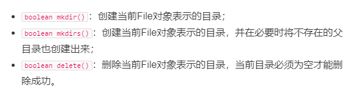

# 都是字节流 操作Stream的都是字节操作

## 文件对象File
+ .表示当前目录 ..表示上一级
+ 我们构造一个File对象时,即使文件不存在也不会报错,因为此时没有对磁盘操作,某些方法才会操作文件
+ File f =new File("路径");
+ 返回路径 getpath();
+ 一个File静态变量 separator打印当前系统的分割父
+ isFile() 判断当前对象是否已经是一存在的文件
+ isDirectory() 是否是以存在的目录
+ 是否可读  canRead()
+ 是否可写  canWrite()
+ 是否可执行 canExecute
+ 字节文件的大小  length
+ 创建一个文件 createNewFile()
+ 删除文件 delete()
+ 创建临时文件 createTempFile()
+ deleteOnExit()  JVM 退出时自动删除该文件
+ 列出目录下的文件 list listFiles 
+ File: 如果表示的是一个目录


---

+ path 对象  
+ toFile 转换为File对象


## InputStream 是一个抽象类是所有流的超类 
+ IOExecption 
+ InputStream 是所有输入流的超类
+ FileInputStream 是文件读取流
+ int read()一个重要的方法,如果文件读完他会自动返回-1
+ 创建了一个流了以后,我们要使用close关闭流
+ 所以我们使用try -finally来确保流的释放但是写法过于繁杂
+ 所以使用try(resource)的新语法,那些可以用这个语法,实现了java.lang.AutoCloseable接口的就行
+ 语法规则:
```java
public void readFile() throws IoException{
try (InputStream input =new FileInputSytream("....."))
{
...
while(n=input.read)
...
}

}//编译器在此自动为我们写入finally并调用close()
}


}
```


---

## 缓冲
+ int read(byte []b) ;b就是我们可以定义的缓存大小
+ 使用 byte[] buffer =new byte[1000]; //1000字节缓存大小
+ n =input.read(buffer)
+ read是阻塞,不会一次读完除非缓存大


## 模拟内存 ByteArrayInputStream 
+ 主要用于测试
+ byte [] data={72,101,108,108,111,33 };
+ InputStream input = new ByteArrayInputStream(data))  
+ 这样我们省去了对文件的操作


---

## OutputStream
+ FileOutputStream 子类
+ 同样我们需要try()新方法来保证写入不崩溃
+  关闭 close 
+  刷新缓存 flush ,这个还是很重要的,缓存慢了调用flush close调用
+  write 写入信息
+  OutputStream output = new FileOutputStream("C:\\Users\\13707\\Desktop\\test.txt"))
+  output.write("找工作!!!!!".getBytes(StandardCharsets.UTF_8));
+  注意UTF_8的特点.

---

+ ByteArrayOutputStream 测试类
+ 先write
+ byte[] data;
+ 然后 data = byteArrayOutputStream.toByteArray(); 


---

## Filter 嵌套功能模式
+ 缓冲区 功能BufferedFileInputStream
+ 计算机签名功能 DigestFileInputStream
+ 添加加密/解密功能  CipherFileInputStream
+ 我们发现，给FileInputStream添加3种功能，至少需要3个子类//我们需要继承他们,而且这三个类有更多的子类,子类爆炸
+ Filter模式 我们只要为基础InputStream 添加功能
+ 首先你得有个数据源
+ InputStream file = new FileInputStream("test.gz");  
+ 我们希望FileInputStream能提供缓冲的功能来提高读取的效率
+ InputStream buffered = new BufferedInputStream(file); 
+ file来自上面,可以看出这个在不断嵌套,但是我们最终只需要用一个InputStream来指向这个不断添加功能的流


# 字符串的相关操作
## 读Reader
+ Reader: 
+ 所有的流我们都要使用try() :这是一个习惯问题
+ Reader是所有字符串输入流的超类
+ Reader 其实是基于InputStream 改造而来的,InputStream操作字节,Reader操作Char ,所以Reader他相当于一个编码转换器,内部持有一个InputStream.
+ 我们只要指定格式就可以完成类型转化
+ InputStream input =new FileInputStream("src/readme.txt");
+ Reader reader =new InputStreamReader(input,"UTF-8); //指定格式用input当做参数舒适化,以此可以看出Reader的确内部持有一个InputStream

---

+ FileReader:
+ FileReader 子类 如果在它创建时需要读取一个文件,中文可能乱码,需要指定格式打开
+ Reader reader=new  FileReader("src/readme.txt",StanderCharSets.UTF_8);
+ 读取int read() 读完返回-1
+ public int read(char[] c) throws IOException  提供了一次性读取若干字符并填充到char[]数组的方法：所以我们可以利用它来实现缓冲区
---
+ CharArrayReader :
+  模拟一个Reader 把Char[] 变成一个Reader 
+  Reader reader =new CharArrayReader("Hello".toCharArray);

---

+ StringReader
+ 可以直接把String当做数据源
+ Reader reader=new StringReader("Hello")

---
## Writer
+ Writer
+ Writer就是带编码转换器的OutputStream
+ void write( int c | char []c | String c) 写入三种类型
+ 通上面一样,可以利用FileOutputStream 来创建OutputStreamWriter ,原理上面解释过了
+ Writer wirter =new OutputStreamWriter((new FileOutputStream("redam.txt"),"UTF-8"));
---

+ FileWriter
+ 对于字节操作一定带上编码格式,因为他们就是编码转换器流,你肯定得定义好格式,不然他咋转换
+ Writer writer =new FileWriter("readme.txt",StandardCharsets.UTF-8);   //

---
+ CharArrayWriter
+ Char [] data =writer.toCharArray(); //书写一个数据

---
+ StringWriter

## PrintStream
+ print(int | boolean | String |Object)  提供了很多版本print
+ println() 自己加上换行符
+ System.err 标准错误输出
+ System.out 是系统默认提供的PrintStream

---
+ PrintWriter 扩展了Writer接口 他的print/println最终输出char数据
+ 所以你可以自定义自己的System.out
+ PrintWriter pw =new PrintWriter(buffer);


___

## Files对象
### 读取
+  只能读取小文件,大文件依然需要使用流方法
+  他提供了一些静态方法,所以可以不用创建对象读取文件,这一点非常方便
+  配合Paths提供的静态方法Paths.get("C:\Users\13707\Desktop\test.txt")
+  读取为String 默认编码UTF-8 :Files.readString(Paths.get("C:\Users\13707\Desktop\test.txt"))
+  指定编码格式 :Files.readString(Paths.get("C:\Users\13707\Desktop\test.txt"),StandardCharsets.ISO_8859_1)
+  按行读取文件 :List<String> lines =Files.readAllLines)Paths.get("C:\Users\13707\Desktop\test.txt")

---
### 写入
+ byte[] data =.....
+ 写入文件 :Files.write(Paths.get("C:\Users\13707\Desktop\test.txt"),data)
+ 直接写入文件按照指定编码 :Files.writeString(Paths.get("C:\Users\13707\Desktop\test.txt"),"文本类容",StandardCharsets.ISO_8859_1);