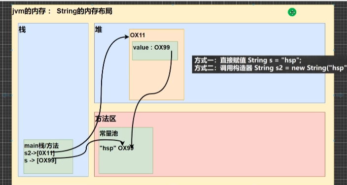

# 基础讲解
+ 数组你是存在堆里面的,因为数组一般意味着你可以分配大小,所以这个是在堆里面的操作
+ String 他是存在常量池中的,他是final的,所以他需要经常在常量池创建对象,所以他只适合用于常量的情况.
+ StringBuffer 他的内部是  Char [] value 是数组,所以他是可变的,同样他存储在堆中

## 常量池
+ String s ="hsp";
+ String s2= new String("hsp");
+ if(s= =s2) // = =是比较他们的地址 所以他为flase 看图片中虽然他们都指向相同常量池,但s2首先指向对地址,所以s(指向常量池)和s2地址不同
+ s.equal(s2);
+ if(a ==b.intern()) true intern返回的是常量池的值

+ 引出这个概念的目的在于,我们创建了很多变量或者常量,他们的内容一样,所以我们在常量池中只要存储一个就行了,这样大大节约了空间,因为是同一个变量,比较他们相等也变的容易很多
+ 例如: 上面代码中 s 创建 首先在常量池中看有没有"hsp"这个内容的,没有的话就创建一个 ,s2因为是在堆上面创建,所以现在堆上创建一个,看到常量池中已经有一个"hsp"直接指向他就行了.
  

## String 特性
### 内部运作过程
+ String 类是final的所以他是不可变的
+ String A ="123"
+ A ="234"; //这个可以执行
+ 在常量池中 "123"的对象并没有被删除后再创建一个"234" ,他是创建一个"234" 然后让A指针指向"234" final的定理就没有被打破,但是不是说String 是final吗,那么这种跟换指针指向应该也不可以吗, 这个应该是针对 显示写出来的final String A ="1234" 这种

---
+ String 的常量和变量的相加内部运行完全不同
+  String str ="123" +"256" 
+  这种编译器不是傻子,编译器直接在常量池中创建一个"123455" str 指向他,而不是先创建两个常量
+  String str1 ="123"
+  String str2 ="256"
+  String str =str1+ str2;  
+  这个和上面完全不同, str的创建是在内部调用StringBuider,通过append(str1)这种方式用于字符串相加,调用append的函数,他是类的方法,所以会在堆上面创建对象,所以最后str 先指向堆然后,堆指向变量池 变量的相加和常量的相加的运行完全不同

### 特性二
+ String 我们一般用作常量,如果用作变量,他需要不停的开辟空间,效率低下,他存放在常量池,所以这个就是为什么String他是final的,
+ 他在常量中处理字符非常的方便
+ equalsIgnoreCase 忽略大小是否相等
+ indexOf 返回字符串字符第一次出现的索引
+ lastIndexOf 最后一次出现的索引
+ subString 截取范围中的字符串
+ trim 去除前后空格
+ charAt 获取某个索引的字符,注意他不能使用Str[index] 因为,这个String 他默认不是数组类型,他一般处理常量;

--- 
+ str.toUpperCase()  全部大写
+ str.concat("宋哥").concat("威武) 拼接字符串
+ s1=s1.replace("宋哥","小宋" ) 将所有的宋哥替换成小宋  返回的结果才是替换过的
+ String[] split =poem.split("书写以分割的依据") 如果是"宋,小,哥" 我们在split中书写(',') 它就会以逗号为依据分割,这个字符有的你需要添加转义字符

## StringBuffer 可变容量的
+ 他内部是 char [] value 他是可变的,自动扩容,同样他存在堆中
+ 为什么他存入对象时比String高效, String他是每次都在变量池中创建一个对象,二StringBuffer 只有当空间满了,才扩容 和拼接

+ Stringbuffer(空的: 默认StringBuffer大小为16  / 100: 可以构造一个100大小的StringBuffer /  字符串 : 16+ 字符串长度)
+ String和StringBuffer的相互转换
+ String str =Stringbuffer.toString();
+ String str =new String (new StringBuffre());

+ 增加 : append
+ 删除 : delete(start,end)
+ 改:   replace(start,end,string)
+ 查 : indexOf() 第一次出现的子串
+ 插 : insert
+ 长度 :length

## StringBuilder 
+ 他是没有线程安全保证的,所以在单线程的使用 中 ,极力推荐他.线程不安全
+ 方法跟StringBuffer是一样的