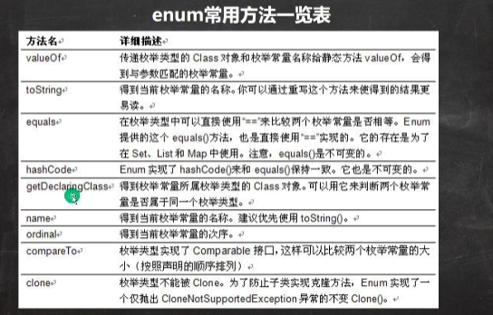
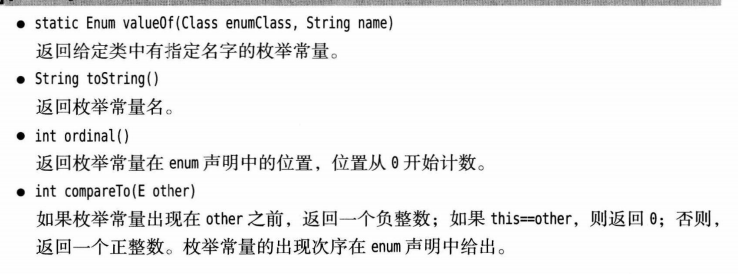

## 枚举的定义
+ 所有自定义的枚举类都默认继承自ENUM类,这个类提供一些方法
+ 
```java
enum Season {
    // 这些枚举值必须写在最前面
    // 枚举值后面的括号实际上是来自构造器来构造,构造器一一对应
    SPRING("春天", "万物复苏"),
    SUMMER("夏天", "炎炎夏日"),
    AUTOMN("秋天", "硕果累累"),
    WINTER("冬天", "雪国风光"),
    whate;   //括号省略,调用无参数构造器

    private String name;
    private String desc;
    Season(){}
    Season(String name, String desc) {
        this.name = name;
        this.desc = desc;
    }
```

### 常用方法
+ Size[] values =Size.values();//返回整个枚举值

