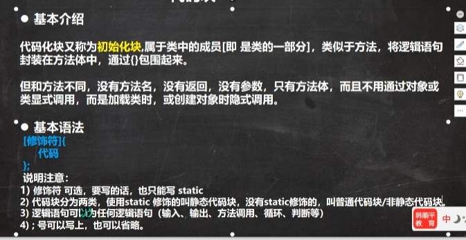

## 可以认为代码块本质是函数 级别高 专门用于构造
### 代码块 构造器的老大

+ 类中的任何构造器,它都会优先调用代码块的内容,再调用构造器中的内容,这样如果构造器中存在重复代码我们可以提取到代码块
```java
class cat {
    static public int IN = 1999;

    static {
        System.out.println("cat的静态代码块");

    }


}
```
## 静态代码块(static)
+ 作用对类进行初始化, 类加载的时候执行,执行一次,如果没有static 代码块,没创建一个对象,就执行
+ System.out.println(cat.IN);
    System.out.println(cat.IN); 静态代码块只加载了一次(静态一词代表毕竟是在比类还大一层的环境中,所以只需要加载一次)
### 类什么时候被记载
+ 创建对象new
+ 创建子类 父类也被加载 A类 extends B类的静态块
+ 使用类的静态成员的时候(静态属性,静态方法) 例如 system.out.println(cat.IN);
+ 类的静态变量被调用时,那么这个类肯定也要被加载,一旦被加载那么,代码块就要被调用


### 类构造的时候 各个模块的初始化
+ 静态代码块和变量 >类的代码块和变量>构造函数;
+ 与c++不同的是(从后往前),那个写在前面就先初始化谁,但是还是按照上面的优先
+ 其实后面两个是在一起的
```java
class aaa{

public aaa{
super();       // 所以父类还是优先级非常高的
类的代码块和变量; //这两个是默认隐藏的
}
}


```

### 还是按照上面的顺序 看看继承时候 初始化顺序
+ 代码块依旧可以看成是一个没有名字的函数,只不过他的执行级别最高,在一个类初始化的时候
+ 其实还是上面的思路 静态优先
+ 静态代码块 最高优先级
+ 爷爷类静态代码块和静态变量
+ 父类 静态代码块和静态变量
+ 子类 静态代码块和静态变量
+ 然后就可以按照 构造器的默认顺序来理解
+ 父类 代码块和变量 
+ 父类 构造器的
+ 子类 代码块和变量 构造器的
+ 子类 构造器的