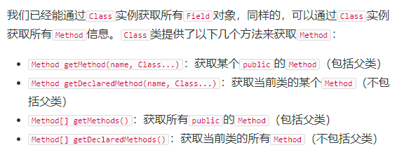

## String类加载到jvm(反射含义)
+ JVM 会为我们的每个类在JVM运行中创建一个Class类的实例(区别标识符class),Class类的构造函数是private,所以只能在JVM中创建
+ Class实例包含的String类的信息,这样我们发现Class类包含了类的全部信息

+ 这种通过Class实例获取class信息的方法称为反射（Reflection）


## 反射记载class 类的机制
+ 只用用到class 的时候他才会被加载
+ 父类会不会加载呢,这个肯定加载不然哪儿来的子类.
+ 反射获取我们最多获取到父类的public 这是因为继承的机制
+ 反射通常是一个特殊的机制,所以我们可以访问子类的private 这个虽然破坏了类的封装,但是我们通常对于类毫不知情的,这个时候就需要我们打破机制,获取信息

---

## 第一步 两种方式获取 Class的实例(类型Class)
+ Class cls=String.class;  //利用class这个静态变量 
+ 利用一个实例变量 获取, String s="hello" ,Class cls =s.getClass();


## 第二步 我们获取到Class实例对象后,需要拿到变量(字段)的对象,这个对象类型是Field
+ Field getField(name)：根据字段名获取某个public的field（包括父类）
+ Field getDeclaredField(name)：根据字段名获取当前类的某个field（不包括父类）
+ Field[] getFields()：获取所有public的field（包括父类）
+ Field[] getDeclaredFields()：获取当前类的所有field（不包括父类） 

### 第三步通过获取对象类型的对象后,然后再去拿到变量的信息
+ 一个Field(变量)对象包含了一个字段的所有信息：

+ getName()：返回字段名称，例如，"name"；
+ getType()：返回字段类型，也是一个Class实例，例如，String.class；
+ getModifiers()：返回字段的修饰符，它是一个int，不同的bit表示不同的含义。


## 变量我们拿到以后,方法的类型我们可以通过Method信息(他跟Field对象相似)
### Method对象获取 获取方法的名称也遵循上面的规律



---

### 获取函数相关信息
+ 你可以先打一个get 会有代码提示的


### 函数的调用 (!!!)
+ 我们调用getMethod()获取到某个固定的方法才能调用 invoke
+ 函数声明:  invoke(一个类的实例化,需要调用的参数)  
+ 类的实例化.getMethod()得到的Class对象依然没有把类的实例化信息传到Class对象中.所以getMethod 和类名.class没有区别
+ newInstance()也可以获取类的实例化

### 如果是static函数调用
+ 函数声明:  invoke(null,需要调用的参数) (static需要啥实例化)


### 函数调用的多态问题
+ 函数声明:  invoke(实例化对象,需要调用的参数) (static需要啥实例化)
+ 这个实例化对象运行类型决定了到底执行那个子类还是父类的函数,所以,invoke也透露出了多态

---
## 获取构造器(实例化)
+ newInstance()问题在于只能调用public无参数构造器
+ getConstructor(需要填写参数的类型);如果你有两个String的参数,你需要写getConstructor(String.class, String.class);参数类型的个数对于不同构造器


## 获取实例化对象过程
```java
Constructor constructor1 = song.class.getConstructor(String.class, String.class);  //先拿到构造器
song song1 = (song) constructor1.newInstance("宋", "ge");  //调用newInstance 来实例化对象
```
---

## 获取类的继承关系
+ 通过Class对象可以获取继承关系：

+ Class getSuperclass()：获取父类类型；
+ Class[] getInterfaces()：获取当前类实现的所有接口。// 只会打印当前类实现接口,接口有很多所以是Class对象数组

### 判断向上转型是否成立
+ isAssignableFrom()
+ Number.class.isAssignableFrom(Integer.class); // true，因为Integer可以赋值给Number   

