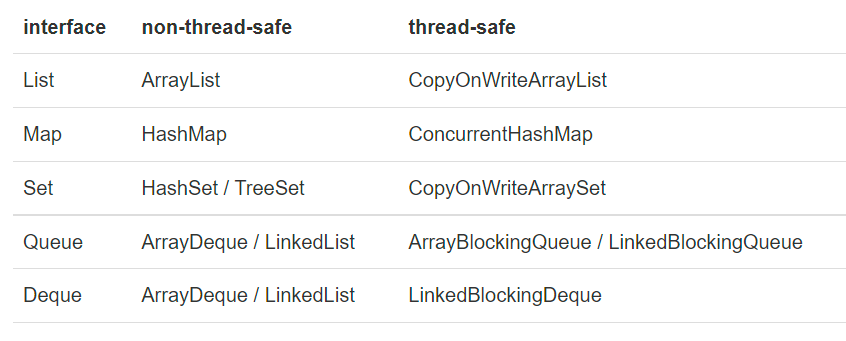
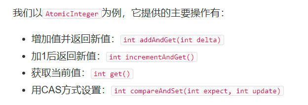

## 线程启动顺序
+ 运行java程序 系统开启JVM 进程 JVM的主线程执行main
+ 在main函数中可以开启多个线程

---
+ Thread t = new Thread() {
            @Override
            public void run() {
            }
        };
+ t.start() 
+ 通过重写run函数来定义自己的线程,start 调用的是run函数 ,如果我们直接调用run函数没用
+ 沉睡 :Thread.sleep(毫秒) : 你写在那个线程中就让那个线程睡觉 
+ 优先级 :Thread.setPriority( int n)
+ 在main函数中 等待该线程结束 在往下执行自身线程   t.join();

## 线程状态
+ New：新创建的线程，尚未执行；
+ Runnable：运行中的线程，正在执行run()方法的Java代码；
+ Blocked：运行中的线程，因为某些操作被阻塞而挂起；
+ Waiting：运行中的线程，因为某些操作在等待中；
+ Timed Waiting：运行中的线程，因为执行sleep()方法正在计时等待；
+ Terminated：线程已终止，因为run()方法执行完毕。

## 线程休息和打断
+ 发出中断信号: t.interrput();
+ 这个函数他发出中断信号,由编译器来决定是否中断,虽然我们无法决定线程什么时候中断,但是我们可以捕获信号,来标识中断
### 第一种 中断信号捕获
+ isInterrupted() 静态函数 检查调用它的线程是否有中断,所以我们需要使用while(is Interrputed()) 时时检测中断信号


### 第二种中断信号捕获
+ t.join() 让调用这个的线程进入等待,等待t线程执行完.
+ 如果我们在a线程进入等待状态,如果a.interrput(),打断a线程,这个时候他会抛出InterruptedException信号,我们只需要捕获,就可以得到这个信号是否中断

```java
public static void main(String[] args) throws Exception {
Thread t = new MyThread();
        t.interrupt();      //第二: MyThread还在等待,此时打断他
}
class MyThread extends Thread {
try {
            hello.join();   //最先调用: MyThread线程需要等待hello线程完成
        } catch (InterruptedException e) { //第三 :捕获错误,线程结束
            System.out.println("MyThread+ interrupted!");
        }
}
```

### 第三种控制线程中断
+ volatile 关键字
+ public volatile boolean running =true;
+ 由于计算机为了提高高速缓存的内存访问速度,计算器计算的结果,往往会保存在高速缓存中一级缓存中,这样对于临时的数据快速读取非常有效率,但是其他的线程往往会在二级高速缓存中读取不到,因为在一级缓存中的临时副本还没有写到二级缓存,这样的变量对于中断线程控制有很大问题
+ 所以volatile 这个关键词可以保证,一旦改写了内容,就会立即写到公用缓存(二级缓存) 这样保证了及时线程中断的问题

## 守护线程
+ JVM 不会理会是否有守护线程的存在,这样解决了JVM主线程关闭时,是否还有线程的存在而无法关闭的问题
+ 创建守护线程: t.setDaemon(true); t.start();
+ 守护线程他不能够打开任何需要关闭的资源 such as: file文件 ,JVM不管守护线程,这样容易导致线程关闭,数据丢失


## 锁 synchronized
+ 针对两个线程前后调用有依赖的线程
+ 称呼这种为原子操作
+ public static final Object lock =new Object();
+ synchronized(Counter.lock){
+ 你要锁的操作
+ }

+ 其他原子操作:
+ 为什么会出现需要锁,因为我们在调用一个线程时,他的一条语句,有几个指令来完成,我们害怕打断所以需要锁, 但是有些语句 只有一条指令,这个可以通过有硬件实现,这个就是原子操作,这种无论如何都不怕打断.
+ java 有两种原子操作:
+ 基本类型的赋值 
+ 引用类型赋值 List<String> list =anotherList;

---
+ synchronize(我们一般锁的是类的this) 
+ 一个类有两个函数 add dec 函数 ,他们的实现对于变量n的加减, 我们可以利用this来锁住,这样调用类的class的方法时,会自然按照相关的加减
+ public void add(int n) {synchronize( this) {count+n;}}
+ 这种写法等价与 public synchronize void add(int n) {count +n;}的写法 , 这种也相当于整个方法锁住了this

## 死锁手法
```java
// 同时执行add 和dec 方法,先add获得lockA,dec获得lockB ,add继续想要获得lockB 但是在dec 手里,所以他无法释放lockA ,导致dec也无法继续进行下去,这就是死锁了
public void add(int m) {
    synchronized(lockA) { // 获得lockA的锁
        this.value += m;
        synchronized(lockB) { // 获得lockB的锁
            this.another += m;
        } // 释放lockB的锁
    } // 释放lockA的锁
}

public void dec(int m) {
    synchronized(lockB) { // 获得lockB的锁
        this.another -= m;
        synchronized(lockA) { // 获得lockA的锁
            this.value -= m;
        } // 释放lockA的锁
    } // 释放lockB的锁
}
```
+ JVM无法处理死锁,
+ 推荐获取锁的顺序 相同,都是 lockA 然后LockB 

---
+ 解决了死锁的问题
+ 线程之间的协调的问题
+ this.wait( ) 是一个非常复杂的程序,如果最开始调用getTask方法,这样就出现了问题,队列一直是空的,然而他有拿到了锁,这样不就死锁了吗
+ wait让线程睡眠,等到用到他的时候再次调用,因为wait的复杂,所以在线程睡眠的时候,他会释放锁,这个时候addTask运行,让队列中有数据,同时他唤醒所有沉睡的线程.
```java
public synchronized String getTask() {
    while (queue.isEmpty()) {
        // 释放this锁:
        this.wait();
        // 重新获取this锁
    }
    return queue.remove();
}
public synchronized void addTask(String s) {
    this.queue.add(s);
    this.notifyAll(); // 唤醒在this锁等待的线程
}
```
# 建议使用来替代原始写法
## 包装后的锁ReentrantLock替代synchronized()
+ 相较于synchronized更安全,使用tryLock失败不会死锁
+ ReentrantLock保证了只有一个线程可以执行临界区代码;
+ private final Lock lock =new ReentrantLock();
```java
public void add(int n){
lock.lock();
try{

    count+=n;
}finally
{
    lock.unlock;
}

}


```

+ lock.tryLock(1,TimeUnit.SECONDS) 尝试获取锁,如果1秒钟没有得到锁,程序就可以去做额外处理,而不是一直等待


### ReentrantLock版本 如何替代wait notify
+ 使用Condition对象
+ private final Lock lock =new ReentrantLock();
+ private final Condition condition =lock.newCondition();
+ // 利用RenntrantLock() 来newCondition一个Condition;
+ await 来替代 wait
+ signalAll 来替代 notifyAll


### ReentrantReadWriteLock 解决ReentranLock只准一个线程执行临界区的问题
+ 我们有你只准只有一个线程写数据到数据库,ReentrantLock的方式只准你同一个线程读取
+ 我们想要提高效率这种方式太慢了,所以我们在ReentrantReadWriteLock 区分了两种锁
+ final ReadWriteLock rwlock = new ReentrantReadWriteLock();
+ 读取锁 //final Lock rlock = rwlock.readLock();
+ 书写锁//final Lock wlock = rwlock.writeLock();
+ 我们在写的函数调用wlock锁,这样保证只有一个线程可以调用它
+ 当我们写的函数完成以后,我们在读取的函数中使用wlock锁,这样就可以多线程调用

## ReentrantReadWriteLock只允许读完才能写
+ StampedLock和ReadWriteLock相比，改进之处在于：读的过程中也允许获取写锁后写入！这样一来，我们读的数据就可能不一致，所以，需要一点额外的代码来判断读的过程中是否有写入，这种读锁是一种乐观锁。
+ 乐观锁的意思就是乐观地估计读的过程中大概率不会有写入，因此被称为乐观锁。
+ 这种锁 看书把 !
+ 这种锁的用法,是我们先创建乐观锁,用锁的版本号来检测,是否存在读时发生写,如果有,就重新读取一遍
  https://www.liaoxuefeng.com/wiki/1252599548343744/1309138673991714


## java把很多集合和容器都实现了不同版本的线程安全容器
+ 非常方便,哇塞! 真的实用
+ 

## 提供了原子操作封装的类,这样我们不用在意锁的存在



## 线程池 分为三类 
+ 优点在于 :他维护了一个线程组,这样解决空间内存的消耗
+ 定期反复执行的线程 ScheduledThreadPool 提供了一个非常方便的接口类型
https://www.liaoxuefeng.com/wiki/1252599548343744/1306581130018849

## 读到了Future 实在读不下去了 太他妈的恶心了
+ 下面的还没读
https://www.liaoxuefeng.com/wiki/1252599548343744/1306581155184674