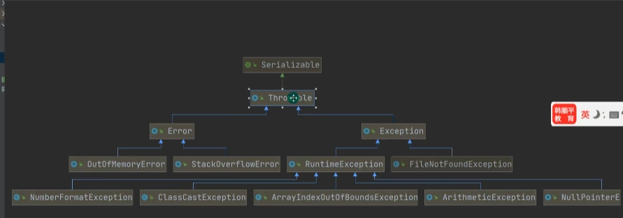
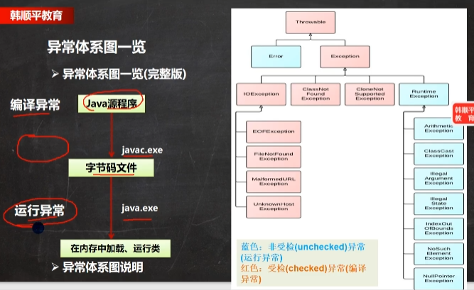
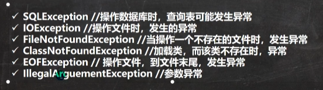
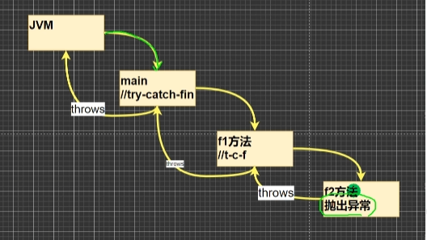

## 选中 -> control+ alt +t 可以直接生成异常
## 异常的基本结构 来自Throwable
+ Exception 中有RuntimeException运行时异常 和FileNotFoundExcption 编译异常 还有其他的,
+ 编译异常是程序员自己的锅,必须处理,运行异常经常存在,




## 常见的异常
###  NullPointerException
+ 主要是对象指向null 然后调用对象

###  ArithmeticException 数学异常
+ 除以0的数学运算

### ArrayIndexOutOfBoundsExcetption 数组下标越界异常

### ClassCastException类型转换异常

### NumberFormatException 字符串装换成一种数值类型异常,字符串转成适当格式时异常
+ 把字符串"宋哥你还"转成数字,肯定报错


# 编译异常
+ 运行异常编译器默认处理,编译异常你必须书写出来



# 异常处理的方式
## 第一种自己处理
```java
try{


}
catch(Exception e){


}
finally{  //必须执行
// 不管是否有异常产生,都要调用finally,所以finally中一般都是释放资源的地方


}

```

## 第二种 (特别是在方法传递异常中,看图片)谁调用我,我就把异常抛给谁,网上抛的时候,上一层try catch也可以处理,也可以继续网上抛
### 为什么程序报错默认会打印异常
+ 比如我们写了10/0时,在main方法中,main方法默认在后缀添加了throw Exception,只是没写出来,这样我们其实调用了图中最上层JVM处理,所以直接对应了错误信息,因为程序需要捕获异常,其实在每个方法背后都有throw操作
+ 如果类的方法抛出了类,




### 我们可以捕获具体的异常,不过一个try_catch每次只能捕获一个,同时,父类异常必须写在后面,因为你前面都捕获了父类了,后面就没意义了.
```java
try{


}
catch(NullPointerException e ){

}
catch(Exception e){//必须写后面


}
```

## 自定义异常
+ 继承RuntimeException 就是继承的是运行异常,我们一般自定义异常都是使用运行异常,因为运行异常编译器会默认抛出
+ 继承Exception 就是编译异常,编译异常我们必须处理,所以往往会在抛出异常所在的类,书写throw异常,这是我们必须处理的,编译器不会帮忙