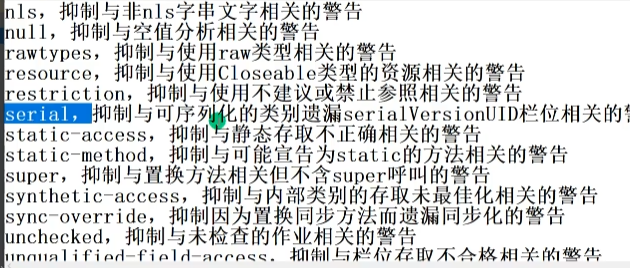

## @Deprecated 
+ 用于表示某个程序元素和方法已经过时了. 版本升级使用
+ @Documented
+ @Retention(RetentionPolicy.RUNTIME)
+ @Target(value={CONSTRUCTOR, FIELD, LOCAL_VARIABLE, METHOD, PACKAGE, MODULE, PARAMETER, TYPE})  //他可以用在的地方非常多
+ public @interface Deprecated {
## @SuppressWarnings
+ 抑制编译器警告
+ 

## @interface 
+ 源码中看到这个代表他是一个注解类.

## @Target(ElementType.METTHD) 元注解
+ Target代表这个注解你可以放在那些元素上,这个表明我们可以放在方法上.
+ 元注解修饰注解的注解
  
## Retention
+ 注解作用的范围 三种SOURCE CLASS ,RUNTIME
  

## Documented 
+ 指定该注解是否出现在javadoc体现

## Inherited
+ 子类会继承父类注解