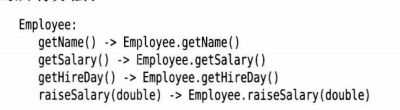
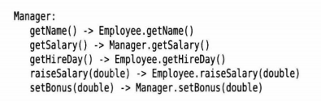
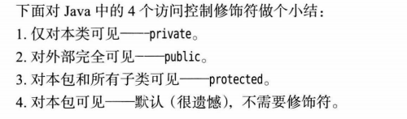

## java中的继承都是public继承

## super特殊关键词
+ super他不是一个父类的引用 表现他不能给另一个对象变量赋值,super().getSalary(父类的一个方法)
+ 调用父类(超类)的特殊字段

## java的动态绑定是默认行为

## java子类引用的数字可以转换成超类引用的数组,并且不需要使用强制转换
+ 但是我们还是推荐建议, 所以数组必须牢记创建时的元素类型,数组不要轻易跨界.

## java方法调用流程
+ 第一 根据方法名,把方法名相同但参数不同的方法候选出来
+ 第二 根据参数类型然后选出这个方法
+ 第三 如果是private(只能本类使用) static(静态方法不是在类中) final 这些静态绑定的方法就已经到这里结尾,如果是动态绑定
+ 第四 如果一个个找函数,编译器代价太大,所以编译的时候给类生成了一个方法表,所以动态绑定会根据实际绑定的类去找方法,如果不在就往超类找.
+ Manger extends Employee
+ 
+ 

## final 也可以防止继承
+ public final class Executive extends Manger
+ java一般提倡明确区分那些方法应该是final,防止多态卵用

## 强制转换的细节
+ 超类转成子类 报错 ,instanceof来首先检验,这是java程序员的一个好习惯
+ instanceof 支持对象引用的类是否能够转换成instanceof右边书写的类,转换成功的类包括对象自己对于的类,和父类(自上而下转换),后面一点考满足我们检验的目的

## 接口和抽象类
+ 借口所有的代码 你都是 abstract的
+ 抽象类 你类后面写上  public abstract class person 你的字段并不是需要全部都是abstract

## protected 细节

# 继承的技巧
+ "is-a"的技巧特指 不能在子类中增加新的字段,但是这个不包括方法
+ "不要使用