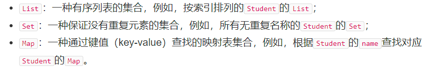
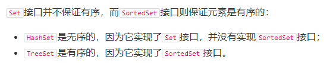
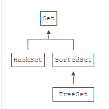
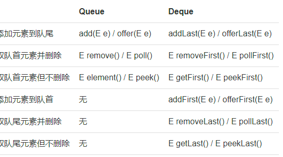
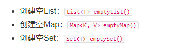
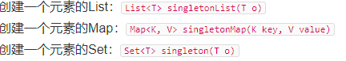
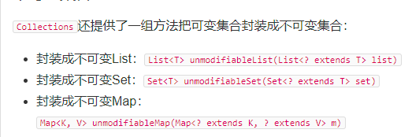

## 类的继承关系
+ Collection类 处Map外所以的结合类的根接口

## 结合的基本分类
+ 集合实现特点:
+ 1. 接口和实现类分开 ,有序表的接口List,从他实现出来的包括了ArrayList 
+ 2. 集合所有的访问通过迭代器Iteraotr ,通过他知道集合是如何存储数据的(c++ 萃取机是玩的贼帮)

## List
+ List 
+ 判断某个值是否存在 contains
+ 某个指定缩影 indexOf(Object o)

---

+ ArrayList 类似数组
+ LinkedList 链表
+ 添加值 add
+ 删除值 remove
+ 得到值的索引元素 get(int index)
+ 大小 size

+ 迭代的访问永远是最高效的
+ Iterator<String> it =list.iterator();

## Map 接口 常用HashMap (c++ 类似)
+ 存入: map.put(key,value );
+ 取出 :Map.Entry<String ,Integer> entry:  map.entrySet();
+ 取出key值 entry.getkey()
+ 取出vlaue值 entry.getValue();
+ 查找 map.get(key);
+ Map的key通过Hashcode值来定位到Vlaue;
+ 他的equal方法必须单独实现"https://www.liaoxuefeng.com/wiki/1252599548343744/1265117217944672"
+ 使用TreeMap的时候必须实现Comparable接口,添加自己的元素
---

+ EnumMap
+ key是enum版本的Map
+ 速度比map快 - enum(key)的值是固定的,所以EnumMap可以刚好让空间大小只有enum的值那么多,所以容量大大节约
+ 因为不用再调用hashcode()来换算value,速度加快
  
---
+ set (一般当做接口)
+ HashSet 无序 只存储了key值,不能重复,可以用于去重
+ TreeSet 有序 ,添加元素需要实现Comparable(只要谈到排序你都牵扯到了Comparable接口)
+ 条件Set<E>(一般使用呢HashSet 和TreeSet)
+ 添加 add
+ 删除 remove
+ 包含 contains

---
+ 队列Queue
+ 添加 add
+ 队首获取元素并删除 remove
+ 队首获取元素不删除 element

___

+ PriorityQueue 方法与队列一样
+ 不过他的策略是 优先级高的先出来,所以你要实现Comparable接口

___ 
+ Deque
+ 双端队列,可以从两端都出来,

---

+ stack栈 ,实现来源于Deque
+ push压栈
+ pop 弹栈
+ peek 取栈顶元素不弹出

___ 
+ 迭代器 Iterator  
+ 每个For each 都是用Iterator来迭代的
+ 你要自己的类支持For each 就需要实现迭代器
+ 方式
+ https://www.liaoxuefeng.com/wiki/1252599548343744/1265124784468736

--- 
+ Collections 收集了一些静态方法配合容器集合使用
+ 创建空集合 空集合是不可改变的集合
+ 
+
+ 创建单集合 (也是不可变的)
+ 
+ 排序: 必须传入可变的List
+ Collections.sort(list);
+ 洗牌算法: 传入一个可变有序List,课打乱顺序
+ Collections.shuffle(list);
+ 把可变的集合封装成不可变的集合
+ 