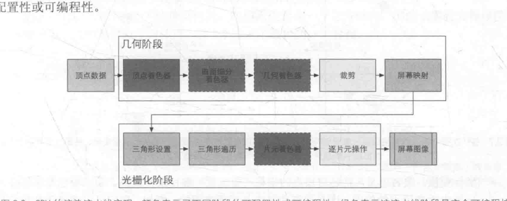

+ 这一章讲述的非常清楚,我会和计算机的网课中的知识进行混合讲述概念
+ 着色器:矢量计算,坐标转换,运算,说白了就是运算器

1. 顶点着色器: 网课中我们提到了 摄像机需要的观看空间,往往是长方形,摄像机处于原点,长方形变成[-1,1]的正方体,正方体 对于正交视图,可以直接舍弃z得到x y信息,把点映射到屏幕空间,正方体同样是为了方便映射像素点,正方体2*2,而像素恰好1*1,自然方便转换,正交和透视的转换区别看课程
2. 曲面和几何着色器我觉得区别在于是不是处理顶点,
3. 裁剪:当然是超出长方体,或者变换成正方体多余的点抛弃
4. 屏幕映射和三角形设置 :有了顶点位置不就可以进行屏幕绘制了吗,这个是错误理解,首先我们说物体的显示化都是以三角形为基础的处理单元,基于顶点着色器处理顶点逻辑,我们只把三角形的点映射到屏幕,但三角形中心的点又如何处理,这个就是三角形设置,下一阶段的准备工作
5. 三角形遍历:当然是我们叉乘计算是否处于三角形的内外位置,来生成一个大致三角形,往往坑坑挖挖,三角形的插值解决这个问题,
6. 片元着色器:片源你可以认为是就是三角形,不过这个三角形你需要注意,片源的包含不限于边线的信息,同样囊括三角形中间的像素点颜色等信息,因此片源你可认为是呈现画面的基础组成结构了,片源着色器可以干很多例如纹理渲染,这个依然到了
7. 逐片元操作,也叫做合并输出,对于每个片源因为材质透明度和前后的问题,前面的图元显示,后面的就可以抛弃了,这个算法是取决于opensl和directx处理的不同,这个是物理硬件需要GPU计算的,前面的cpu处理
 

 + cpu 发出Draw call 命令 Gpu ,如果类似这样命令太多, cpu就会忙于提交Draw call命令,会造成过载
 + shader:就是流水线的一部分