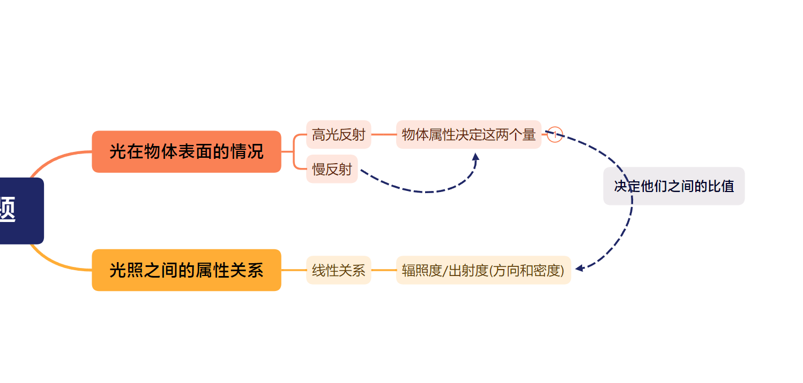
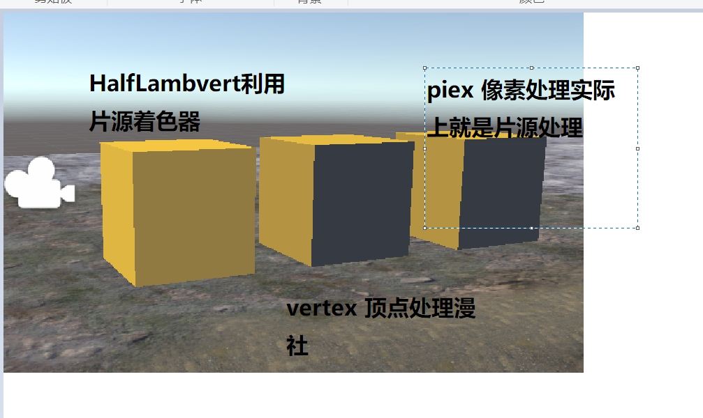

+ 辐照度: 单位时间单位面积平行于法线的能量,光是斜的,所以需要你点击法线得到cos,然后乘以cos
+ 散射只改变光线方向,不改变密度和颜色,吸收值改变光线密度和颜色
+ 散射到内部的角透射,散射到外部的反射
+ 对于光线方向在光射到表面的时候是有反射和折射两种光线方向
+ 高光反射(Specular) 计算光线是如何反射的
+ 漫反射(diffuse) 表示多少光线折射,吸收,散射出表面
+ 出射度:我们可以算出的是出射光线的数量和方向,我们用出射度来表示
+ 辐照度(物体表面接受的能量强度)和出射度是线性关系,这个是必然的,光照强度和反射出来的光线可能成线性,他们之间的比值就是材质的漫反射和高光反射属性

+ 着色:就是物体看表面的颜色,这个物理化的过程,一束光(辐照度和方向)射到一个物体表面(物体材质不同:高光反射和慢反射) 反射出来的光线的出射度(方向和密度),然后你绕着一个随意方向看,这个过程叫做物体的着色,这个等式也叫做光照模型

---
### 标准光照模型
+ BRDF光照模型,这是一个经验光照模型,
+ 虽然不科学,但是看起来比较贴合显示,计算机图形学,一切看起来对的模型都是正确的.
+ 这个模型他被进入摄像机的光线分为4个部分
  + 自发光 ,这里自发光并不会真的点亮周围的物体,只是看起来自己亮了
  + 高光反射:Blinn模型和Phong模型
  + 漫反射,这个模型认为慢反射从哪个角度看起来都是一样的,符合基本事实,所以光线的入射方向比较重要
  + 环境光,它是一个全景变量,所以场景中都使用同样辐射度的环境光
 
---
+ 基础的光照模型(只考虑定量环境光+漫反射)
 + 渲染方式的两种: 逐个顶点计算光照和逐个片源计算,但是他们对于的背光面就更黑的平面一样
  + 半栏伯特模型解决这个问题

