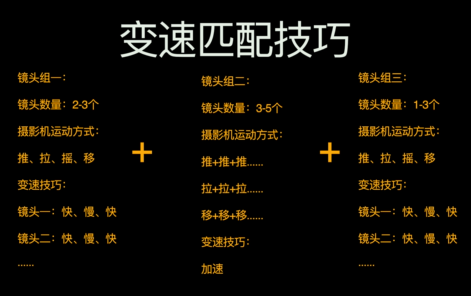

## 可以有四到五次创造剪辑方差
+ 序幕 1次
+ 过程 2-3次 剪辑节奏反差
+ 尾声 1次 剪辑节奏反差

## 用快切做反差
+ 序幕部分,一上来就用快切的方式造势,吸引观众

+ 故障干扰的音效来用作序幕
+ 如果你的是一组场镜头,你可以用长镜头和快切来营造反差感

## 在影片过程中
+ 更适合用相同运动方式变速做匹配的方式来营造镜头的反差感

## 快切镜头
+ 小景别,特写
+ 固定镜头
+ 成组形式
+ 三个镜头以上做快切 2-8帧