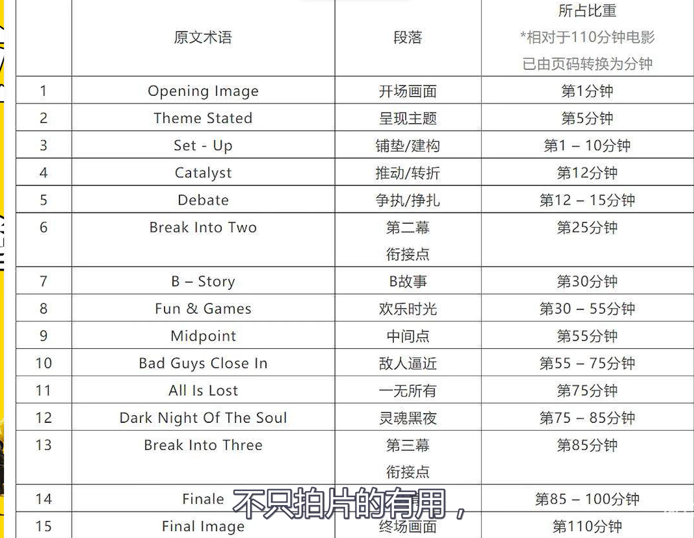

## 片头一定是非常重要的存在,片头不稳定整个影片的基调也就非常不稳定

### 第一幕
+ 展现人物的背景和性格
+ 接着有一个事件或者物品推动人物的周围事务发生改变,发生争执,这个就是事件的阻力
+ 但是这个事件依然被推动起来
+ 25分钟到30分钟  还是在讲述A故事,这里你不能直接切换到B故事中,A故事讲铺垫讲述前景,B故事放置结果,你要开始让A故事衔接到B故事
+ B故事是家庭,
+ 欢乐时光是观众最想看的部分
+ 中间点,事件发生转折,父亲破产,片子中爷爷死去
+ 转折点直接决定后半场人物的方向
+ 转折点就是前半场人物情绪的最高点,后半场就是从最高点一直往下滑,形成高低两个点
+ 知道转折点就可以确定了第11条,人物一无所有,猜出人物后面的遭遇,转折点也可以理解为高潮点,但这个高潮点往往是人物伪胜利的时候,也可以是伪失败的时候,爷爷去世,事业崩塌
+ 为什么11条都一无所有了,还能用最终的胜利能,他这个一无所有是A故事彻底失败,B故事他依然可以成功!这就是为什么B故事放置结果,阳光小女孩中,A故事小女孩选美比赛逐渐失败,但是家庭却越来越和睦
+ 高潮好不好就看故事衔接的好不好,A故事选美到B故事家庭很好的契合,最终达到A故事的高潮
