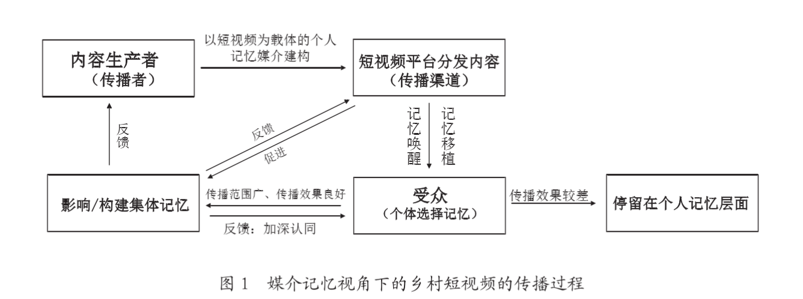
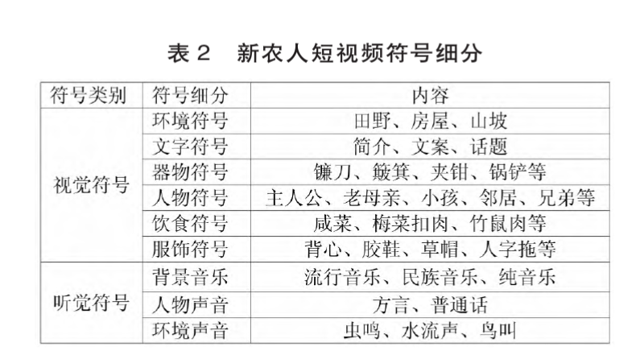

+ 短视频是如何叙述和构建文化乡愁的

+ 论文: 三农”短视频兴起背景下乡村文化建设策略探究 
  +  三农短视频崛起的原因
  +  文化乡愁,乡村记忆只是大家共同经验,我们一边远离故乡,一边缅怀故乡,短视频对于乡村记忆只是一种对于过去生产方式的再现
  +  “三农”短视频发展困境
+ 论文: 使用与满足”视角下的李子柒短视频走红原因浅探
  + 满足理论中谈到了回望乡愁的需求
    + 李子柒的视频无论是对乡村意象的表达 ，还是对隔代亲情的展现, 这里可以拆解为 乡村意象为乡村环境和物品等符号,隔代亲情,也就是乡村人际关系,
    + 短视频表达乡愁可以从这两个角度出发

+ 论文: 新农人”短视频兴起中的城乡互动与关系重构
   + 短视频“镜子式传播”的影响下，城乡居民通过短视频中的场景共享、经验互通来了解乡村生活
   + 了解乡村生活的场域、经验、态度、情感等
   + 方言进行交流增强“同在感”
   + <mark>重要</mark>:从时间维度而言，“乡愁”主要包括“传统乡愁”“现代乡愁”和“后现代乡愁”。其中，“传统乡愁以回望式的怀旧为主要特点，指向物质家园或文化家园;现代乡愁以理性反思、启蒙性和前瞻性为特点，主要指向精神性家园;后现代乡愁则以反理性和消费性为特点，主要指向拟像家园”［论文: 时间维度下乡愁意蕴的嬗变与叠加]

+ <mark>关键论文(我觉得可以依照这个分析张同学)</mark>: 场景、呈现与认同：怀旧短视频的叙事模式与创作机理(根本就是怀旧叙事,)
   + 摘要:怀旧短视频在继承传统怀旧影像传播逻辑    
       +  与当前加速社会巧妙融合，并在大众情感、传统文化、地域认同等多个维度上发挥价值
   + 怀旧定义:  怀旧在英语中的表述nostalgia来 自两个希腊单词，nostos（返乡）和algia（怀想）， 是对于某个不再存在或者从来就没有过的家园的向 往。怀旧是一种丧失和位移，但也是个人与自己的 想象的浪漫纠葛。[斯维特兰娜·博伊姆.怀旧的未来[M].杨德友，译.南 京：译林出版社，2010：2]
   + 
   + 多元怀旧叙事策略表达
     + 故事策划下的剧场式表演
       + 通过颇为考究的服装道具、化妆技术等手段 复制历史记忆中真实场景 
       + 将极具特色的“日常餐食”“过节仪式”“人际活动”等转化为关键性符号(所以需要找出一些关键性符号)
     + 竖屏模式下的凝聚微阅读
       + ，从小节点、 小人物、小地方出发，点缀些许时代标志性的细节， 进一步将观看者追忆情绪推向高潮。(竖屏更加关注微小记忆)
     + 视听符号下的碎片化沉浸
       + 怀旧的叙事文本要有标志性的提示元素
       + 特定阶段的建筑风格、衣食 住行、影视歌曲
       + 又或者充满地域文化的习俗风情、 大众消费品等
     + 怀旧短视频的意义即是对过去以慢为主的乡愁情节驻留，即使时光 流转，人们心中对于过去美好情谊的追求依然存在

+ 论文: 从创新扩散视角看“张同学”乡村生活短视频的走红
   +  摘要: 创新是“一种被个人或其他采纳单位视 为新颖的观念、实践或事物。”一项创新应具备相 对的相对优势、兼容性、复杂性、可试性、可观察 性五个要素
   +  相对优势：打造专属视觉与听觉符号
   +  兼容性: 张同学”的短视频内容聚焦乡村日 常生活起居，满足现代城市居民对“乡愁”情绪的 抒发需求。

+ 核心论文: 唤醒与移植：媒介记忆视角下的乡村短视频传播
  + <mark>摘要: 唤醒与移植：媒介记忆视角下的乡村短视频传播,唤醒与移植：媒介记忆视角下的乡村短视频传播
  + 记忆本就是乡村短视频生产及传播的重要一环
  + 乡村短视频以展现乡村生活、乡村文化、乡村 面貌等为主要内容
  + <mark>不同的乡村短视频共同建构了对乡村的媒介记忆，乡村民俗、乡村民风、乡村场景 等乡村的点点滴滴通过短视频平台的扩散得以展现 在不同的受众面前
  + 理论依据: 媒介记忆被受众选 择的过程即受众个体记忆唤醒与记忆移植的过程。 在本文中记忆的“唤醒”指乡村短视频展示的某 些内容触发了受众自身拥有的某些记忆，受众对视 频内容产生共鸣与认同感，因此选择了短视频中呈 现的媒介记忆内容，具体行为表现为对该内容点赞、 转发、评论等，
  + 乡愁产生的过程就是:唤醒(通过特色事物引擎人们思考)和移植(这是媒介给你创造的记忆,如果你点赞了,说明你接受了这个假的记忆)
  + 乡村短视频的传播，主要 以传播者、传播渠道、受众三方面为主体(并有一张理论图片)
   

+ 核心论文:集体记忆的味觉书写(没看)

+ 论文:跨越与转型：抖音中新农人形象的符号建构及文化意义(该论文表格的形式研究)
   +  摘要: 新农人在短视频中通过视听符号及消费符号分别建构了乡愁承载者、 乡村景观展演者以及乡村振兴的中间人三种形象
   +  

+ 核心论文:李子柒短视频对当代乡愁的时空意象建构
   +  本文试图从乡愁空间性、时间性和主体性三个特征入手(因变量)
      +  李子柒短视频对乡愁空间意向的建构包含家、乡、国三个层次,我觉得这里你甚至可以做到更多空间上面去分析
      +  子柒短视频对于乡愁时间性的运用， 主要从时间节气、自然景观和日常生活三个方 面缓缓展开
         +  唤醒乡愁的时间具有一定的规律性， 雨天、深夜、传统节日等特殊时间节点都易引发 人们的愁绪，唤醒思乡之情
         +  乡愁的时间性还体现在载体的时间景 观中，特别是以自然景观为代表的一草一木的生 长变迁与时间轮回
         +  日常性是乡愁表征与生成时间系统中 的重要特征。
         +  情感是乡愁主体性的主要表征，也是乡愁 的本体特征，“爱”和“美”是当代乡愁情感的 主调。乡愁之“爱”主要是对家人、朋友、乡亲 的关爱，

+ 论文: 李子柒短视频品牌传播的文化记忆研究(论文基础概念丰富)
  + 摘要: 从文化记忆的时间、空间和情感角度入手，探讨李子柒短视频的品牌 传播的特点 ,以乡村文化和传统文化符号为内容引发受众情感共鸣
  + <mark>重要概念: 乡村记忆乃至传统文化记忆是集体记忆和社会记忆的一种体现
  + 论述了集体记忆和文化记忆关系,文化记忆是集体记忆的一种衍生

+ 论文: 李子柒古风美食短视频的消费逻辑
  + 这种田园诗意的乡愁符号建构包括田园风光呈现、 民俗风情表达以及诗意人物塑造三种方式

+ 论文:图像地方性的“二次建构”：媒体报道呈现的短视频与农村_吴世文(主要是具体到细节去分析)

+ 论文: 乡村乌托邦的媒介化展演(完整的研究过程)
