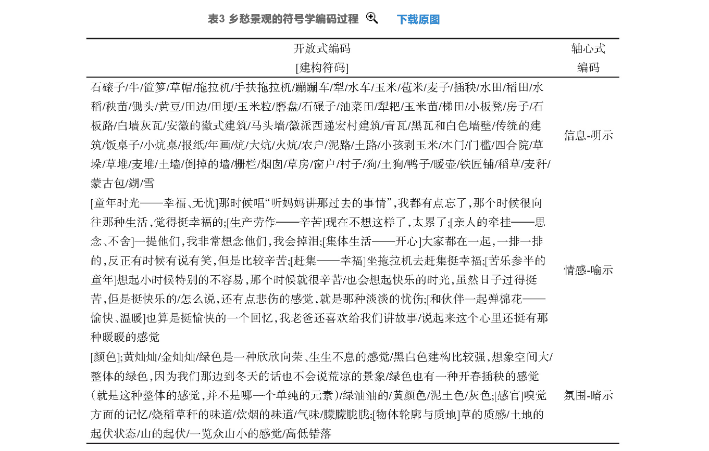
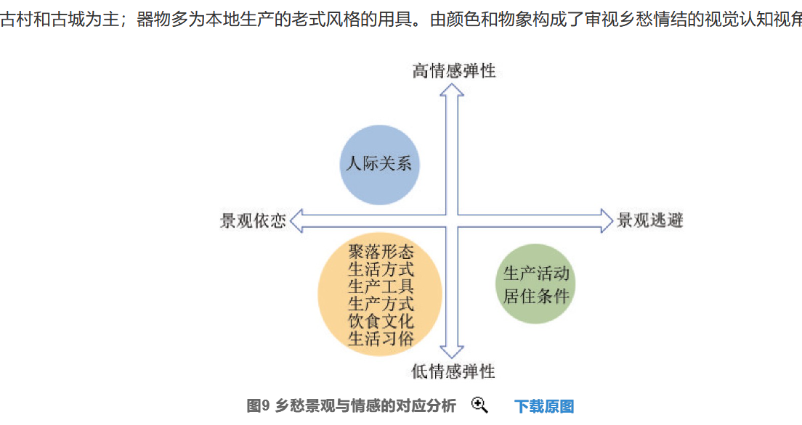
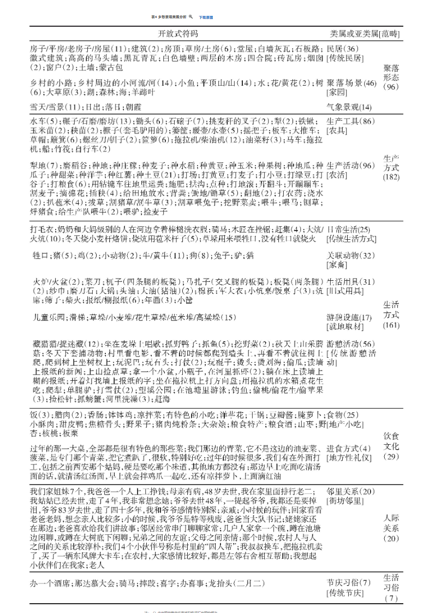

+ 核心论文: 作为景观的乡愁:旅游体验中的乡愁意象及其表征作为景观的乡愁:旅游体验中的乡愁意象及其表征
  + 根据形态差异，乡愁载体可分为物态乡愁景观载体和非物态乡愁景观载体
  +  提出乡愁景观包括民俗、农耕、风貌、生态、邻里交往和场所空间
  +  乡愁呈现出不同时空的“色”景观，如少年时代的“红色”景观、家乡的“绿色”河道及“黄色”的草坝
  +  以及“声”景观，如乡音是唤起乡愁最直接、最具识别性的景观之一
  +  景观是理解乡愁的重要符码。景观的塑造过程，也是创造乡愁情景体验场所的过程
  +  乡愁的3个层次：信息、情感和氛围，它们分别对应符号学中的明示、喻示和暗示的分析框架
  +  本文在皮尔斯符号学理论的基础上，构建了明示、喻示和暗示的符号                                                                                                                               学框架，作为乡愁符号的诠释依据。

  + 
  + 
  + 对文本资料进行扎根理论分析，本文最终形成了6个可以表征乡愁的维度。
    + 景观逃避是由特定景观符号引起的负面情感，如文本中出现的“不想回去”“累”“辛苦”等词语
    + 景观依恋是由特定景观符号引起的积极情感，如“怀念”“幸福”“舒服”“喜悦”“温馨”等词语
    + 从旅游者在面对不同乡愁景观类型时所表现出来的情感波动程度,
    + 与其他乡愁景观类型相比，人际关系往往更能唤起游客的情感波动并衍生出情感纽带
    + 情感弹性的意思就是: 引起的情感波动
+ 论文: 纪录片《记住乡愁》文化传播的符号意蕴
    + 语言符号建构
      + 声音语言符号
        + 旁白语言符号
        + 现场语言符号
      + 文字语言符号
    + 非语言符号建构
      + 造型语言符号
      + 音画语言符号
    
    + 传播者编码
      + 叙事方式
      + 表现手法
    
    + 传播过程中的“噪音”
      + 时间距离
      + 空间距离
      + 表意距离
    
    + 《记住乡愁》符号系统建构的意蕴

+ 论文:央视纪录片《茶，一片树叶的故事》的符号学解读
  + 乡愁构建 
     + 物质性场所的沦丧: 饮茶的地方越来越少
        +  旧时的茶馆越来越少,新的茶馆也变了样,地方的减少当然是乡愁的表达
     + 集体记忆和共同经验的沦丧:传统工艺面临失传
        + 对古老技艺的珍惜,现在看不到了,这个物理层面的因素,当然容易让人引发对过去的思考   
     + 传统文化的沦丧:消费时代茶文化的困境
        +  上面说技艺,这里说茶文化的丧失.

+ 论文推荐: 乡村题材纪录片中影像符号的挖掘与呈现_梁佳敏(有一个书写的完整模板)

+ <mark>最核心论文: 基于乡愁景观载体的田园综合体景观空间营造研究_张智惠
   +  人们是如何