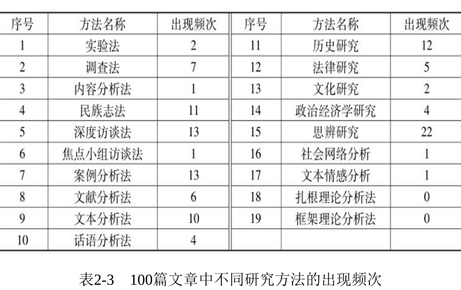
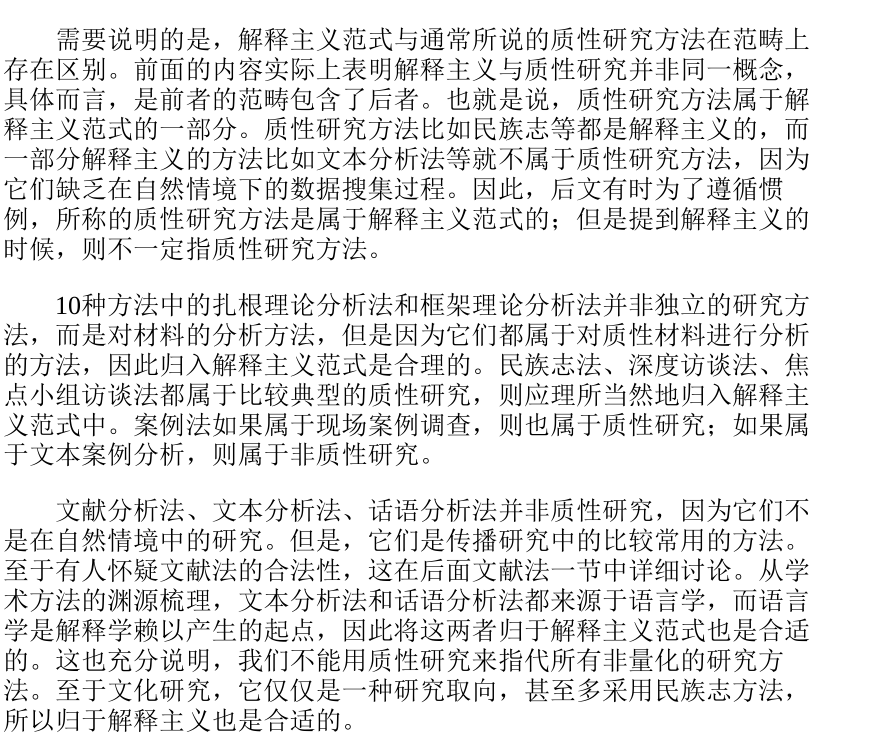
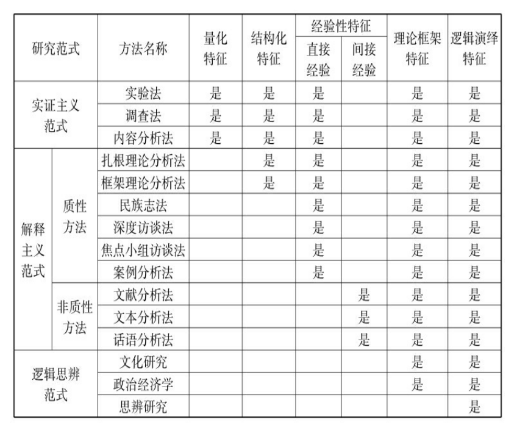

## 学术论文和非学术的区别
  + 在一篇文章到底是知识的扩充还是一种陈述(非知识)以知识为界限来区分
    + 知识他是一个非常复杂的概念,但是我们可以让他降级
       + 知识表现形式符号 概念 命题 理论(跟符号论相似)
         + 符号一种具体事务的代称 例如指人这种生物
         + 背后的意义或者象征,人可以生产工具
         + 人的本质不是单个人所固有的抽象物，它是一切社会关系的总和”，这就是与人有关的一个命题(提出假设)
         + 马克思关于人的诸多论述，则构成马克思主义关于人的理论(完成解答,写出论文)
  + 学术论文是理性的分析,而不是感性的陈述,根据上面的知识又分为理性知识和感性知识
     + 理性知识包括 概念、判断、推理三种形式 ,就行蜜蜂一样,既要采集又要整理
       + 学术论文是有理性知识的创新的,学术文章是理性知识非创新的
       + 创新性体现在是否提出了新问题，是否采用了新方法，是否运用了新理论，是否发现了新材料，是否获得了新结论。
       + 如何判断问题是否有创新性,参考大量文章,如果有你就没发现,说明你没有研究透理论
     + 而感性知识他是陈述性的,描述性的,没有生成知识,增加总量,例如下面的文章.
       + 直接照抄红龙梦的话
       + 工作总结 总结实际经验, (这里要区分应用性论文,他有自己的前提条件,你只有满足)
       + 评论性的 纯主观,学术研究是现有现象 后有结论
       + 不要用议论文的思路,他是论证举例,我们是现有现象 后有结论
## 范式
+ 范式等于方法论,一套严密的研究方式
+ 解释主义范式
  + 社会科学的目的不是去寻找事物之间的“客观规律”并验证之，而是努力去对社会、文化和人的意义进行解释。它“不是‘一种如探求规律性的实验性的科学，而是一种探求意义的解释性科学’”
  + 解释主义其实和实证主义一样，都是从经验主义派生出来的，都是将感性经验作为知识生产的出发点并对经验世界进行解释，而不是将抽象概念作为出发点。
  + 实证主义希望从经验中发现某种“确定”的真理，解释主义则希望对感性经验中蕴含的社会意义作出阐释。明白这一点具有重要意义
  + 解释主义的一些典型方法，如民族志法、深度访谈法、焦点小组访谈法等
  + 如文本分析法、话语分析法等，也是以间接的感性经验为研究起点的
  
## 研究方法的具体解释
+ 可以从程序、手段、工具、标准四个方面理解研究方法的内容。也就是说，研究方法一般是对这四个方面的规范
  + 比如程序方面，扎根理论分析法中的三个阶段编码法即为此类；
  + 手段方面，民族志等方法中的参与式观察即为此类；
  + 工具方面，调查研究中运用的量表即为此类；标准方面
  + 量化研究中的信度和效度指标即为此类。

+ 主要出现的研究方法

+ 实证主义范式

+ 解释主义范式

+ 逻辑思辨范式

+ 计算机研究方法

+ 研究方法的特性越多就越科学

