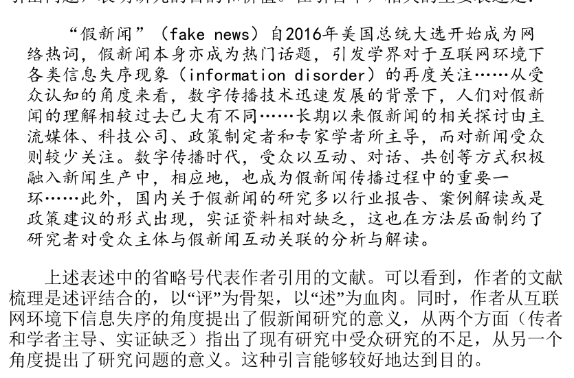
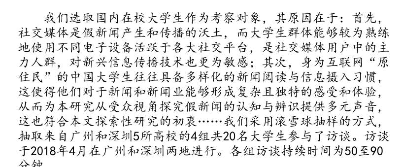
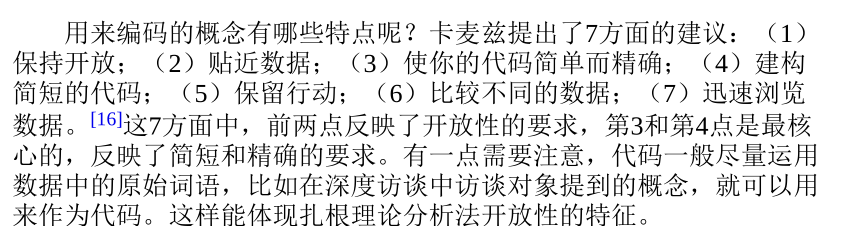
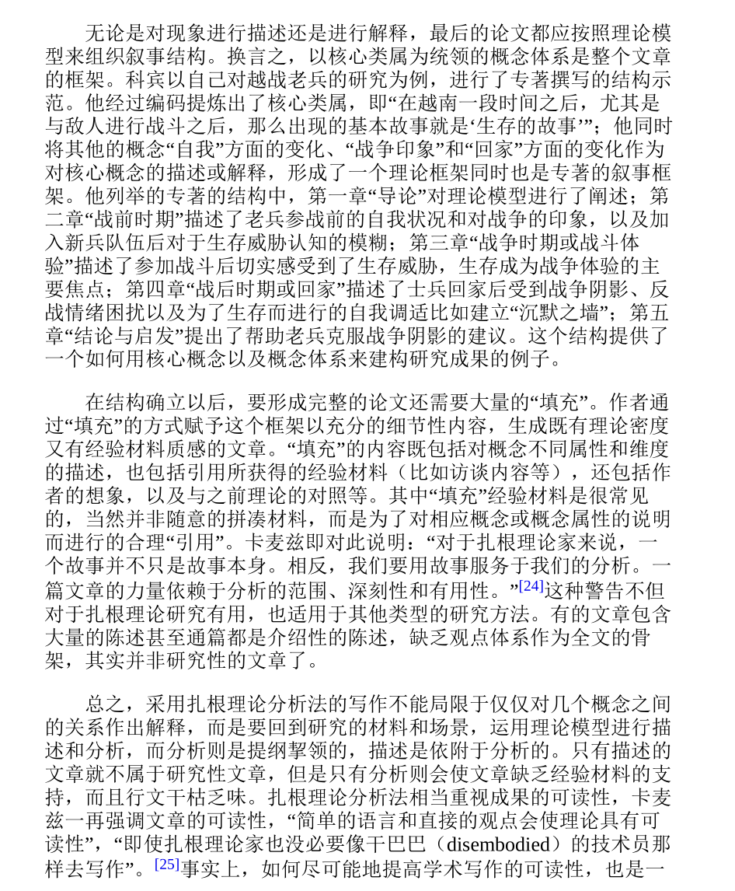
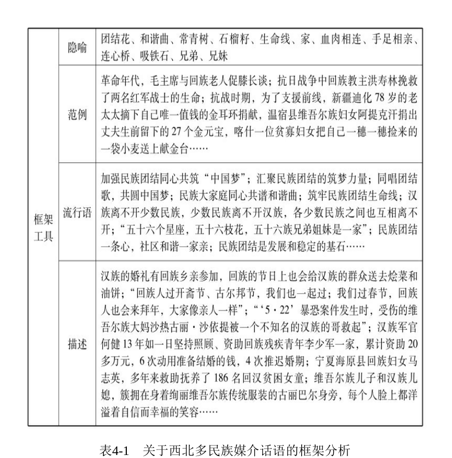
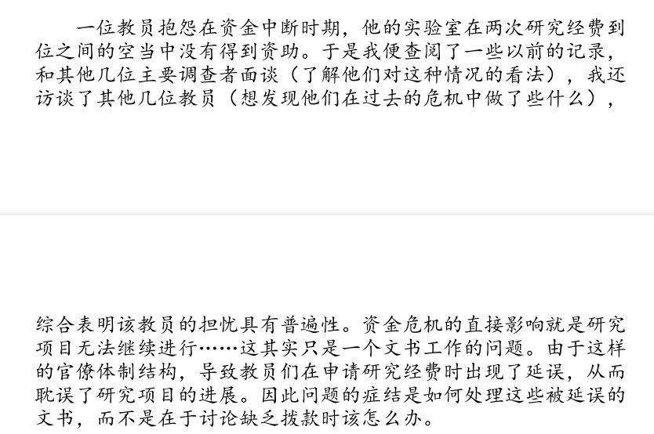

+ 是不认为社会现象与自然现象一样地具有所谓“客观”规律，因此社会研究的方法论不是去寻找这种规律
+ 解释主义也有自己的特点
  + 解释主义不追求所谓客观的规律，而是希望对社会现象进行“理解”.
  + 解释主义强调对社会现象的意义进行“理解”，“意义”本身是难以量化的，因此并不主张采取量化的技术。
  + 研究假设方面:解释主义既然认为不存在“客观”的规律，那么假设的前提也就不存在了，而是直接对研究现象进行分析。
  + 在结构性方面。实证主义方法有较强的结构性特征，比如研究假设、量化模型、研究发现、结论与讨论等,这些研究步骤就是一种结构性的,
     + 扎根理论分析法也要求进行编码这样的程序，可以称为“半结构性”的研究；
     + 不具备结构性特征或结构性特征很弱，比如话语分析法，基本上没有可以依据的程序或标准，可以称为“非结构性”的研究。
+ 解释主义是如何保证数据的客观性的
  +  解释主义也是经验主义的，也就是从感性经验出发进行研究的，这是为了保证研究数据搜集的客观性。
  +  社会科学的结论(你需要的理论知识)如何可以检验呢？它往往是抽象的，如何搜集经验材料是可以描述和评价的，人们可以以此判断一项研究是否客观(所以一定需要加上资料的收集过程)

+ 解释主义他的结构性不强但是你依然可以参考下面的5个步骤来书写.
  + 引言 引出问题,表明研究价值和目的,提出不足
  + 

  + 文献梳理
    + 解释主义他没有提出研究假设的任务. 解释主义研究不需要量化测量，但是一般仍然需要概念操作化过程
    + 比如《真实》一文的研究问题主要是受众在新媒体环境下如何辨识假新闻，那么应从哪些角度来分析这一问题呢？文章提出了三个方面：一是从生产方面，即新闻生产的“情境”；二是从假新闻的特征方面，即对假新闻的认知“框架”；三是从依靠何种标准来判断假新闻方面，即辨识假新闻的“路径”。
    + 同时注意你的概念化操作中注意逻辑自洽,细分的概念要能够回答你的问题,细分的概念他们之间最好有层层递进关系,不要出现并列的部分,很容易出现逻辑混乱.
   
   + 研究对象的获取
     +   解释主义一般选择采用非概率抽样.你的抽样是可以支持研究过程与结论的,比如运用焦点小组访谈法,都应当进行说明和解释
      

   + 研究数据的获取
     +  在解释主义研究中获得的数据远比实证主义广泛，除了数字外，还包括文字、实物等,可以是某个人的表情.  

   + 信度和效度的检验
     +   控制质量的重要手段是信效度控制,无论在解释主义中信度和效度叫什么,他们是保证论文质量和结论的质量的关键因素.
     +   扎根理论中 他的理论饱和度,就是较好的保证研究的课重复性,也就是一个信度检验.

   + 研究数据分析 两种主义关键区别
     + 量化分析方式重在建立起变量，然后将代表传播现象的经验材料通过概念操作化转变成不同的变量，再分析变量之间的关系，从而得出结论 
     + 概念分析方式是将代表传播现象的经验材料转变成具有传播理论意义的概念，然后通过对概念的解读或者通过对概念之间区别与联系的分析，获得理论性的结果。
        + 例如对于文本进行归纳,作者如果对“归类”的方法进行较为清晰的说明，预先提出概念体系，那么与后面研究发现部分之间的衔接也会较为自然一些。

## 研究方法
### 扎根理论
+ 方法的概述
  + 扎根理论是最接近自然科学方法的方法,他是对于数据的分析方法.
  + 它的这种特点体现在三次编码过程中对操作技术的具体规定，目的在于避免研究者的随意性和主观性。它对量化方法的借鉴还体现在根据材料中登录的概念反过来对材料进行分类
  +  因此它需要与其他方法联合使用。可与它联合使用的方法，如焦点小组访谈法、深度访谈法、文献法、开放式问卷调查法、田野笔记等
+ 方法的大体框架
   +  扎根理论论文的结构大致是：引言—文献梳理—研究方法—理论模型阐述—结论与讨论
   +  扎根理论的数据分析模式
      +  扎根理论他有个理性抽样,就是在获取数据后,除了首次抽样外，理论抽样总是建立在对之前资料的分析的基础上，依赖于分析中出现的新概念来提出问题，然后再次抽样来回答该问题,对于新概念你肯定需要理论解释的.
         + 所以扎根理论天然的优势就是,他可以不断补充概念出来,完善自己的逻辑
   + 研究数据的获取  
     + 一般地，与扎根理论分析法联合使用的深度访谈法、民族志法等方法中往往会运用访谈、观察（参与式观察）、调查等手段搜集资料。
   +  信度与效度检验
      +  另一种理论抽样和饱和度检验的方式是子样本模式，即在抽样时备有子样本，子样本专门用于饱和度检验,如果没有出现新的概念，或者很少出现新概念，就可以认为达到或基本达到了理论饱和.
   + 编码是扎根理论的<mesh>核心,这里和前面提到的非常类似,就是前面提出概念具体化操作
     +  分为下面三个步骤
       +  即开放式编码、关联式编码和选择性编码。
       +  开放式编码 :是从原始材料中提取概念的过程。
          + 在扎根理论分析中，分析的度内容单元可以是逐词、逐行或者逐个事件
          + 提炼出其中的理论概念，并在相应的数据上做好规范的备忘录标签
          + 如果受访者说“我们的手机24小时开通”，那么可以提取出与应急机制相关联的概念“手机畅通”
          
          + 开放式编码的结果是产生了相当数量的概念,第一个办法是剔除,另一个重要的办法是对概念进行类属化，也就是对同类概念进行合并
       + 关联式编码
          + 关联式编码的任务是对第一步中获得的初始编码进行分类，将同类的或关联的编码划分在一起
          + 轴心编码的方法，就是把在开放式编码中获得的较多数量的概念或范畴分成内部相关联的几组，每个组内均有一个“轴心”概念，其他的概念都对“轴心”概念起着不同维度的描述作用
          + 例如 :根据卡麦兹的说法，其他概念可以从“谁”“在哪里”“什么时间”“为什么”“如何”“结果”[18]等维来回答“轴心”概念
       + 选择性编码(两个步骤)
         +  第一步是发现核心概念或核心类属，它要能够将其他概念或类属联系起来
         + 作者以确定的核心类属为中心或塔尖，将其他类属作为对核心类属的描述、陈述或解释等
  
       + 理论模型与阐释
       + 即研究的最后要形成理论
           + 目的在于对现象进行分析并指出“为什么”；
           + 也可能是解释主义的，目的在于对现象进行陈述而指出其“是什么
       + 

### 框架理论分析法
+ 引用的论文 :媒介话语动员：建构民族团结的一种策略——基于西北多民族报道的框架分析》
+ 基础认知
    + 扎根理论分析法需要三级编码，而且编码之前没有设定理论概念作为依据；而框架理论分析法只需要一次编码，而且在编码之前要设定概念体系。因编码过程的存在，框架理论分析法显得较为“客观
+ 核心概念
    + 我们可以看到‘框架’的核心含义延续下来，那就是传播者经由主体认知对社会现实的建构,赋予“框架”的含义都是一种对世界的认识方式，
+ 研究的范围和领域:
    + 框架理论的运用范围颇为广泛，涉及传媒研究的三个领域，即传媒的生产框架、内容框架、受众框架
  
+ 框架理论具有结构性(因为它有编码的环节)5部分的结构：
    + 引言—文献梳理—研究方法—研究发现—结论与讨论。
  
+ 框架理论研究对象的获取
    +  采用框架理论分析法时，研究的问题不同，抽样的对象和资料收集方法也不同
        + 例如:比较常见的是对内容特征的分析，因此相应地常见到对文本进行抽样的情况。对文本抽样时，一般先确定关键词，然后在相关的报刊数据库中搜索文章 

+ 研究数据的分析(两个步骤)
    +  具体的框架理论
        + 这种“框架”其实是一个概念体系  ,这种框架一般都是直接使用别人成果,自己改进,自己构建难度非常大.

    + 常用的框架模式
         +  话语分析框架
            +  将新闻话语归纳为一系列的概念类别，在客观上与框架分析建立了契合之处。梵·迪克的新闻话语框架由10个概念构成，其中归属于摘要的有2个，即标题和导语；归属于正文的有8个，即主要事件、结果、境况、先前事件、历史、各界反应、期望、评估
        + 台湾学者臧国仁提出的框架(大陆学者所采用的方法)
            + 即“高层次指的是事件的抽象意义，或是主旨，通常难以辨识。中层次则由主要事件、历史、先前事件、结果、归因以及评估等几个环节组成，有些事件包含了所有上述环节。低层次指的是框架的表现形式，系由语言或符号组成，包括字、词、句，以及由这些基础语言所形成的修辞或比喻
        + 诠释包裹”（interpretivepackage）框架 
            + 他的“诠释包裹”理论被广泛采用。他将新闻框架分为两类，一类是“框架装置”，包括隐喻、描述、短语、论据以及视觉影像；另一类是“推理装置”，包含的元素有问题来源、后果或事件影响、责任归咎、解决方案、道德呼吁。
        + 类目登记
            + 框架理论分析法既可以采取与内容分析法相同的频数统计方式，也可以作为质性研究而不严格地进行数学模型运算,而框架理论分析法需要运用框架理论事先确定概念体系，然后根据概念体系对文本进行分类。
            + 
+ 理论阐释
    + 做质性研究，则一般进行纵向分析，即通过对各个框架概念本身的解读来揭示理论意义，
    + 如果属于量化研究，则一般对框架概念的统计结果进行横向比较，也就是对不同框架概念的出现频数进行对比，通过对“多”和“少”对比效果背后意义的发掘来建构理论。

### 民族志研究法
+ 民族志的研究目的
    + 民族志起源于文化研究的传统，即“试着尽可能详细地描述一种文化或一个社会群体”[
    + 如果说内容分析等方法最接近于自然科学方法，那么民族志却有一些处于科学性与文学性之间的特征
    + 这句话不是否定民族志方法的科学性，而是说它具有一定的描述性气质
+ 独特的民族志方法
    + 传播民族志的理论基础是，社区的文化影响传播，因此观察传播就可以反过来研究文化。 
    + 传播民族志的文化研究是基于符号学理论的，即交流符号在具体情境下的文化意义，这里的文化包括制度、风俗、宗教、饮食、服饰等；
+ 名族志研究的模式
    + 名族志研究的论文结构大致仍然为：引言—文献梳理—研究方法—研究发现—结论与讨论。
+ 研究对象的获取(两个层次的抽样)
   + 第一个层次是对社区抽样，因为民族志研究的本质是深入情境，在语境中阐释符号的意义
   + 第二个层次的抽样是对人或事件等。第一个层次的抽样仅仅是提供了田野调查的场所，而要开展真正的田野调查，需要明确作为对象的人或事件等。(在抽样中你可以采用挑选法,你认为非常适合你的研究)

+ 研究数据的获取
    + 民族志法进入研究数据获得阶段，也就是具体的田野过程或田野调查阶段,一些研究者提供了手册般详细的指南，包括研究者如何进入田野社区、如何沟通等.
+ 名族志是如何保证它的客观性？
    + 民族志不采用实证主义范式，也不采取编码的方法,民族志学者提出了三角测量的方法
    + 三角测量的实质是验证材料的真实性，提高资料的质量和研究结果的精确性
    + 三角测量最关键的是要采取多种途径去核实和验证每一个观点（角度1）
    + 

+ 民族志的书写
    + 可能前面三部分分别是“引言”“文献综述”“田野场所情况”之类，属于研究问题的提出、理论的介绍、工作的报告等；从第四到第五部分才是民族志书写。《录像厅》一文也基本上是这个结构。
    + 民族志书写实际上又分为两个部分:
        + 论文第四部分可以称为民族志描述，是对民族志田野中的发现进行细描和深描，回答“是什么”的问题；
        + 第五部分可以称为民族志分析或讨论，是以田野描述为基础进行的理论分析，回答“为什么”的问题。

### 深度访谈法
+ 深度访谈的概念
    + 在很多研究方法中都可用到访谈，比如调查研究法、民族志研究法等，但这些方法中不一定会用到深度访谈。就访谈的内容强度而言，深度访谈的对象少，但强度要大得多，需要较长时间地、从较多角度进行交谈.
    + 深度访谈除了收集文字意义外，还可能收集动作、神态、表情等方面的信息.
+ 深度访谈法的设计
    + 即也采用“引言—文献梳理—研究方法—研究发现—结论与讨论”这样的模式。不过，由于多人深度访谈的论文并不多，
+ 研究对象的获取
    + 深度访谈同样需要考虑结论的科学性，因此访谈对象人数的确定虽然要视情形而定
    + 访谈对象没有新的观点出现或者出现很少，那么可以认为人数是充分的了，理论饱和度来决定理论抽样
+ 研究数据的获取
    + 确定主题与提纲
        + 访谈问题的设计对访谈的成功具有基础性的作用
        + 所提问题在结构上应该有纵深感
        + 不是完全并列式的。也就是说，要就一个问题进行“追问”，甚至步步“追问”，这样才能把访谈对象潜意识里的知识、观点或见解激发出来
    + 实施访谈工作
        + 深度访谈的实施对访谈人要求较高 ,深度访谈是对研究者专业能力要求较高的
        + 
+ 信度和效度检验
      + 笔者建议借鉴民族志中的三角测量法,
+ 深度访谈法的书写
    +  对一人进行专访后形成的论文，往往重在体现访谈交流的原貌，也就是多数内容是以对话体的形式表现的。
    +  多人深度访谈的分析与写作可参考扎根理论分析法部分

### 文献分析法
+ 文献分析法和文献梳理的区别
    + 文献梳理仅仅是文章的一个部分，依赖的数据是一次文献中的学术文献，梳理的目的是为了厘清研究动态，建立研究问题的合法性；文献分析法则是针对整个文章的研究方法，依赖的数据主要是零次文献和一次文献中的非学术文献。 
    + 传播研究中同样有文献分析法，比如相当多的新闻史或传播史研究都采用了文献分析法，只不过没有声明而已
    + 例子: 摘要的第一句就提出：“本文采用知识社会学的研究路径，运用各类文献材料考察了起源于美国的调查性报道导入中国的历史过程，关注这一过程中观念、实践与话语的互动机制,它所用来分析的文献远远超出了学术文献的范围，甚至根本就不是以学术文献为主的。
+ 研究对象的获取
    + 文献分析法所用来分析的文献不能通过抽样产生
    + 文献收集来了，也应通过细读，将有用的作为材料，没有用的就放弃
+ 研究数据的分析
    + 这并非“概念先行”的研究方法，而是只有通过对文献细读、整理、分析之后才能得出结论。
+ 信度与效度检验
    +  文献分析法也并非不能检测研究的信度，即可使用理论饱和度的概念来测试——如果收集到的文献通过分析后已经足够支持结论的产生，
+ 文献分析法的书写
    + 献分析法也不属于结构性很强的研究方法，即它的研究程序和论文结构都较为灵活，
    + 文献分析法论文如何体现出学术性?
        + 其一是观点或结论要来源于对文献的分析，而非自己主观的想象和议论
        + 二是分析的概念框架要有系统性，能够体现出清晰的分析逻辑
  
### 文本分析法
+ 文本分析的基础概念和误区
    + 文本分析法和后面的话语分析法一样，它们实际上很难被称为研究“方法”，因为你很难归纳出某种程序、技术、手段等具有“方法”特征的元素。
    + 文本分析法与“对文本的分析”也不同，前者可以作为一种研究方法，后者则泛指所有以文本作为研究资料的研究方法
    + 文本分析法属于解释性研究，即通常所谓的质性研究；内容分析法属于实证性研究，即通常所谓的定量研究。文本分析法,不需要编码过程，而内容分析法需要编码过程

+ 文本分析法的理论取径
    + 文本分析法并非一种结构化的研究方法在此并不介绍其结构化的方法设计，而是介绍几种理论取径
      + 三种理论路径
        + “新批评”法
          + 过细读来捕捉词句中的言外之意、暗示和联想等，
          +  其操作过程大致分为以下三个步骤：首先是了解词义，然后是理解语境，最后是把握修辞特点
        + 叙事学方法
          + 经典叙事学旨在对叙事作品的构成成分、结构关系和运作规律等展开科学研究；
          +  关注作者、文本、读者与社会历史语境的交互作用
        + 符号学方法(研究的三个方面)
            + 一是研究大众传播中符号与符号的组织关系，如大众传播语言组织规律，文本和话语的结构，语言符号和非语言符号的搭配等
            + 二是研究大众传播符号的意指作用，能指与所指关系的发生即意义的生成和传达等问题；
            + 三是研究大众传播符号与符号使用主体之间的关系，着重探讨媒介话语背后所隐含的社会认知和意识形态因素。

+ 如何展示科学性的
    + 文本是否真正体现出了研究者在文章中所呈现出来的“意义”，是判断文本分析论文科学与否的标准 

