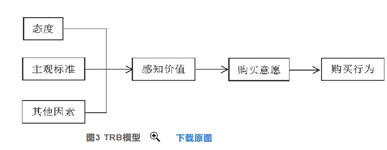

+ 无论短视频还是新媒体他们的广告相较于传统都有了明显的区别,

+ 论文一
  + 短视频广告的制作和传播技巧
    + 增强视觉符号的表现力 
    + 设置“爆款”话题，实现“病毒式”传播
  + 短视频广告传播应用革新

+ 硬性广告和软广告在新媒体平台下用户的态度

+ 评测广告 是如何树立广告信任的  还有具有什么广告效果

+ 合理设置推送频率，同时精准计算推送时间，设置一定的时间差来降低消费者对于隐私被追踪或被监控的不适感。
+ 短视频广告生产商
  + 短视频平台大多是依靠UGC（用户生产内容）、PGC（专业组织生产内容）、PUGC（专业+用户生产）等的模式来进行内容的传递
+ 短视频广告的类型
  + 开屏广告：打开抖音应用的第一入口
  + 信息流广告：以一种“嵌入式”的模式插入用户的浏览中
  + 植入类广告：可分为剧情中插即场景式广告、情感式广告,可能是主人公读广告词或者视频中出现产品样品，引起用户的情感诉求。
  + 博主推荐、测评、展示类：这类广告由于形式多样且比较亲切，让受众有很强的代入感，，推荐用户购买，同时给出自己的使用感受和体验
  + 按照制作者或发布者划分：
  + 一是MCN机构运营，MCN是一种“网红经济”的运作模式，
  + 官方账号运营，企业会注册属于自己的账号发布品牌的软广告、品牌故事、
  + 三是个人账号，又名意见领袖运营,某个领域的专业人员对该领域的知识和产品拥有丰富的知识和独到的见解，如李佳琦、薇娅等职业带货网红，
  + 四是电商合作模式，在抖音短视频软广告处添加了电商的渠道连接，
  + KOL广告:KOL即“关键意见领袖”(Key Opinion Leader，简称KOL)，是营销学的概念，通常被定义为拥有更多、更准确的产品信息，且为相关群体所接受或信任，并对该群体的购买行为有较大影响力的人
    + 意见领袖 :意见领袖在何种领域具有知名度、发言权，对粉丝或微博用 户能够产生较大影响
    + 兴趣领域的划分主要包括情感、电影、搞笑、科技、 美食等，此处的活跃领域同样可以作为细分依据
    + 广告主对于KOL活跃领域做出选择 的实质是希望寻找与自身品牌或产品的高度契合的KOL,这种契合度越高，传播效果会越好这种契合度越高，传播效果会越好
    + KOL广告自身带有的不确定性,有可能正相关,也可能存在负面相关.
  
  + 测评类广告:他认为口碑是人和人之间面对面的交流行为，是人们在信息的交换过程中对产品或者服务产生的带有个人观点的评价信息。结合口碑的概念可得，微博测评类广告是一种以类口碑信息为内容的广告。(微博“意见领袖”与测评类广告效果研究)
     + 这里有一个维度:测评类广告中产品的契合性会影响到其在广告内容中表达的个人独特体验等信息的可靠性,让人感觉更“接地气”，更愿接受.

+ 广告效果
  + 主体自我意识状态或客体自我意识状态——对广告效果的影响。
  + 广告诉求是广告信息的核心内容，是影响广告效果的决定性因素。
    + 两种诉求:利他诉求(理性广告诉求)更注重他人或社会所获得的利益，而利己诉求则更关心产品或服务给消费者提供的利益
    + 当消费者的个人自我被激活时，利己诉求的广告效果更好(White et al., 2013)；而当消费者的集体自我被激活时，利他诉求的广告效果更好 ,感性诉求广告指的是涉及到人的情感诉求层面的广告，
    + 
  + 信息加工流畅性会对消费者评价、广告态度及其购买意愿等产生正向影响。(“察自身”还是“观世界”？社会化媒体使用中消费者自我意识状态对广告效果的影响),
  + 路易斯提出AIDA模型:广告效果分为注意、兴趣、欲望、行动四个阶段
  + 1973年迈克尔·雷提出的根据产品感知差异和卷入度来确定“认知—情感—行为”这三个阶段的三种不同次序的信息处理的三维模型。
  + 日本电通公司消费者生活形态的变化提出一种全新的消费者行为分析模型：注意(Attention)—兴趣(Interest)—搜索(Search)—行动(Action)—分享(Share)。该模式指出，网络时代的信息流向变成了由“SAS”形成的自我循环，消费者的参与和互动成为最显著的特征[5]

+ 广告用户需求区分
  + 第一种类型,直接搜索包含关键词推荐,这种观众是明确具有商品需求
  + 第二种类型,普通观众直接观看博主视屏,他们是没有明确的商品需求的.

+ 视频博主的选择
      + 专门选取那些具有品牌标题的博主. 

+ 不要使用第一人称摘要,需要使用第三人称摘要.