## 学习过程
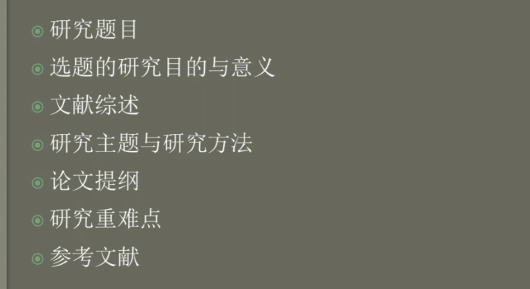
## 科学与研究导论
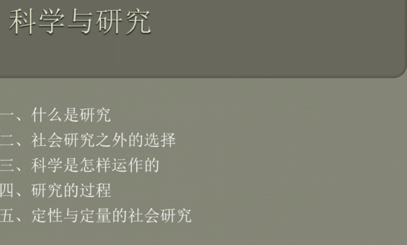

### 为什么要进行社会研究
+ 寻找实际问题答案(这个也是你整个学期研究的动力)
+ 得到决策信息
+ 想要改变社会
+ 建立关于社会的基本知识(纯理论的研究,解决社会结构的问题,不分民族 国家)

### 什么是研究
+ 一种发现问题答案的方法.

### 社会研究之外的选择
+ 权威
+ 传统
+ 常识
+ 媒体的神话
+ 个人经验

### 科学共同体
+ 普遍主义(只以科学价值去判断)
+ 组织化的怀疑论(答辩环节,从头到尾,研究的任何细节进行提问)
+ 无偏见(在研究过程中有意去寻找相反的价值导向)
+ 共享主义(与他人共享,知网)
+ 诚实

### 科学的方法和态度
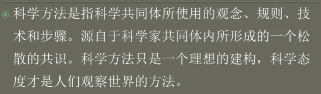
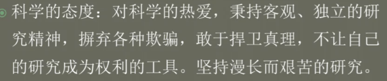
+ 科学中的期刊论文(中外研究概况, 所以你会考虑只限于国内吗)
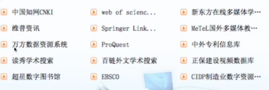

### 研究过程(整个流程都要查阅文献)
+ 2 聚焦研究(明白你的研究对象 ,描述你的研究问题 ,这个时候你要阅读文献,研究范围过大,往往出现在这个过程,找那些研究较少,意思就是你有研究的空间)
+ 3 研究设计(这个就是开题报告)
+ 4 收集数据(千万不要用链接,下载到本地)
+ 5 分析数据(发现了一些规律和现象,描述清楚)
+ 6 解释发现(很多环节都是循环往复的)
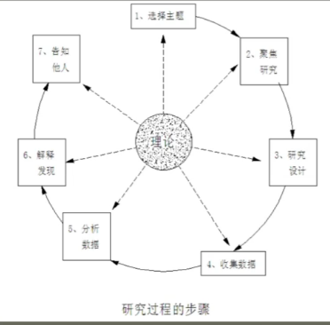

### 透过案例来了解研究过程
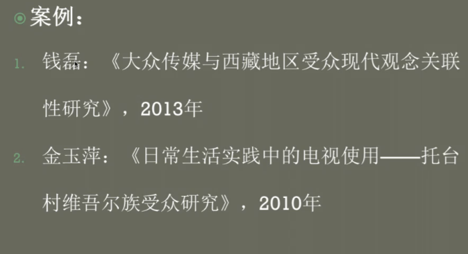

#### 第一篇
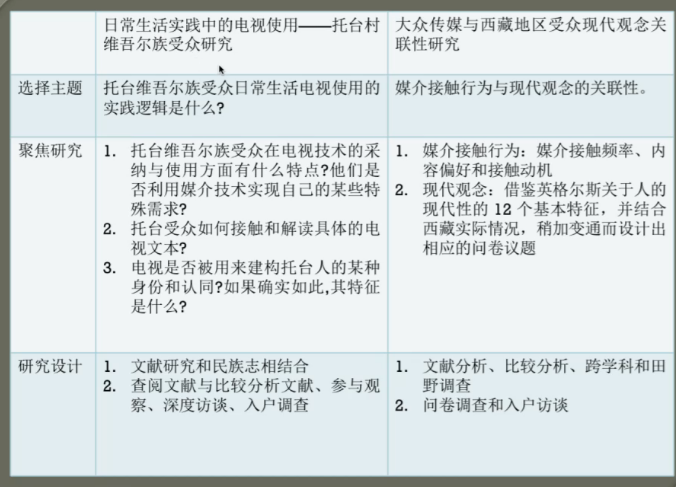
+ 选择主题: 他们是如何看电视的,

+ 聚焦研究:
  + 1. 他们是如何选择电视和使用电视
  + 2. 看他们在看电视的时候再谈论什么
  + 3. 一个老大爷说:"电视是有钱人看的",通过电视构建了阶级

+ 研究设计
  + 名族志 参与式观察,融入到村里面

## 定性和定量的社会研究(重点)
+ 2 测量客观的事实 
  + 不能随着时间而变化的客观事实 ,定性是个人想象的,自己对于某种解释
+ 3 焦点是互动过程事假
   +  定性:人们讨论谈论某个时间的过程,解释他们行为的意义
  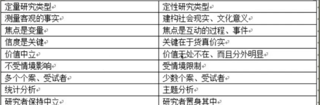
+ 有信度才会有效度.
  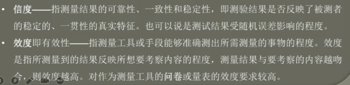

### 推荐阅读
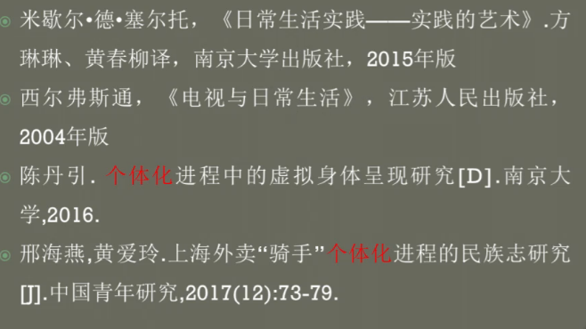