## 研究的维度
+ 基础研究(大范围研究纯理论研究)

## 研究的维度(研究的三个阶段)
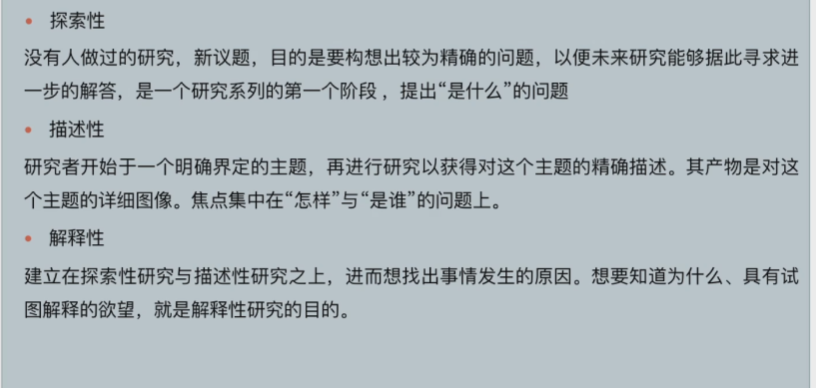
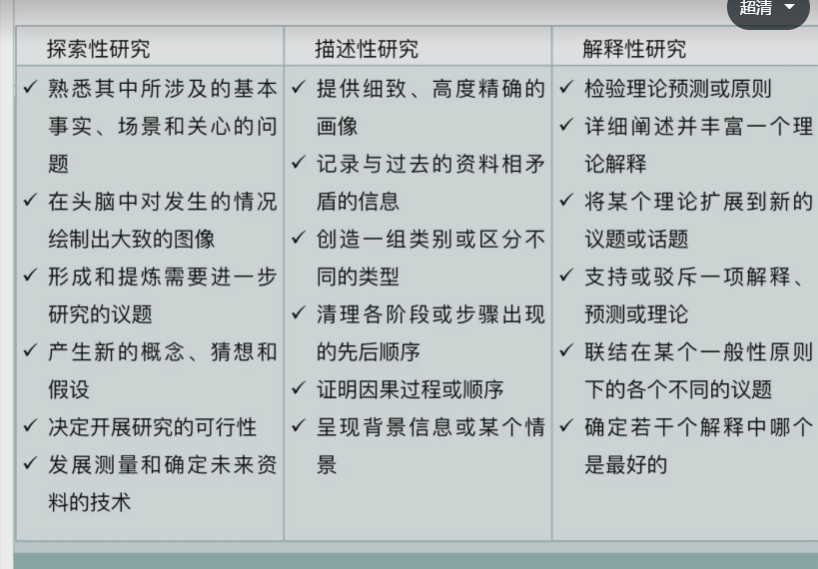
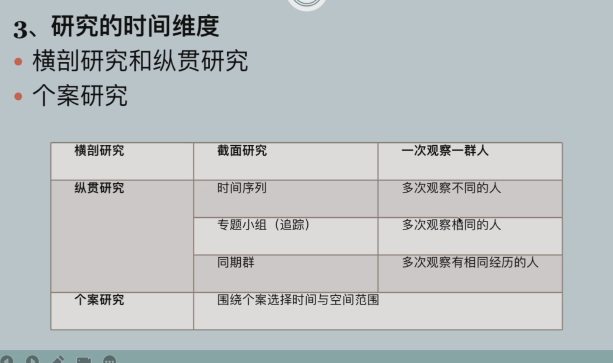
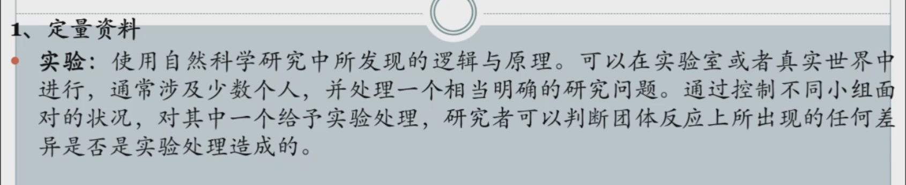
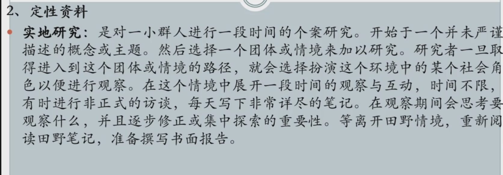

### 案例
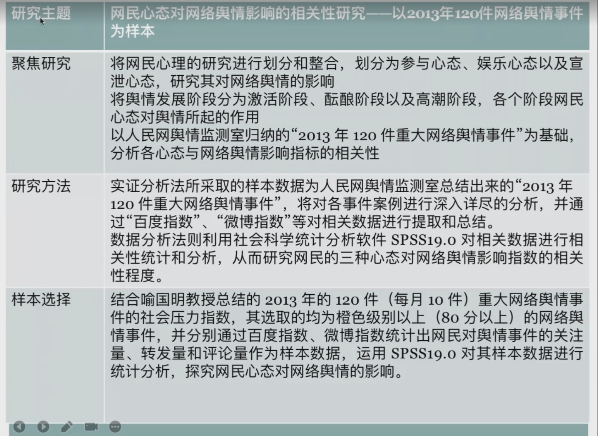
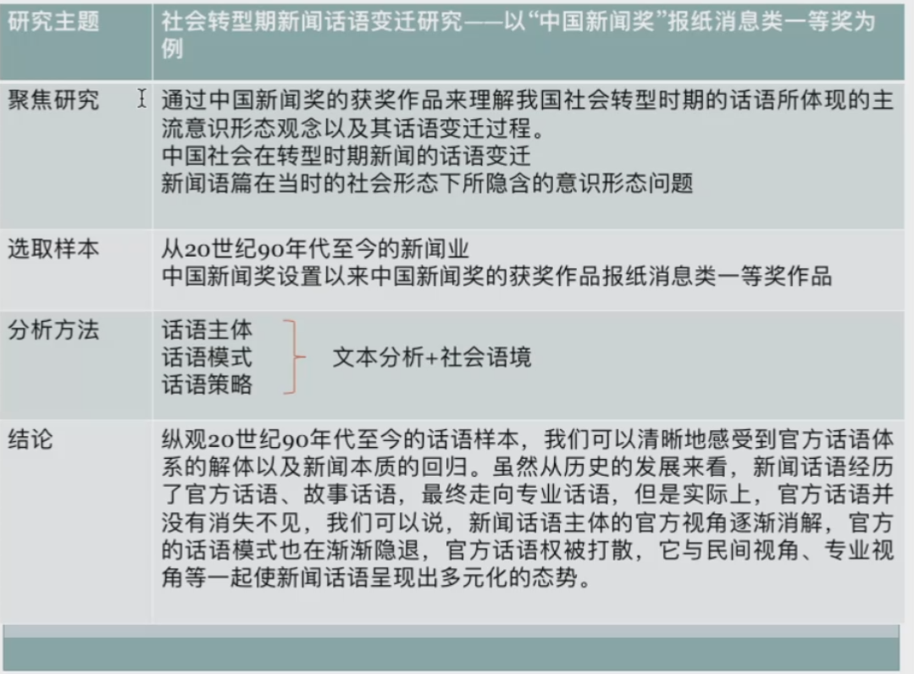
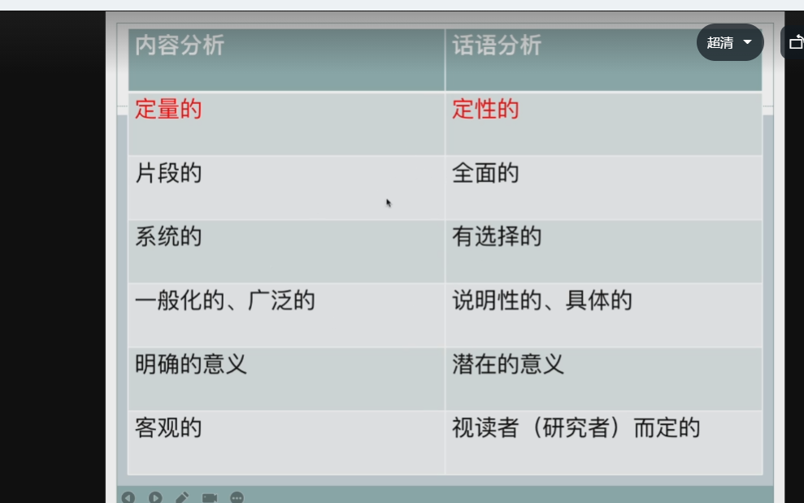
+ 全面的意思都是你要解读背后的逻辑
+ 有选择的代表的是你要分析有代表性的
+ 一般化的 要求普遍性跟公式类似.
+ 潜在的意义,解读语句之间的关系,语句背后的潜在意义.
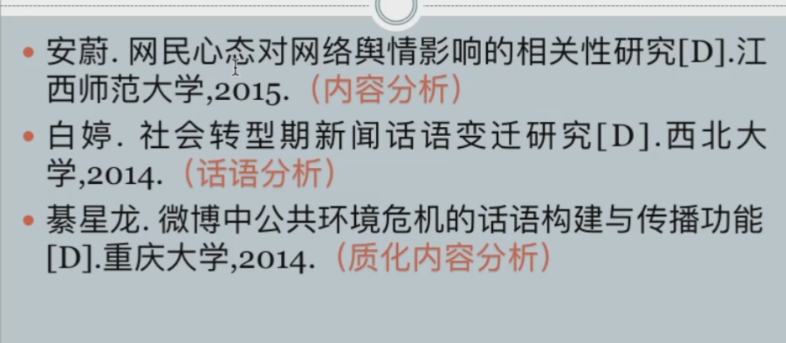

+ 透过符号和语言透视传播现象,也就是说透过文本最终解读社会传播

+ 基本的站位还是在定性上面

+ 质化分析 提倡提问的方式聚焦研究,一篇论文就是回答这些问题
+ 质化分析依然通过小样本
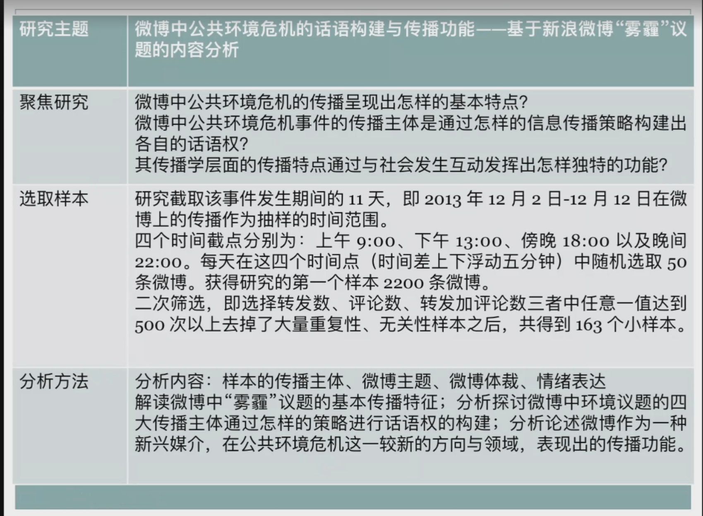
+ 具体分析
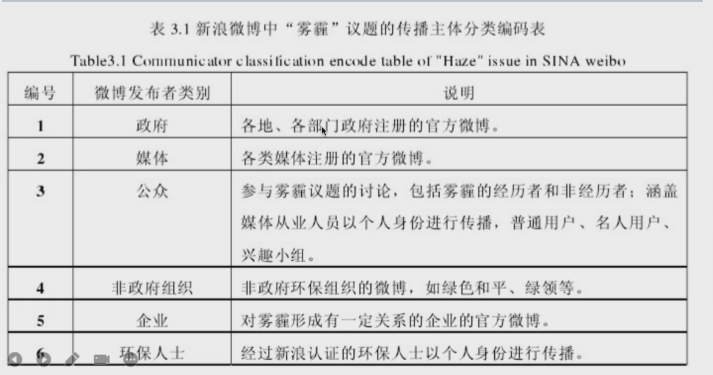
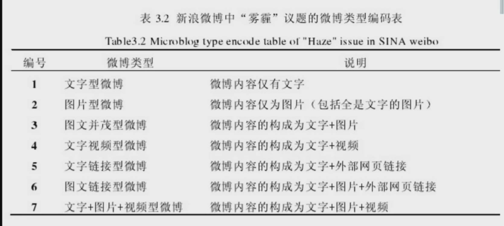
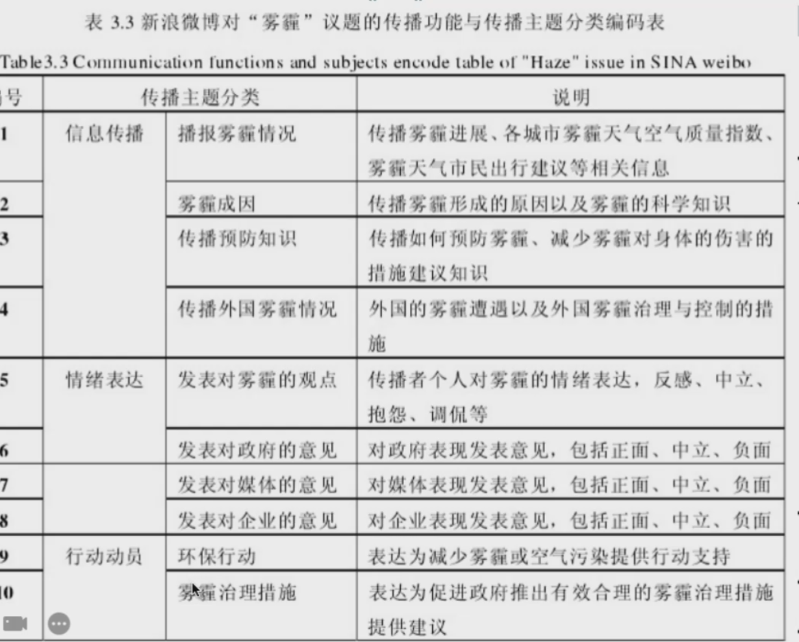
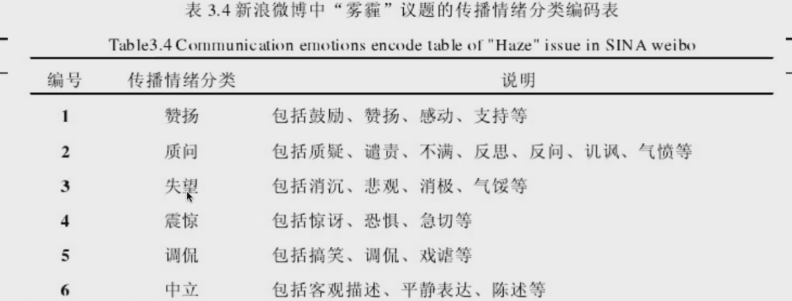
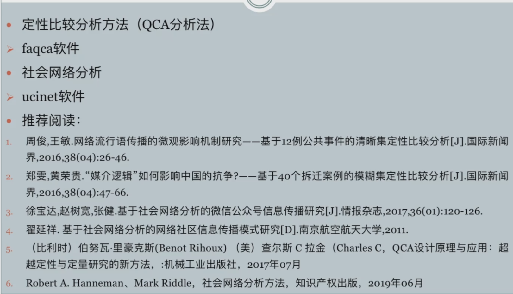

