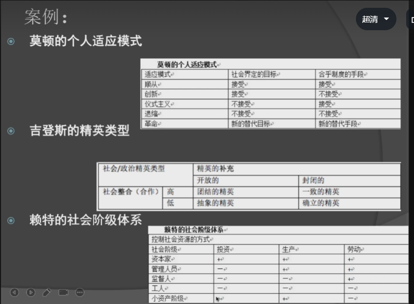

+ 你不能把意识形态当做理论,如果这样研究就出现了大问题.

+ 意识形态具有无可置疑,这是在履行他自己的最根本的任务,太过绝对正确了.
+ 意识形态是一个结论在先的理论,他会使用狡猾的手段模糊论证逻辑,例如发展和思想,两个互相论证,发展促进思想,思想推动发展,除此之外没有其他的论证.意识心态根本就是在价值判断,而学术论证是在论证价值,看他的条件下,价值是正确.
+ 不要在选题中用了意识形态.
+ 马克思主义 意识形态,在学术界是叫做马克思哲学
+ 案例:
   

.png)
+ 理论分类 可以做到 从高纬度抽象概率 下降成低纬度概率,变成单维度的概率,有利于我们去研究.

+ 一定需要在大量论文中,进行分类供你的论文进行写作.

+ 通过分类不断拉低维度:然后在找出他们的的共同点,写入一篇文章.

