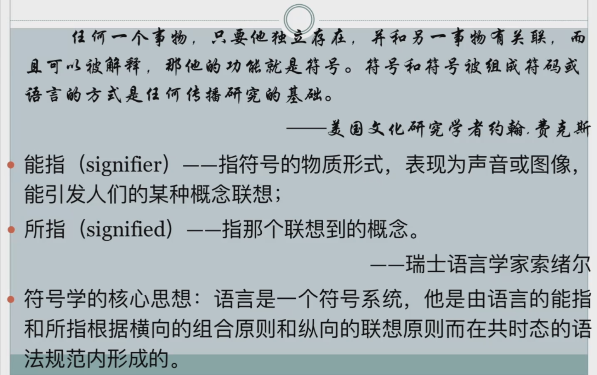
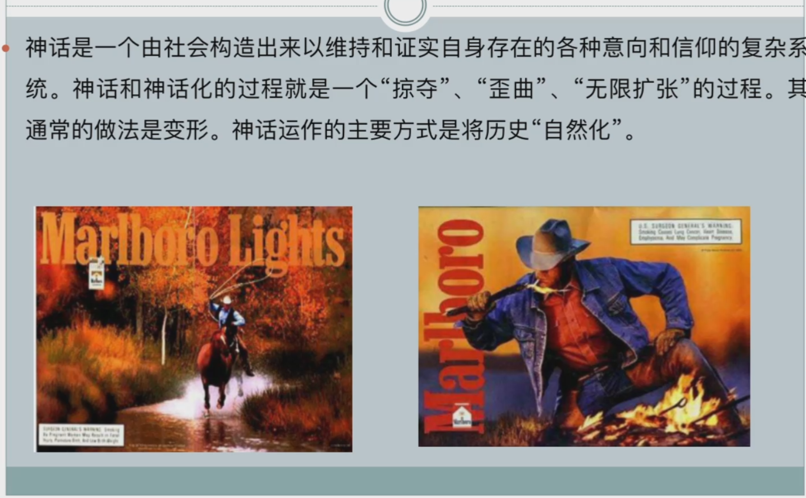
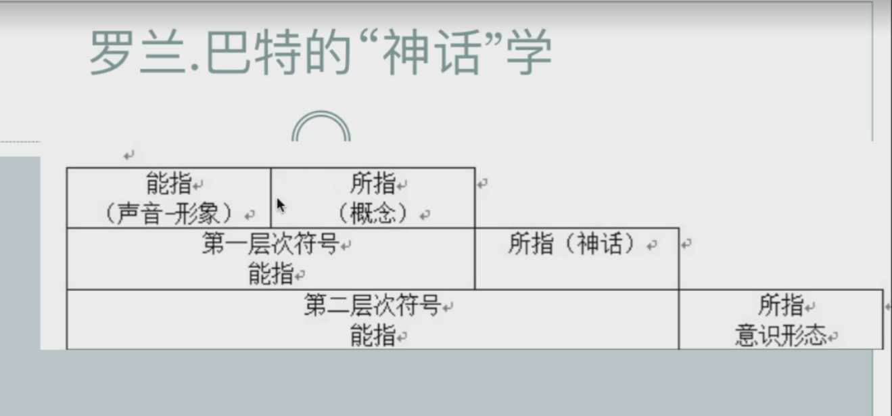
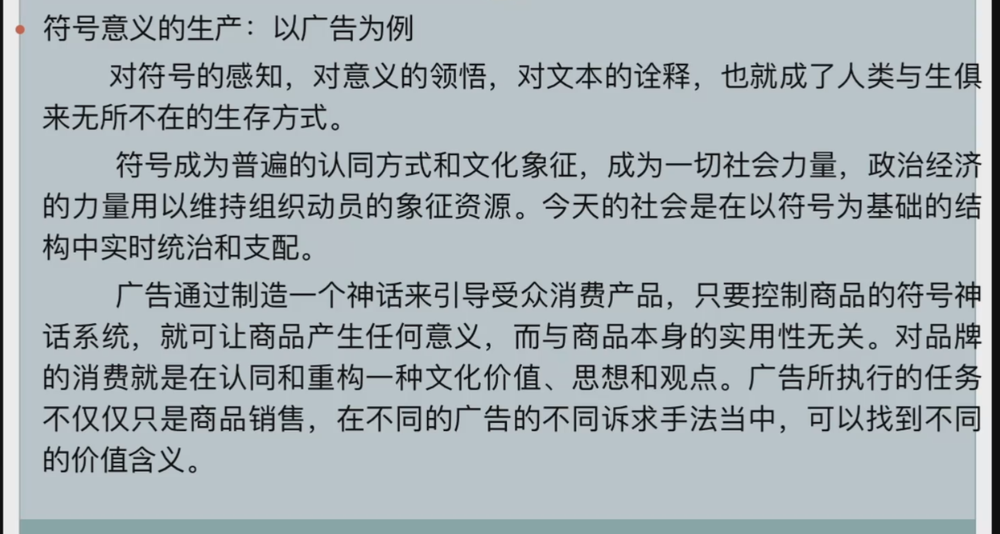
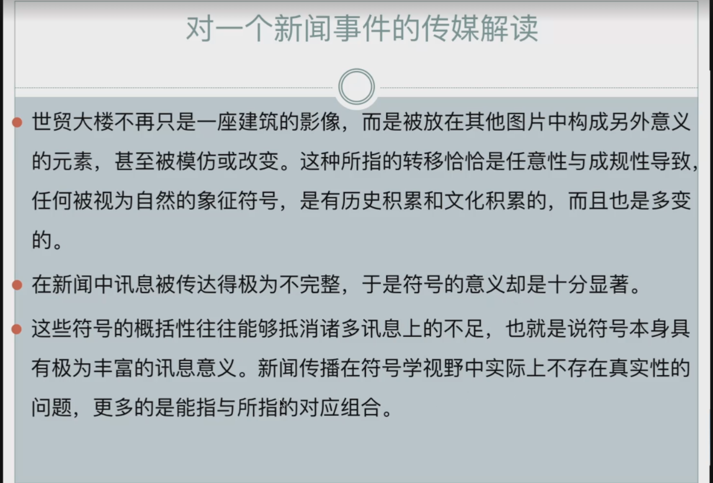
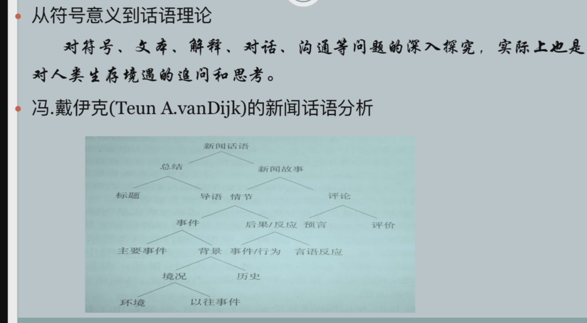
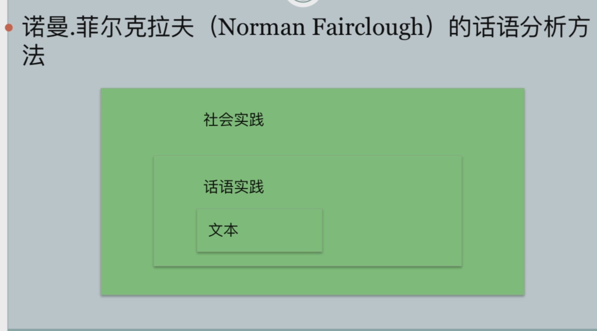
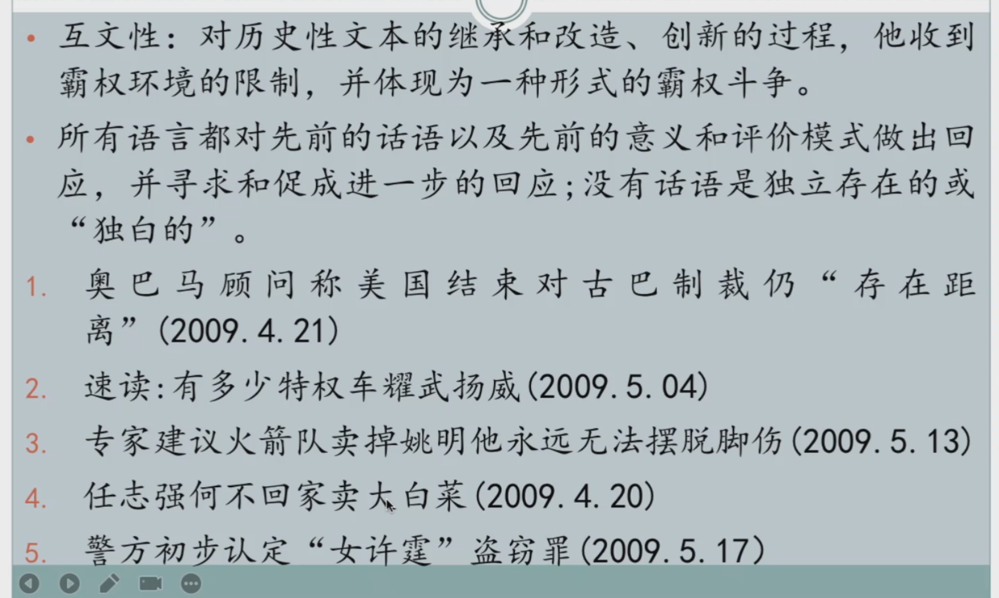

+ 能指: 你想到水瓶这个物理本质
+ 所指: 水瓶是由钢做的.

+ 神话化过程就是,人为制造一个所指(意义)赋予到到能指,让你察觉不到.自然而然的想到两个之间的关系,这就是神话过程

+ 图片中第一层 能指是图片 所指 广告
+ 第二层 能指 广告  所指牛仔
+ 第三层 万宝路香烟  所指 非常man非常霸气
+ 你就自然而然的得到了广告的含义,这就是符号的神话化过程,让你自让而然的接受.
+ 所以牛仔就被纳入到美国符号系统,代表男性气质.
+ 语言是一种符号,而人和行为都是一种符号,人的行为都是由意义的,你要解读这些符号的意义,也就是人的意义,这样你就可以通过语言解读社会.

+ 解读符号的文本,文本也是符号,符号有所指,所以你就是在解读后面的意义,意义的传递都是通过符号建构来传递.
+ 你能理解符号是因为,你能能够自然而然的接受符号所构建的世界.

+ 广告是营造一种神话让你消费
+ 在他的能指上面给你塞一个所指,让你相信某种神话.

+ 符号学不去关注事实的真像,而是关注这个事实是如何构建出来的,能指和所指他们是如何传递的过程.
+ 
+ 
+ 话语实践 是指记者报道的过程,采访了几个人,他们之间是如何报道的.
+ 社会实践 ,记者在当时环境是如何报道的.

