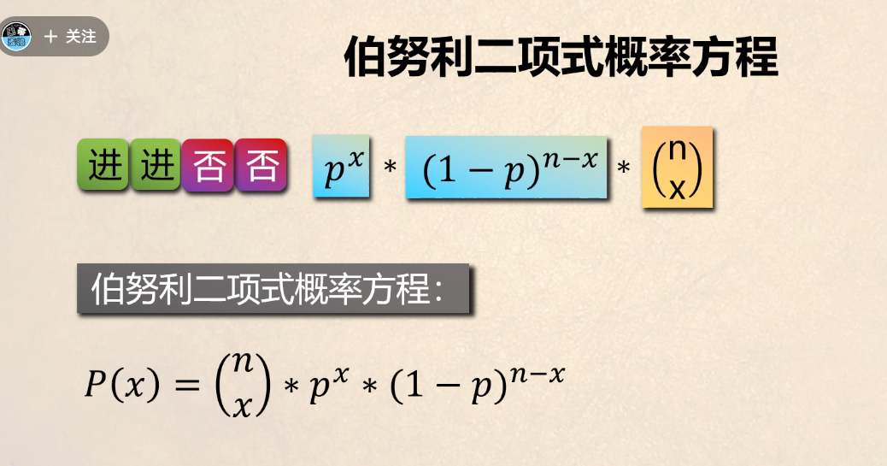
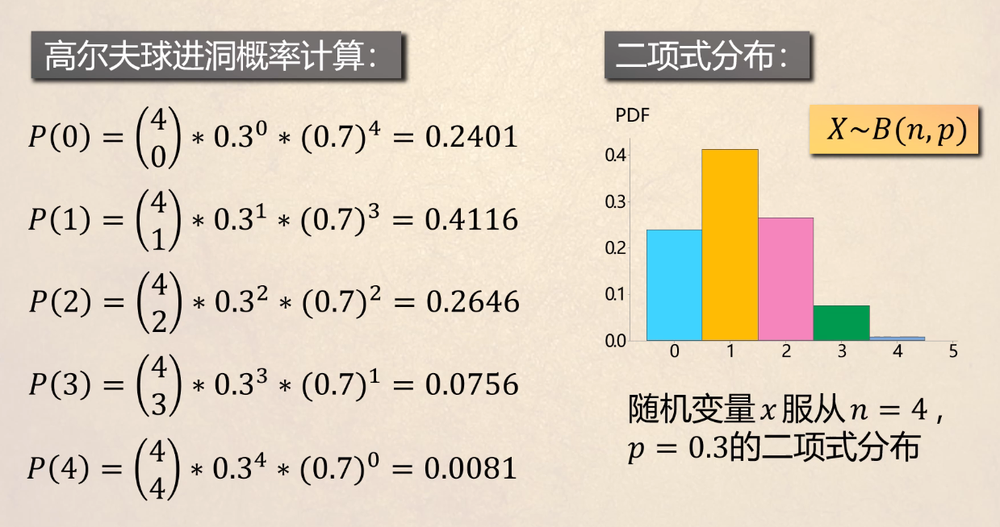
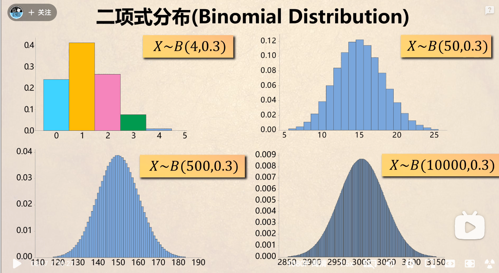

## 二次项式研究的范围和目的
+ 范围 多次重复实验
+ 每次实验概率相同，前后实验互不影响
+ 每次的实验只有两个结果，成功和失败，这也就是为什么叫做二次项式
+ 研究问题 在n次实验下m次成功的概率是多少
## 二次项式根本来源于伯努利方程

+ 方程= 第一项 是m次成功的组合有哪些，为什么不是排列，因为要求的是成功m次所以排序没有前后关系
+ 第二项 p是成功概率 ，x是成功次数，当然p 的x次方当然计算的是，x次成功的概率是多少，成功多少当然还有失败的次数也要乘进去，   -----为什么还要失败的次数，因为我们每次都是进行完成实验，所以整体的组合不是只有多少次成功，而是还包括失败的组合，
+ 最后 前面第二项是计算的单次成功的概率，你还有区分出成功的组合才能得出真正的概率，也就是把所有可能成功的概率加起来，就是整个成功的概率，也就是与第一项相乘，一样的结果

## n和x的变化

+ 我们发现随着次数的不断增加，越来越趋向于一个圆滑的图形，这个就是魅力所在。