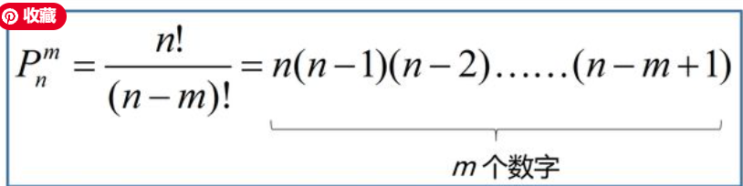
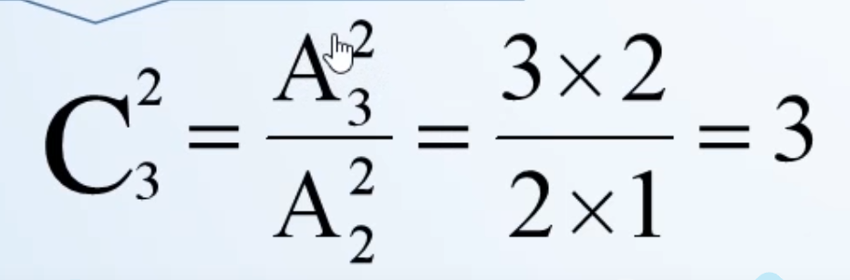
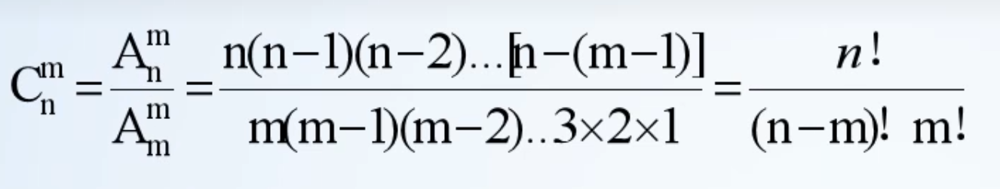

## 排列  Arrange

+ 理解其中的公式 上面的阶乘是n！他是由 n-0* n-1* n-m+1带来的，这个公式理解排序第一位n个中选出一个，然后n-1中，直到第m个也就是n-（m-1),
+ n!是由分子分母同时扩充n-m！得到的

## 组合 C n/m

+ 组合是由排列推到出来的，公式中，我们使用排列计算出3个中选两个的所有排法，组合不需要排序，所以我们用总的排法然后除以每组中存在的排法   -也就是2个中有两个排法的可能，这个是多余的。我们消除掉每组的排法自然得到了有多少组。
  
  
  +由第一个式子衍生推算出来的
