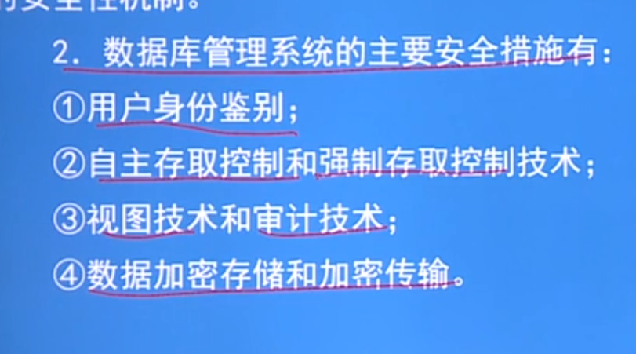

# 数据库安全的主要知识点

## 两种数据库安全标准
+ 美国最开始的安全数据库标准 TVSEC/TDI 标准, 分为四等防卫级别
1. D级 没有任何防卫措施
2. C2级 我们要求的最基本的防卫底线
3. B1级 MAC 强制存取控制技术
4. B2级 DAC 自主存取控制技术    
5. B3级 提供了审计的保护

+ 我国采用CC V2.1技术,这个数据库安全标准全球认同,他有ongoingEAL标准来对标上面的不同安全等级   P135

---

## 数据库保护的流程
+ 用户 -- 数据库安全保护 --操作系统安全保护 --数据库密码存储

### 第一 用户的身份鉴别
+ 生物信息, 用户的密码等

### 第二 数据库安全保护
+ 这个阶段我们主要讲述 对于数据库数据的操作的权限和如何设置用户的权限.来保证数据库的安全
#### 存储控制机制包括两个部分 (重点在于掌握相关操作)
##### 自主存取控制技术(他侧重于用户的权限声明,指定)
1. 用户的权限  - 
+ 数据库对象(模式,基本表,视图等)和操作的类型(CREATE VIEW)
+ 需要掌握有用户的权限赋予 GRAKNT
+ 用户的权限收回  REVOKE 
+ 同时指定关键字 来说明我们赋予给A的权限,A还能不能把这个权限赋予给别人
+ 如果A有删除数据的权限,那么他赋予给别人的也只有删除的权限
+ 数据库角色 :你需要给一百人指定 删除和插入,存取的权限,这样太过麻烦,所以角色可以简化这个操作,先指定角色的权限,然后把你需要的用户指定不同的角色就行

2. 合法权限的检查

##### 强制存取控制技术
+ 理清:主体和客体
+ 主体 :对应数据库的实际用户
+ 客体 :对应数据库的数据,视图,基本表
+ 强制存取控制技术 他的进步在于对用户和数据本身都打上了权限的标签,每次访问数据,都要检查用户和数据的权限
+ 四个等级 (P146)
+  数据的写入和读取两条,第二条无法理解(p123)
+  第一条: 只有主体的许可证高于或等于客体才能读取
+  第二条: 只有主体的许可证低于或等于客体才能写入
+ 你只有先建立自主存取控制技术才会建立强制存取控制技术

### 视图机制
+ 利用视图来把用户无权的信息隐藏起来

### 审计
+ 记录用户的访问记录,他是在用户访问完以后,工作人员才能知道是否有非法访问的情况的发生,他不是防范于未然,是秋后算账
+ c2 以上的安全标准,非常高级的防范规则
+ 非常耗费服务器的资源,运算和保存
+ 那些操作会让审计工作(p148)
+ 同时我们必须要保证一个方面,保证审计的完整性和审计存储的信息的真实性(p148)
  
### 数据加密
+ 存储加密,储存在服务器上的数据加密
+ 传输加密, 有意思的是他也采用了SSL传输加密,先是证书验证,建立连接,交换公钥,开始传输数据,私钥解密,断开连接,跟HTTP那个协议的SSL加密一样.
