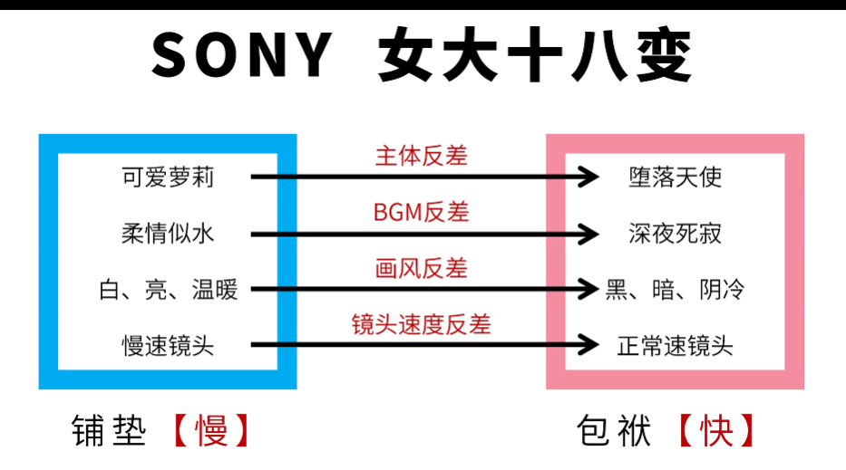
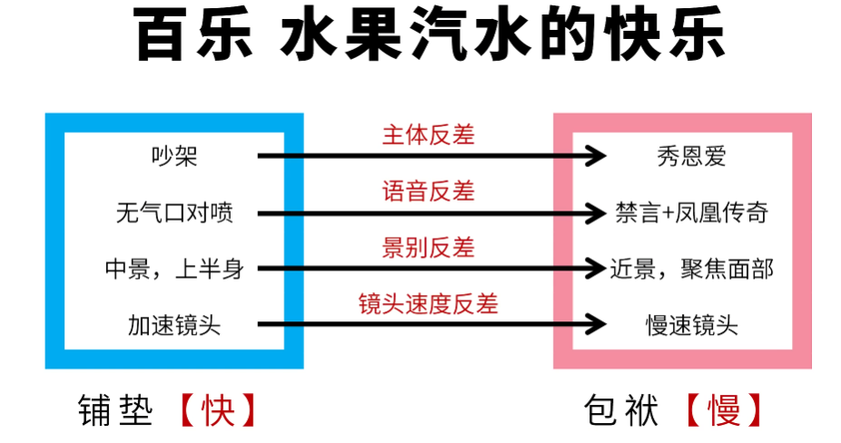
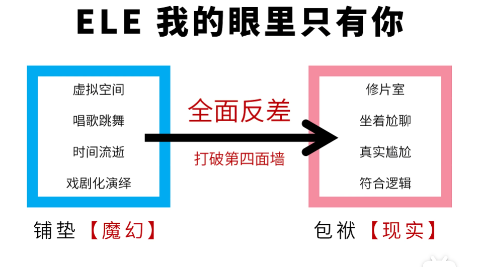

+ 商业广告最重要的就是卖货!
+ 插入广告想要给观众的传递的产品核心
+ 最好的方式就是渐进式的自问自答
+ 搞笑=铺垫+包袱
## 举例
### 泰国广告小女孩sony
+ sony广告商思想:记录美好回忆
+ 问 什么情况下,回忆最美好
+ 答 再也回不去的回忆,最美好
+ 问 那些情况下,回忆再也回不去
+ 答 不随人愿,例如生老病死
+ 问 生老病死太过沉重,能不能既不遂人愿,又轻松好笑?
+ 答 受众中年男子的痛点,女儿的不好成长

### 水果汽水的快乐
+ 问 水果汽水的快乐是什么
+ 答 就是甜
+ 问 除了味觉上的甜,还有那些甜?
+ 答 情感上的甜,是个不错的切入点
+ 问 那种情感上的甜最让人意向不到
+ 答 人们常说三年骚,老夫老妻之间的甜最意向不到
+ 问 那种老夫老妻之间的秀恩爱最让人意向不到
+ 答 小吃店里忙碌夫妇互相关心
+ 包袱: 秀恩爱(是一个很慢的节奏),为了加大反差(吵架)

### 抗老护肤品广告
+ 问:如何表现这款护肤品可以抗老
+ 答:同龄人之间对比
+ 问: 如果就她不老,极端化演绎会有什么结果?
+ 问: 当年最帅的男神,多年以后爱上他.
+ 问: 怎么把这个故事讲的好笑
+ 答: 嘴上忠贞不渝,眼睛却一直偷瞄
+ 问: 如何让他产生反差
+ 答: 在跳舞的时候一直偷瞄
+ 问: 但是跳舞一般都特别的魔幻,不真实,这样会不会表现的和现实差距太大,
+ 答: 反差越大越好,我们就可以利用打破墙的原则.
+ 铺垫越魔幻,越不真实,就可以用打破第四面墙来抖包袱.
