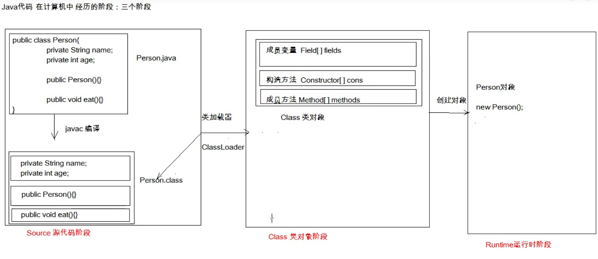
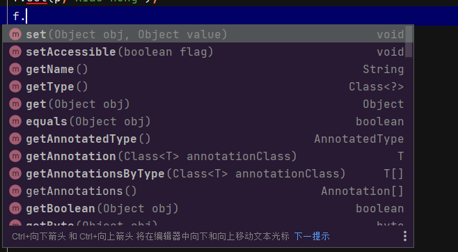
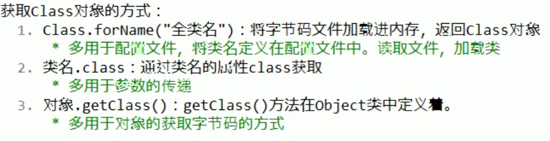

## reflect all process

#### Class 类对象阶段就是 pereson.class文件加载进入内存阶段


<span style="background:yellow">反射的目的就是为了把一个类的不同字段找到，变量，构造函数，一般成员函数，调用出这三种分组的信息</span>



1. 生成的Person.class文件我们为他在Class类对象阶段生成一个Class(C是大写说明他是一个类型)的实例,代表着Person.class文件中的一个class的类
2. 我们无法否认的是在Class 类的对象阶段。java 把Person.class中的不同字段,也就是 变量,构造函数,一般函数,分成三个部分.分别用三个数组来存储.方便在Runtime的运行阶段创造对象.
3. 我们使用反射是因为我们想在代码运行阶段,获得类的内部相关信息.
<br><br><br><br>
---
### 例子
IDE 工具在不断运行,然后我们通过,一个变量就获得函数相关提示,这个不就是在运行阶段获得类的相关信息



<br><br><br>

---
### Class实例获取的三种形式,对应着反射的流程图的不同阶段

### 下面的这些目的都是从不同阶段得到一个类 实例化出来的唯一一个Class类型实例

1. 把.class文件的字节码加载到内存中 获取Class对象实例.
   ```java
   Class person = Class.forName("reflect.Person");
        System.out.println(person);
   ```


2.  从类对象阶段获取
   ```java
   Class cls2 = Person.class;
        System.out.println(cls2);
   ```


3. 从runtime阶段的
```java
 Person p = new Person();
        Class cls3 = p.getClass();
        System.out.println(cls3);
```

---
### 调用方法
<a href="https://www.liaoxuefeng.com/wiki/1252599548343744/1264803678201760">reflect specific method</a>


## 应用场景
思路 ：加载配置文件信息，我们通过第一种获取Class实例的方法，把他添加到内存中。再获取类的函数实现调用
```java
Properties pro=new Properties();
        ClassLoader classLoader=test1.class.getClassLoader();
        InputStream is=classLoader.getResourceAsStream("pro.properties");

        pro.load(is);
        String classname=pro.getProperty("className");
        String methodName=pro.getProperty("methodName");
        Class cls=Class.forName(classname);
        Object obj=cls.newInstance();
        Method method=cls.getMethod(methodName);
        method.invoke(obj);
```


