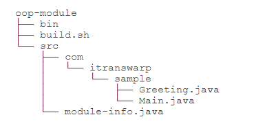

<a href="#diyi"> 目录</a> 


---


## 包

<P>在Java虚拟机执行的时候，JVM只看完整类名，因此，只要包名不同，类就不同。

---

## jar包
对于jar包我们不推荐将他的路径设置在环境变量中的classpath  
jar包实际上就是一个zip格式的压缩文件，把后缀从.zip改为.jar，一个jar包就创建成功。

<br>


---
## 模块
原有的Java标准库已经由一个单一巨大的rt.jar分拆成了几十个模块  
我们把原来的class 打包成多个.jmod文件，
，按包名的目录结构存放，仅仅在src目录下多了一个module-info.java这个文件，这就是模块的描述文件。在这个模块中，它长这样：

```java
module hello.world {
	requires java.base; // 可不写，任何模块都会自动引入java.base
	requires java.xml;
}
```