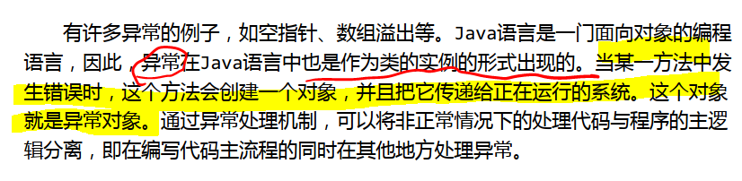
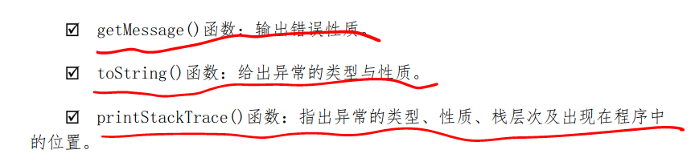

### 错误xi
1. 异常原理
 


---

### 异常的自定义
```java
public class test1 {
public static class MyException extends Exception{  //第一步我们创造我们自己自定义的错误处理
    String message;
    public MyException(String ErrorMessagr){
        message =ErrorMessagr;
    }

    public  String getMessage(){
        return message;
    }
}
static int quotient(int x,int y)throws MyException{//这个throws会把异常往上一级抛出
        // ,所以我们下面写的try catch 刚好捕捉.
        if (y<0) {
            throw new MyException("除数不能够是负数;");
        }
        return x/y;
    }
public static void main(String []args) throws Exception {
try {
    int result=quotient(3,-1);

}
catch (MyException e){
    System.out.println(e.getMessage());
}
}
}
```