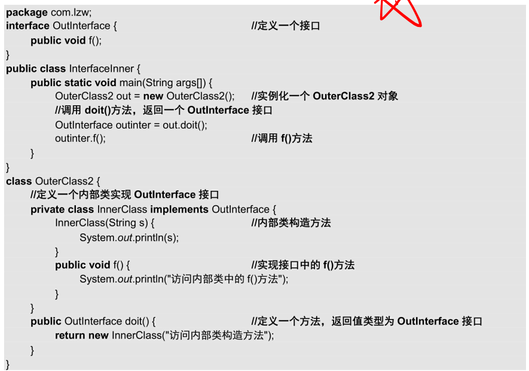

## instanceof
1. 除了判断一个引用是否是一个类时,他还可以判断类之间是否有一个继承关系
 
 
 
---

## 内部类(具体看书)
1. 难点 如何初始化内部类
2. 内部类可以访问外部类,外部类无法访问内部类.局部性.

   
   1. 我们可以看出两种方式 ,直接使用方法 实例化内部类,返回一个内部类 dolt方法返回一个new innerClass
   2. 实例化 内部类变量out.new

### 内部类精髓.对子类隐藏细节.
