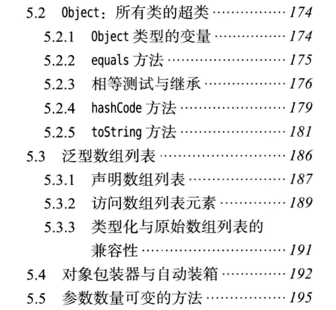
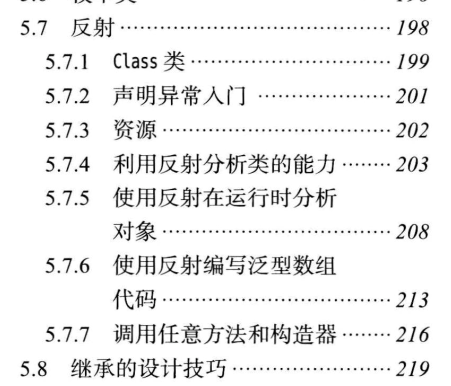
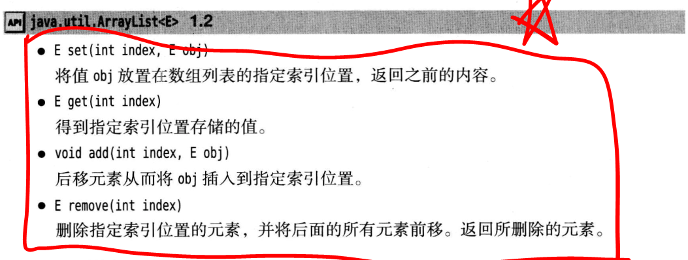
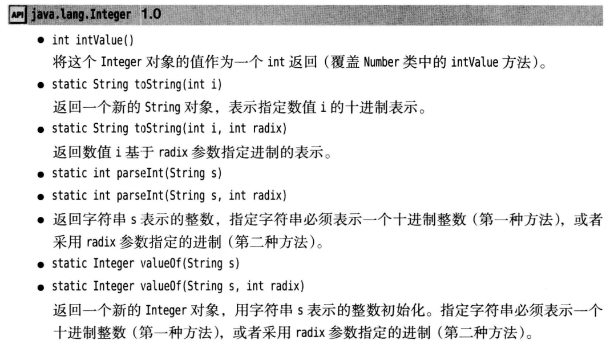

### 5.2.4 hashcode 通过对象计算散列码，如果两个对象相等，他们的散列码也相等。

<br>
<br>
<br>
<br>
<br>
n


---

### 5.2.5 tostring 方法
   1. 当我们调用System.out.println(x); x是一个对象，编译器会自动在括号中转换成x.tostring
   2. 我们书写的每个类 都应该提供一个toString 的方法，不提供如果我们调用上面的System输出，会出现乱码，所以为了大家都方便开发，大家都应该去编写一个，

<br>
<br>
<br>

---
## 泛型数组列表
  1. Arraylist 不是我们java本身所提供的，所以他不能使用【】下标符来访问数据，通过 get，具体看书。
  2. 


<br>
<br>
<br>

---
### 自动包箱和拆箱
<span style="color:red">我觉的装箱的意义在于把java int这种内置类型全部变成Interger类型,让java类型也可以继承自Object类型,不然int 如何解决呢? </span>   

<br>
<br>


### Interger意义
大叔认识，这样设计有助于我们区分这个字段是否被设置过，或者说是否被set过，而对于Integer来说，如果没有被set过，它一定是null(当然你把它强制改为null除外)，而对于int来说，你无法区别0和默认值，因为它默认就是0，我觉得这是最重要的一点。QueryWrapper是一个mybatis里的查询构造器，你可以为实体属性赋值，然后以它为一个依据，去查询与它匹配的结果集，当你没有为属性赋值时，它是null，(而对于int来说，它是0，0往往是有意义的，在QueryWrapper里，你无法忽略int的属性，这是十分尴尬的)。
    
    
    1. 这个过程是编译器，自动完成的，相当于对于int 和double 一种封装成Integer类型，同时 Integer类型包括其他的包箱类型,他是不可更改的.
    2. 在计算一个int 和Inerger时,编译器会自动把Interger拆箱在计算.
    3. 参数传递在java中都是以值进行传递的.
    4. Arraylist<int>是错误的,Arraylist的形参值接受向Interger引用类型,不接受java原生类型,Arraylist<Interger>效率低,不如int []性能高.这是,这种包箱可以通过自己拆箱返回java内置类型.
   

   

<br>
<br>
<br>
<br>
  

  ---
  ### 可变参数
  ```java
  System.out.print("%d,%d",10,11)
  这种写法 编译器会把它变成
  System.out.print("%d,%d",(Object []){new Integer(n), new Integer(n)})

  ```
  1. 所以可变参数,c++ 语法同一个操作 double ...values 这里转换成 Object []数组,所以的引用都继承自Object,java 内置类型自动装箱,


<br>
<br>
<br>
<br>

---
### 反射
看小节

1. 通过Class 对象获取构造器,然后在对这个 类进行实例化
  
```java
   Class cl=Class.forName(className);
   Object obj=cl.getConstructor().newINstance();

```