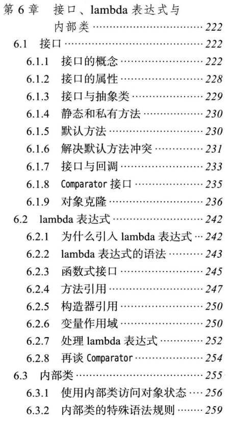
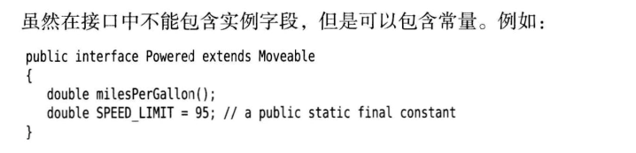
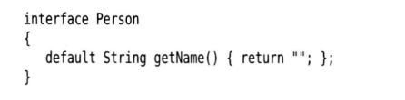
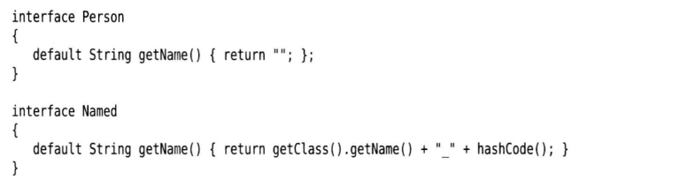

<br>
<br>
<br>
<br>
<br>
<br>

---

## 接口的概念
1. 接口依旧是一个类,我们不能实例化,但是我们依旧可以利用别人继承他,而且使用多态,理论可以,但是不知道报错与否

2. <span style="color: red">接口继承接口 扩展接口, 一个类只能有一个超类,但是可以继承多个接口</span>
3. 子类也只能继承一个抽象类


---

## 列子
比如我们想调用Arrays的sort,他提供了一个Comparable接口,我们就要去实现它,才能够使用sort,
```java
class Employee implements Comparable<Employee>{
    
    Comparable 两个版本,第一个老式版本,在compareTo(Object other),所以我们每次都要把我们自定义的类转换成Object类型  ,可以用,但是被淘汰了
    
    Comparable<T> 一个模板类,特例化接口,然后实现接口
public int compareTo(Employee other)
{
    return Double.compare(slary,other.slary);
}

}


```

<br>
<br>
<br>
<br>
<br>
<br>

---

## 接口的默认方法
1. default 代表我们提供一个接口的默认方法,如果继承接口的类,没有实现这个接口,就可以调用这个默认方法,不会报错,如果原来的接口添加了一个新的接口,原来的类没有实现这个新接口,编译不会报错,但是没有调用时,就会报错,默认方法可以解决历史遗留问题.


<br>

2. 一个类 ,继承的两个接口,他们中的方法都实现了默认方法,你的这个类就必须实现这个方法,不然报错,
 

3. 类中的超类和接口,在方法上冲突,<span style="color: red">类优先</span>,因为 类继承(不包括接口),毕竟是is -a关系,肯定是父类优先  

<br>
<br>
<br>
<br>

---

# 对象克隆

## Java的深拷贝和浅拷贝
1. 浅拷贝：创建一个新对象，然后将当前对象的非静态字段复制到该新对象，如果字段是值类型的，那么对该字段执行复制；如果该字段是引用类型的话，则复制引用但不复制引用的对象。因此，原始对象及其副本引用同一个对象。
2. 深拷贝：创建一个新对象，然后将当前对象的非静态字段复制到该新对象，无论该字段是值类型的还是引用类型，都复制独立的一份。当你修改其中一个对象的任何内容时，都不会影响另一个对象的内容。
3. 总结 他们两者在引用上 拷贝上有区别,浅拷贝只是单纯复制,然后拷贝后的引用还是指向   原对象,深拷贝就直接指向一个新的对象.
   

   ---

## 如何实现深拷贝
4. 首先我们需要知道Object类中一个clone()的方法，并且是protected关键字修饰的本地方法(使用native关键字修饰)，我们完成克隆需要重写该方法。Object 提供的clone是浅拷贝,如果你有深拷贝的需求,
注意：按照惯例重写的时候一个要将protected修饰符修改为public，这是JDK所推荐的做法，但是我测试了一下，
复写的时候不修改为public也是能够完成拷贝的。但是还是推荐写成public。


2. 我们重写的clone方法一个要实现Cloneable接口。虽然这个接口并没有什么方法，但是必须实现该标志接口。
如果不实现将会在运行期间抛出：CloneNotSupportedException异常

3. Object中本地clone()方法，默认是浅拷贝
