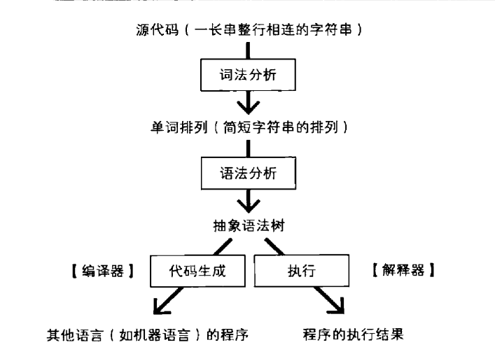

## 编译器和解释器区分
+ 解释器是一个执行程序的软件，我们用类似虚拟机语言去写一程序，例如java的jvm虚拟机
+ 编译器 is 把高级语言转化成机器语言，语言转换器，他通常有一步编译的行为
+ 现代中 解释器中往往使用很多编译器来实现，导致二者定义十分模糊。
  
## 前段的一个编译流程
1. 词法分析把源代码细分成多个词法单元
2. 词法单元构成抽象语法树
3. 语法数转换成其他语言，（这里一般称之为中间语言）
<<<<<<< HEAD

=======
 
>>>>>>> 4a4c916 (diyici)
