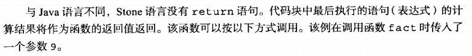
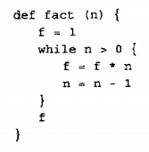
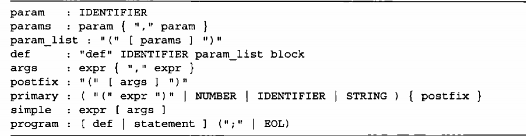
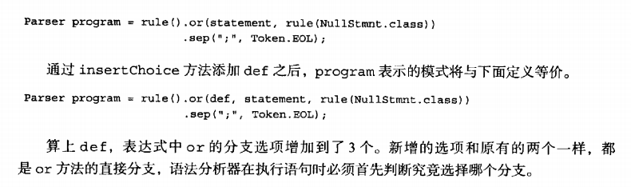
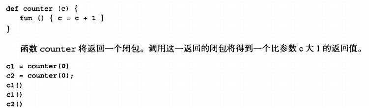

# 为何这一章写的如此详细,因为后面的多态也是按照这种思路进行Stone模块添加的
## stone函数基本语法规则
+ 函数以def 开头,没有返回值的类型声明 写在最前面的int;
<br>

+ 

+ 

## 基于BNF语法stone基础语法,我们添加函数功能
+ 这里讲解了函数的语法定义
+ 我们还不能执行函数,要执行函数就是书写他的eval方法
+ param :IDENTIFIER 这个代表的是标识符和字符串变量是同一层面
+ 第四行 IDENTIFIER 表示符 这里替换函数名(不知原因)
+ 第五行 args 代表实参,expr 是前面的代表表达式,1+2
+ 第六行和第七行都是stone支持函数调用 simple expr(包含终结符) fact  [args] 代表实参,所以 stone 识别fact(9)函数调用


## 谈论函数我们就不得不讨论他的函数中变量作用域和生存周期
+ 生存周期我们不要考虑
+ 作用域        (NestedEnv.java)
  ```java
  protected HashMap<String, Object> values;         //代表内部作用域的变量

    protected Environment outer;                      //外部作用域的变量
  ```
+ 如何找一个变量是在外部还是内部作用域
  ```java
  ublic Environment where(String name)                    //核心所在吧
    {
        if (values.get(name) != null)
            return this;
        else if (outer == null)
            return null;
        else
            return ((EnvEx) outer).where((name));   //这里大概就是如何在一层层的作用域中寻找变量,还是一个递归的方法.
  ```


## 整体代码实现思路 (FuncParser 继承在BasicParser  BasicParser 是添加最基本stone BNF的文件 所以解析器Parser文件都是用于添加BNF语法的文件)
### 第一步    添加BNF语法
+ FuncParser.java 用于将函数BNF语法添加到BasicParser中
#### 如何向将我们的stone函数BNF 这个增加的语法添加到原有的BNF语法中
+ insertChoice  
+ 

```java

    Parser args = rule(Arguments.class).ast(expr).repeat(rule().sep(",").ast(expr));
    Parser posfix = rule().sep("(").maybe(args).sep(")");

    public FuncParser() {
        reserved.add(")");
        primary.repeat(posfix);
        simple.option(args);
        program.insertChoice(def);   //构造函数simple是一个Parser对象 我们调用Parser库的option添加
    }
}

```
### 第二步    创建需要的树节点
+ ParameterList.java 形参表的树节点
+ DefStmnt.java 整个函数的大节点,继承自ASTList 节点, 函数名name  形参 parameters   函数内部 body
  ```java
  public String name() {
        return ((ASTLeaf) child(0)).token().getText();
    }

    public ParameterList parameters() {
        return (ParameterList) child(1);

    }

    public BlockStmnt body() {
        return (BlockStmnt) child(2);
    }

  
  ```
+ Arguments.java 实参节点

### 第三步 改写环境,stone语言只设计了外部环境全局变量和内部环境局部变量,原来的Enviroment只有一层,我们要设计出嵌套环境
+ NestedEnv.java   nested嵌套 Env对应Envrioment
+ 变量 values  &emsp;  protected HashMap<String,Object> values;  我们的环境就是一个HashMap 例如: int Tianshu; 是RiLi这个类中的变量,HashMap第一个参数 就是Tianshu他的name存储,我们把Tianshu这个变量名添加到RiLi这个环境中,就是令HashMap第二参数对应RiLi 刚好他是一个Object,包容万物 设计巧妙. 
+ So values就是我们寻找已久变量实体
+ 第二变量 Environment outer 代表 外层环境,如果TianShu 他是全局变量,那么在RiLi中使用他的时候,他对应的环境只要是ALL(随便取的一个)就可以把环境区分开来.

### 第四步 函数分为定义和调用两部分(这一步终于到了执行函数的阶段 )

#### 1. 定义 


---
<br>

##### 1.原理:前面第二步我们创建了函数各个部分的子节点,我们利用Function.java来整合成一个代表函数的类
+ 程序在遇到 def语句定义函数时, 
  将创建用于表示该函数的对象, 向环境添加该函数的名称并与该对象关联,   也就是说, 程序会向环境添加一个变量. 它以该对象为变量值, 以函数名为变量名,以函数对象为变量值

+ 下面讲解了函数体内部变量如何被调用 
+ 同理 <br>      在调用函数时, 程序将先从环境中获取表示函数的 Function对象之后, 程序将为参数及局部变量创建新的环境, 计算参数的值并添加到新的环境中。 新创建的环境的外层环境由outer 宇段表示， 它记录了全局变量,最后, 语法分析器将通过 Function 对象构造函数本身的抽象语法树, 并在刚才创建的环境中执行eval 方法
  
##### 2.实现:FuncEvaluator.java 中 
+ 还是按照上面的解释,我们需要计算形参 和创建函数对象,和把形参添加到环境中
+ 通过value我们创建一个Function func对象,然后在后面的遍历中添加各个形参到callerEnv , 同时调用AsTreeEx计算
+ 最后一行body() 我们可以看到函数体添加到了一个新环境 newEnv 层层嵌套
```java

public static class ArgumentsEx extends Arguments {
    
        public Object eval(Environment callerEnv, Object value) {
         ......
            Function func = (Function) value;
         .......
            for (ASTree a : this)
                ((ParamsEx) params).eval(newEnv, num++,
                        ((ASTreeEx) a).eval(callerEnv));
            
            return ((BlockEx) func.body()).eval(newEnv);
        }
    }
```
<br>
<br>
<br>
<br>

---
#### 2.调用  例如 fact(9) FuncEvaluator.java
+ 位于 PrimaryEx(实参改写) 也就是函数调用
+ nest只是用于循环 ,不用在意
+ 大体思路 :分为有实参 和无实参
+ 有实参 和无实参都要先经历  return ((ASTreeEx) operand()).eval(env);对函数名添加到环境
+ 无实参直接返回,有实参通过return ((PostfixEx) postfix(nest)).eval(env, target);然后返回
+ postfix就是继承自ASTList 所以相当调用类似形参一个个计算的eval
```java
public Object evalSubExpr(Environment env, int nest) {
            if (hasPostfix(nest)) {
                Object target = evalSubExpr(env, nest + 1);
                return ((PostfixEx) postfix(nest)).eval(env, target);
            } else
                return ((ASTreeEx) operand()).eval(env);
        }
```


## 最后我们实现一下闭包这个概论

+ 图中第一行就是定义闭包
+ 1  自由变量(全局变量)和局部变量,如果一个函数中的变量,不是来自形参或者函数中的自定义 (注意这个时候我们还没有定义类我们是在讨论在函数中定义闭包)
+ 2 那么这个变量只可能是自由变量,图中 fun(){}闭包,他的变量c对于自己而言是不是一个自由变量,但是c是counter函数的形参,是一个局部变量,但是我们可以在闭包中把c当成全局变量来使用,这个是不是相当于我们不用再对于全局变量了,这就是闭包神奇之处
+ 解释第二段代码
+ stone语言没有return语句,所以counter函数返回的就是一个闭包fun,执行两次c1,两个c1都是指向同一个闭包,所以c这个假的全局变量会变成2,c2执行时,应为是不同闭包,所以变量c也在创建时,指向了不同的假的全局变量,这得出闭包在赋值时,他从外界得到的变量也会创建出独一无二的版本.
  
## 实现思路 
1. ClousureParser.java 添加StoneDNF语句
2. 创建闭包节点 Fun.java
3. ClosureEvaluator.java因为闭包跟函数十分类似,所以闭包内部运行我们可以委托给前面定义的函数eval方法
4. stone语言的闭包特性是直接利用java语言自带的闭包来实现的 在ClosureEvaluator.java有详细声明