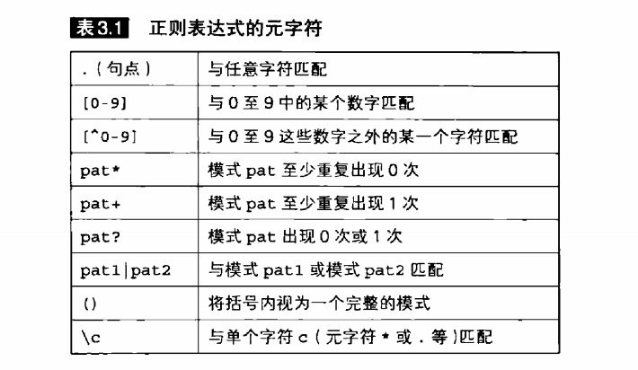
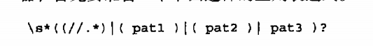
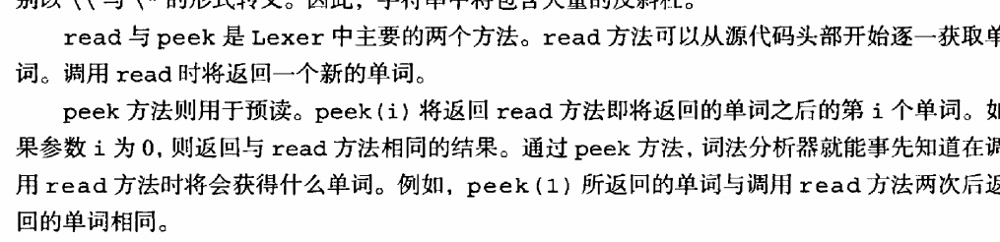
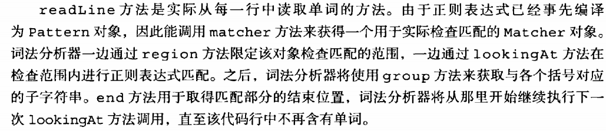

# 本部分 词法分析生成Token单元
## 每个单词都是Token 的子类 (Stone 语言)

1. 标识符  (变量名 函数名 类名 运算符)
2. 整形字面量
3. 字符串字面量

+ 如果是字符串字面量 isString 返回为真
+ Token.EOF 表示程序结束 Token.EOL 表示换行符 他们都是String对象
+ 双引号 "java" 这个中间也包括转义字符的元字符


## 正则表达式 


## 符号处理
```java
"(\\"|\\\\|\\n|[^"])*"   // 字符串字面量的匹配

```

## 如何匹配区分上面的三种类型
+ pat1 对应整形字面量
+ pat2 对应字符串字面量
+ 如果pat1的左括号被匹配到了以后,而其他的模块是null 说明这个就是整形字面量,如果是第二个左括号被匹配,就是注释,根据这个左括号的位置来区分不同类型


## Lexer类就是一个词法分析器
+ Lexer 两个主要函数 read和peak

+ 所以单词读完返回Token.EOF
## 构建词法分析器(核心函数)
+ readline 调用 lookingAt 正则表达式匹配
