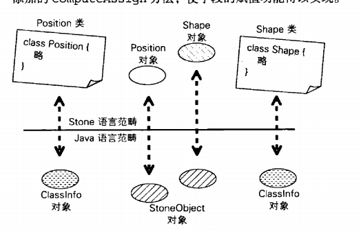
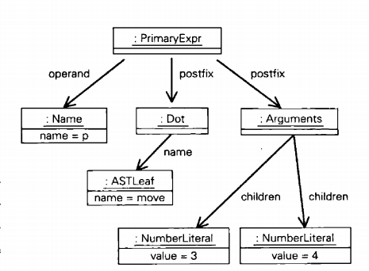

## 跟第七天编写函数的操作流程类似
+ stone的类的创建通过.new的方式 class position{.....} p=position.new 创建
+ 不支持重载

## 大体流程
### 第一步 添加类的BNF 语法到 基础解析器中 ,ClassParser.java

### 第二步 创建需要的类每个部分对应的各个节点
+ ClassBody.java
+ ClassStmnt.java 他包含 name() body() 重要部分 ,同时 他有一个superCLass()也就意味着 stone语言支持继承
+ Dot.java 这个节点非常重要,他关联
1. 类对象的创建    position.new
2. 类中的方法调用  position.getWeiDu()
3. 类中的对象调用   position.WeiDu

### 第三步 无需再次改写环境 创建Class的对象 Classinfo和StoneObject对象,同时制定这两个他们的eval方法(也就是调用代码)
#### 一
+ 观察变量和类对象在java和Stone语言的对应关系
+ 定义类的时候我们无法绕过类中的方法和对象
+ 

---
 
#### 二 添加对象到环境(定义)
+ Classinfo.java 这个和函数那一节相似,观察上面图片在我们定义一个类的时候,他首先创建一个类变量添加到环境中 当然实现细节在ClassEvaluator.java(后缀评估者意思,这个一般都是最后代码定义eval和添加对象到环境中的地方)


#### 三 运行position.new position.WeiDu这样Stone语法
+ 图片中我们都绕不开Dot这个节点,而且Dot也是Class出现后才出现的标点符号,所以我们把运行上面两种形式代码定义在Classinfo.java 中的DotEx 类中 ,观看 做了详细批注
+ 

## 类变量调用问题
+ 我们在类的函数中调用类中定义变量,肯定在函数中需要默默使用this.变量,过于复杂了Stone.
### 利用闭包的思路消灭 this.
```java
Stone 语言
class RiLi{
int month
fun(int day){
    month+day
}
}
```
+ 在上面的变量调用中我们在java语境 month翻译成this.month,但是我们Stone语言要消灭这个this.简化Stone
+ 首先RiLi被创建 这个是第一层环境(也就是包含全局变量的环境)   然后是month变量和函数或闭包fun添加到StoneObject对象中,是不是感觉十分神气,StoneObject对象他是存储名字和变量,所以他就是代表一个环境,最后fun内部是第三层环境

+ java自己支持闭包环境,我们只要在fun这个第三层 将month 和第二层的month绑定就行了,所以我们在第三层遇到没有定义过的变量,java语境肯定知道month定义在第二层,那么我此时调用eval方法,month会将其名字和值添加到第三层环境,是不是就是实现了绑定,免除了this.,充分利用闭包思维,同时这个第三层,这样操作以后,实际上不同对象对应的闭包,形成了不同的变量.
+ 真正全局变量也得到了解决,第二层StoneObject环境中,在运行到全局变量时,发现之前没有遇到过,也会通eval添加到第二层中,解决了问题.