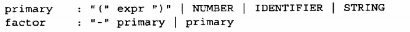
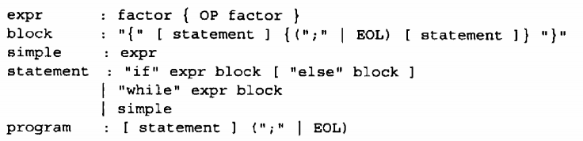
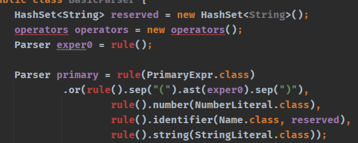
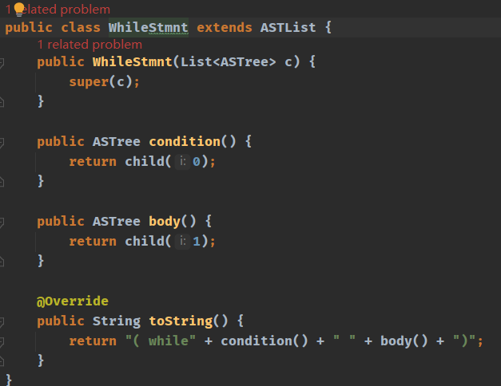

## 根据BNF 定义Stone语法规则
+ 这个就涵盖了我们Stone语言的基本语法

+ 利用后面写的Parser 库 对BNF语法实现一个java的装换,本质都一样,我们只需要翻译一下. (BasicParser)
  
  
  ---

+ 我们能够翻译以后 同时期 我们还没有构造出if while 这种独特的树的结构 ,所以我们ASList来完善和构造树的独特节点
+ 创作了 IfStmnt ，WhileStmnt ,BlockStmnt,BinaryExpr,StringLiteral,NegativeExpr,NullStmnt,这些节点.
+ WhileStmnt.java文件

___

+ 这样以后我们能够翻译if while 语句,和加减乘除表达式了.
+ 同时我们完成了语法分析构造了抽象语法树.完美.

___
### Stone 语法的基本分析

+ expr 可以构成我们想要的各种表达式 (1+2) 或者不带括号的,1+2 或者 "1212"+"12323434" 等等,从expr下面开始

+ 这里就开始构造匹配的if while等语法结构,if 后面的括号判断条件写在哪里呢? expr 已经可以表达了带括号的表达式了.

+ 后面添加函数的匹配