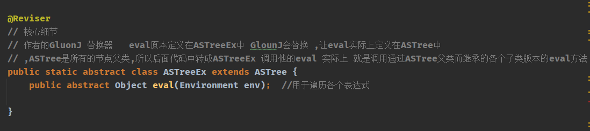
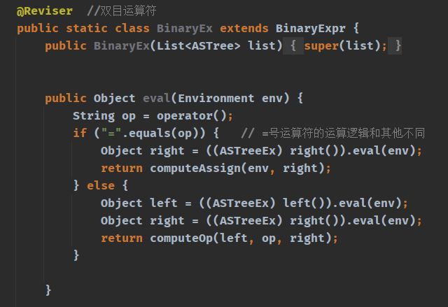
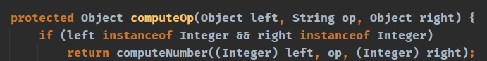
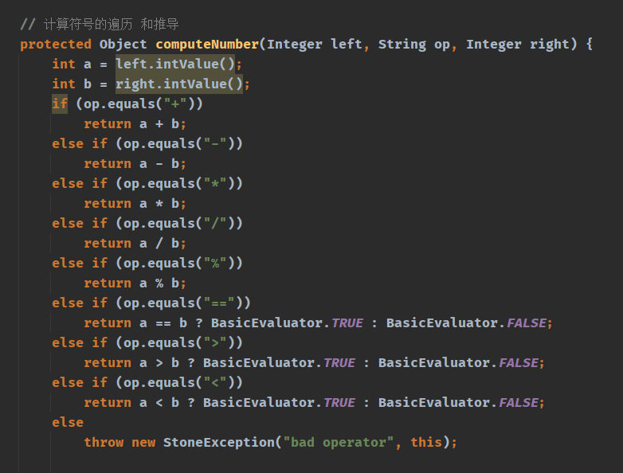

## 核心思想
1. 我们将使用eval 方法.完成不同节点的特例化,比如if 语句while如何进行计算,if 语句存在几个节点我们应该按照什么顺序去遍历
2. GlounJ 替换器的用作方式 @Reviser 代表GlounJ

### 例子分析
+ 双目运算符的eval运作方式 也叫做遍历方式
+ 注意computeOp 方法
+ 在第一张照片中我们把等号运算符领出来,是因为他的计算逻辑特殊

### 总结
+ 这一章我们完成了各个节点的遍历,我们的语法树终于可以完成计算了
+ 意味着Stone语句终于可以运行了
+ 函数功能在下一讲.

