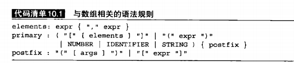

## 大体流程
### 第一步添加 BNF语法
+ ArrayParser.java

### 第二步添加 节点
+ ArrayLiteral.java 数组的字面值 代指[1,2,3,4]
+ ArrayRef.java     数组下标    Month[1]

### 第三步指定 eval方法
+ ArrayEvalutor.java   ArrayLitEx.class 运行数组字面值
+ ArrayRefEx.class                      运行数组下标
+ AssignEx.class                        重写数组处于赋值左边的时候