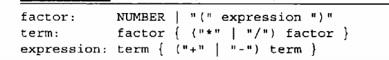

# 这一章思路 
1. 我们先构造出语法树的节点, 
2. 再利用BNF 语法推到出节点之间的关系
## 抽象语法
+ 例子

+构造的抽象语法树会去除冗余信息,例如括号

## 类的关系
+ 注意不同的属性(Name NumberLiteral) 也会绑定节点
+ 

## 语法树代码实现细节
+ ASTree 是一个接口
+ ASTLeaf 代表叶节点 继承自ASTree
+ ASTList 是非叶节点 拥有子节点继承自ASTree

## 构建树
+ 以ASTree为父类,衍生出ASTLeaf 和ASTList ,再从ASTLeaf 衍生出NumberLiteral(整形字符串)和Name(变量)充当树节点, 所以这几个类都是树上的节点,加以细化.
+ 解决了运算表达式的表达问题

---

## 利用BNF书写格式 解析以后来构造语法树
+ 前面我们只是构造了树的节点,ASTList能够表示 1 ,+,2 三个节点关系,但是他们在树中如何摆放,同时我们如何在构造语法树中体现加减乘除的优先级呢?

## BNF语法规则 只要把它倒过来就是我们需要的语法树

### 语法细节

 
 
 
 

+ facator  :分号左边的我们叫它非终结符 
+ 图片显示 factor也从现在:右边,但他依旧是非终结符,我们可以把它理解为,定义的表达式的宏,可以用于替换 
+ 所以 在第二行中 term的右边factor 我们可以用第一行替换,这个是不是就像正则表达式的模式,BNF也是这种思路
+ NUMBER 是一个终结符,他是BNF语法所定义的,
+ 这种写法不利于阅读

---

### 书写形式变形利于阅读
+ 表达式 (13+4)*2 我们利用BNF 语法不断拆分出各个模式
+ 这个图片的形式就是 我们上面图片的一个图示化,但是我们可以采用这种BNF逐步拆分的方式, 来让我们利于阅读想要表达的意义

### 倒过来就是我们需要的构造语法树
+ 这里我们就得到了基于前面的构造节点,利用BNF 表达他们关系

