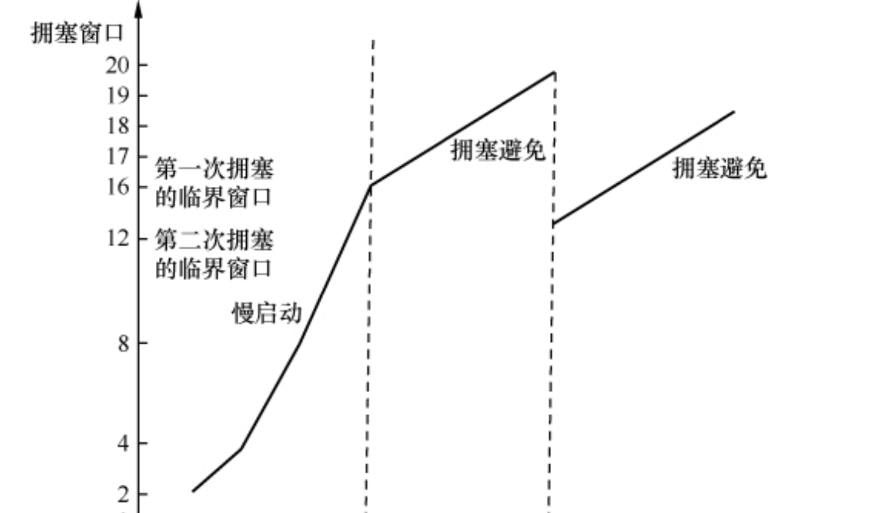

## 不同网段的网关发挥作用
+ 我们都知道IP地址的推算都是通过,子网掩码
+ 网关类似于防火墙,当然同一网段的两台主机通信,不需要让防火墙来传递
+ 不同的网段转发数据就需要通过网关
+ A主机发送ARP数据包,寻求B地址的MAC地址,但是A主机发现B和他不是在同一网段,所以A把数据包交给网关,网关在再其他网段转发ARP数据包,当B接收到数据包的时候,就会直接发送ARP数据包给A
+ 当然同一网段的两台主机通信不用过网关,直接通信

## NFS协议的解析
+ NFS是应用层的协议.
+ NFS服务器提供 /code /document两个共享目录, 然后挂载到各个客服端的本地目录上,当你使用本地目录操作数据时,你实际上是在NFS服务器上来操作文件.

### 操作的流程
+ 客户端首先访问NFS进程的端口.
+ 然后客服端想要操作文件就需要访问服务器mount端口
+ 客户端挂载自己的目录到服务器上的,然后服务器返回一个file handle 数字,客户端你就可以用这个数字来访问服务器了

## MTU和MSS(Maximum Segment Size)
+ 我们都知道TCP决定一次能够传输多大的数据,取决于协商的MTU最小的那个.
+ 而MTU的值是MSS+tcp头部+iP头部,tcp头部=iP头部=20
+ 一般wireshark直接显示的是,MTU值,他自动计算了MSS+tcp头部+iP头部

## TCP建立连接三次握手
+ 一般发送端和接收端,都会维护自己的ACK和seq,因为TCP他是两个可以自动发送数据的,但是往往,接收端,他的seq值不变,因为,他往往返回一个tcp首部,所以seq值不需要变化.
+ 客服端 seq=0 ,服务器端 seq=0 ,ack=1, 客服端 seq =1 ack=1,为什么这里和上面不太一样,仿佛好用seq和ack是公用的,我的理解是自己维护自己的seq和ack,只是对数据更改罢了.

## TCP发送和接受窗口大小
+ 你经常可以在tcp的数据包中看见 win=多少自己 ,这个win: windows size, A 主机中的数据包 win=100字节, 就是在告诉B我的接受窗口的大小是100字节,所以win就是接受窗口,他指定限制发送端B的发送创建大小.这也是合理的,不可能让B把自己的发送窗口大小给A,这个没有什么意义.
+ 我们都知道TCP他是累计确认数据包的,所以1000字节的数据,发送窗口他的大小是10000字节, 而mss大小为100,同时他也变相制定了多少个包发送出去,发送窗口表明一次可以发送多少字节,而MSS指定了10000/100=100个包发送出去.
+ 为了降低数据传输的负担,所以win一般是用count来计算出来,count=5,那么2的五次方就是32,然后window size value乘以这个32来算出win的大小.

## TCP的重传
+ 我们都是知道为了避免网络拥塞,都是用拥塞窗口来实现慢启动来避免
+ 难点在于这个临界窗口值是多少,因为慢启动和拥塞避免的数值增长不一样.

### 慢重传(丢包非常严重的时候)
+ 当发生网络拥塞时,20个数据包,16个没有收到,那么协议RFC 5681认为,这16个的2分之1的就是窗口值的大小,可以不断循环.但是不能小于2个MSS

### 快重传
+ 只有少量包发生丢失重传,这个时候我们只要重传这个包,同时无需再利用慢启动,然后将拥塞窗口设置为临界窗口值加3个MSS，继续保留在拥塞避免阶段。这个过程称为快 速恢复，其拥塞窗口的变化大概可以用图8表示

### SACK和NewReno有利于提高重传的效率
+ 有时候我们丢数据他是一连串丢失,比如数据包2,3,4同时丢失,而5到8收到了,如果是以前2首先没有收到,重传2就行,但是3需不需重传就不知道了,即使知道还是需要等RTT个时间才知道,这样效率低下.
+ 服务器SACK接收到 5-8(这种表示形式) ,所以通过接收到了和没有接收到比较,就知道2-4没有收到,发送给客服端,然后客服端连续依次发送 2,3,4数据包.

### Nagle 延迟确认算法
+ 他只是减轻了网络负担,如果接收端没有数据向发送端发送,那么他完全可以足够一个MSS大小包发送给发送端,这样减轻分段

## UDP
+ UDP可没有编号,他利用分片机制对数据包大小分片,然后在每个包里面有More fragments 的flag 如果为1代表UDP后面还有分片,没有传完,如果为 0代表传完,所以黑客往往用 UDP=1来玩死你,让你内存爆了
  
## OSI七层模型已经被人淘汰,那么复杂谁他妈用,用TCP/IP不爽吗