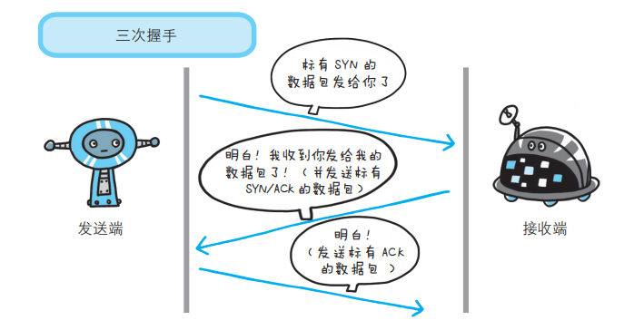
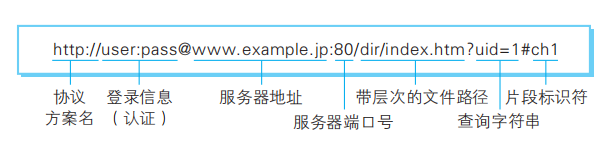

## 各种协议所处的层次
+ 应用层:  FTP DNS HTTP 
+ 传输层:  TCP UDP
+ 网络层:    IP
+ 链路层:  网卡等

## 各种协议的传输过程和内容的封装
+ ARP协议: IP地址和MAC地址的相互解析

## 3次握手
+ SYN和ACK的数据包

## URI和URL
+ URI 指向的是网络的资源的唯一标识字符串
+ URL 网络资源的地址
+ 下面图片中URL是第三部分 服务器的地址
+ 