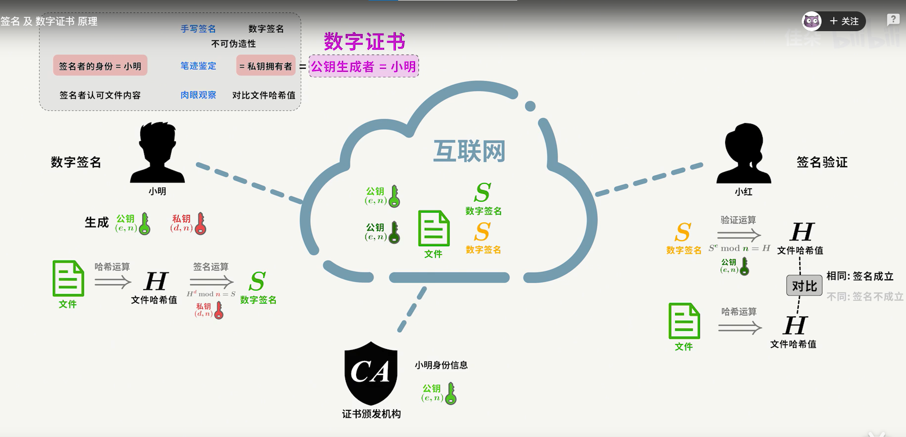

# HTTPS的定义
+ HTTPS=http +加密 +证书认证 +完整性保护

### HTTP自身暴露的缺点和ssl
+ 不加密 明文通信,容易被抓包
+ 无法证明对方的身份
+ 无法检查报文的完整性 

### 如何防止被窃听利用ssl建立连接
+ 在原来的http1.1的基础上首先建立一条ssl的安全通信线路
+ 然后在使用HTTP来通信
+ 内容加密:对报文主体加密,但是你无法避免被篡改的风险
  
### ssl同时需要识别服务器是否为本体
+ ssl融入了证书的功能

___
  

## 加密(核心)
### 共享秘钥加密
+ 客 服 同时使用同一个秘钥解密,但是如何在网络上传输这个秘钥,又使用一个秘钥,无线套娃,显然是非常愚蠢的方式
  
### 非对称加密方式
+ 每个人手上都有公钥和私钥,我把我的公钥给你,然后你用这个公钥来加密,我可以用自己私钥解密,别人无法解密,因为私钥从来没有传递出去
+ 这种方式的问题在于我是黑客,我可以用你的公钥加密假的信息给你,然后我把真实的信息给拦截了.

---
### 我们在网上验证为了保证是真的服务器传来的数据,两个方面来保证
+ 第一你要保证文件没有被篡改
+ 第二 你要保证这个文件是真实服务器传过来的,所以要验证服务器真实身份
+ 
### 数字签名解决文件没有被篡改.
+ 哈希算法只能正向运算,不能逆向推算,比如图片中,文件可以推出哈希值,哈希值却无法推出文件
+ 得出的哈希值我们在用服务器从CA颁布的私钥进行加密(这个就是数字签名了,把自己服务器拥有的独一无二的私钥进行签名)
+ 笔记本用CA的植于系统的根证书,拿到公钥,来对发过来的文件进行解密,(私钥可以用公钥解开,这可能是特殊吧),得到一个由服务器哪里运算的原文件的哈希值
+ 笔记本再次对文件进行计算哈希值,如果两个对上了,那么证明了这个文件就是来源于服务器,而且没有被改过
  
### 黑客可以把自己的公钥和私钥给你啊,让你受骗啊,这个时候CA机构的作用就来了
+ CA机构他能够把申请的服务器给你一个数字证书,也就是给了一对秘钥的私钥,为啥不是公钥呢,你想服务器只有一家,笔记本却有很多,所以公钥我可以给出去,但是私钥我就把他和服务器联系起来了,
+ 那么这个公钥笔记本如何获得,根证书根植于系统中,这个里面就有公钥,CA保证了数字这一对秘钥的正确性.
                                                                                                                                                                                                                                      
## HTTP和HTTPS的优缺点
+ HTTPS计算机加密和解密需要时间
+ 报文的内容也会增加
+ 所有HTTP不用建立SSL通道,也是他的高效性的体现.