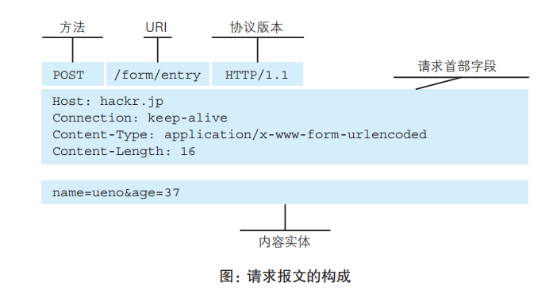
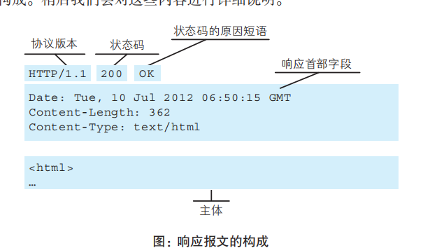
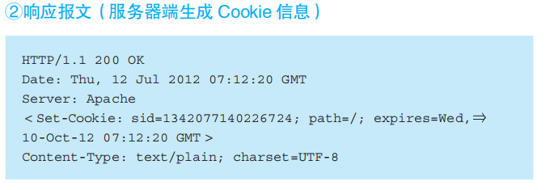
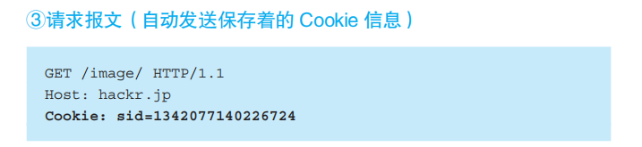
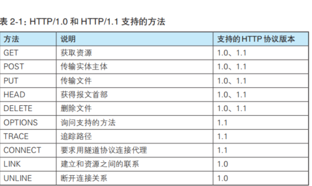
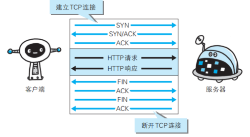

## HTTP 应用层,
+ HTTP 协议下,该协议就可以区分客服端和服务器端

## 请求和发送报文的基本结构
+ 方法 :GET POST 这里有很多种获取还是传送资源可以选择
+ URI : 资源代表的字符串
+ 内容实体: 一般指HTML的资源

---
+ 状态码: 200 OK 分为两部分,后面会有详细介绍
+ 主体: 注意实体中html的开头

## cookie 技术的诞生
+ HTTP他是无状态的协议,决定了传输的高效,同时也产生了问题
+ 用户登录网站的数据,你不保存你每次打开网站,你都要登录信息.

---
+ cookie 请求的三段法:
+ 第一次发送 客户端向服务器请求,包括网站登录
+ 第二次 服务器生成cookie 返回
+ 第三次 客户端持有了cookie 只要夹杂cookie就可以一直向服务器拿取数据了

+ 请求报文中我们用sid 标识了cookie
+ 夹在请求首部字段

## 请求报文中的支持的访问方法

## HTTP协议建立的四段访问法
+ http协议的SYN请求客服端和服务器每个人都要发送一次 ,ACK也都需要答复一次
+ FIN 和ACK 用于终止 

### HTTP所拥有的持久连接
+ 只需要建立一次连接,就可以不断发送数据

