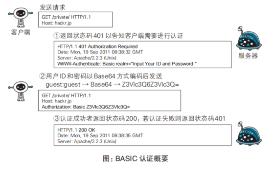
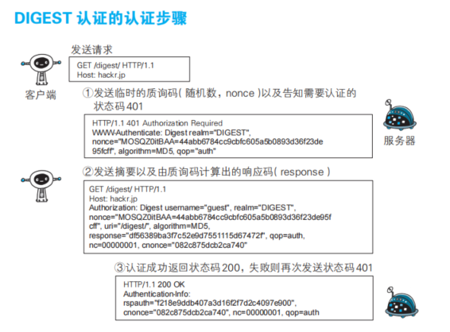

## 服务器确认用户的身份的一些协议
### BASIC认证(低防护要求的网站)

### DIGEST认证(低防护要求的网站)

### SSL客户端认证
+ 主要是客户端通过证书来领取需要的公钥
+ 服务器首先发送Certificate Reques要求客户端提供证书(当然你必须先安装根证书)
+ 客户端选择将要发送客户端证书(对于不同CA机构) 然后以 Client Certificate 报文的方式发送给服务器
+ 服务器通过了客户端验证以后,客户端可以从证书领取公钥.
  
## 各个认证协议的优劣势
+ ssh和FTP拥有高规格防范泄露的标准
+ 但是大部分网站都做不到这一点,通常使用session来管理cookie,填写表单认证,填写账号和密码
+ 客把账号和密码用HTTPS发送给服务器
+ 服务器验证用户的身份,再用 session ID 来和用户进行绑定,会在首部字段 set-cookie中写入session -ID发给客户端
+ 客户端会把session_ID当做cookie来存储,
+ 服务器如何降低风险,即使更新session,同时用户的信息加密和哈希值来存储
