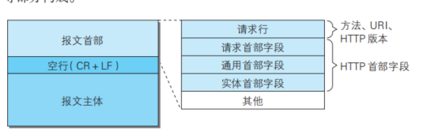

## 请求首部和响应首部他们存在细微区别
+ 在响应报文首部中,第一个是响应行,第二个是响应首部字段
+ 他们在各个部分都有其独特的内容信息,他指定了我的请求包该如何请,和如何答复


## 所以我们抛开重复的首部字段一共有4种字段,简单的介绍一下他们各个的作用
+ 通用:两种都包含,我们主要介绍内容解读
+ 请求 : 客服端信息  响应内容的优先级, 请求的附加内容 表6.2
+ 响应 :响应附加的内容,要求客服端你如果要得到这个资源还需要其他的额外信息  表6.3
+ 实体: 针对HTTP数据包中实际含有的数据的一种解释说明,资源更新时间,实体信息补充.
+ 在这些首部字段中 还有 Cookie和Set-Cookie等信息
  
## HTTP1.1通用首部字段(重点介绍)
### Cache-Control
+ 主要针对缓存服务器,他可以规范一下缓存服务器的缓存数据提供. 表6.5
+ 参数:
+ 是否需要缓存的数据:no-cache ,直接从源服务器直接拿数据过来
+ 指定缓存数据的缓存时间,如果超过怎么处理 例如max-age等
+ 指定缓存数据可以向谁提供 :public(公开) ,private(少部分用户)

### Connection 
+ keep-alive 保持长时间连接
+ close :关闭

### Pragma
+ 老版的Cache -control

### Trailer 
+ 因为首部字段不够用,所以需要借用主体部分,Trailer就是标记了,主体数据部分依然属于Trailer
+ 格式:
```java
首部字段 :Traiiler :EXpiree (标记符号)
---(报文主体)---
Expires :tue 28 Sep 2004
```

### Transfer -Encoding: chunked
+ 传输报文主体的编码格式,只对分块数据传输有效

### UPgrade 
+ 参数指定一个完全不同的通信协议
+ UPgrade:TLS/1.0 HTTP/1.1
  
### via: 1.0 URI
+ 为了追踪客服端和服务器之间的传输路线,各个服务器都会往里面添加自己的信息

### Warning
+ 返回一些与缓存相关的问题

---
## 请求首部字段
### Accept:指定 接受文件的信息格式
+ text/html 格式文件
+ 参数 q; 表示优先级 0-1 1表示最高

### Accept-Encoding
+ 编码格式 3种

### Authorization 
+ 一般用户认证信息

### From
+ 负责人的电子邮件

### if-xxx 相关的语句 
#### -match
+ 只有当match的数字和实体标记ETag相同时,才会接受请求

#### -modified-since:时间
+ 如果在我请求的时间之后更新过资源那么就返回资源

#### -None-Match 
+ 与 Match相反,不加以区分,可获取最新资源
  
#### Range 
+ 他可以指定ETag 时间的范围,一致时返回,如果你不写,那么资源全部返回.

#### -Unmodified-since 与modified-since相反
+ 不更新就返回

#### max-Forwards:2
+ 以十进制指定可以经过服务器的个数,每经过一个就减一,当为0时,服务器必须返回响应文件
+ 可以解决请求陷入循环的问题

#### Range: bytes:5001-10000 
+ 指定服务器接收5001 到10000字节的资源

### Reffer 
+ 只知请求从哪个Web页面发起的

### TE
+ 告诉服务器可以处理的传输编码格式

### User-Agent(重点)
+ 创建请求的浏览器用户的信息,网络爬虫,有可能增加爬虫电子邮件地址


---
## 响应首部字段
### Accept-Rangs :bytes 
+ 告诉客我能否处理指定范围的请求, bytes 代表我能否处理

### Age: 600(秒) 单位
+ 告诉客 原服务器 多久前处理了请求

### ETag
+ 用URI来指定服务器上面的资源是非常困难的,ETag是服务器为每个资源分配的编号,每个资源他的URI不会变,但是ETag会改变(特别是资源发生变化)
+ ETag分为强Etag和弱Etag,资源发生变化时,强ETag变化,弱的不变

### Location
+ URI发生变化时,他会给你提供新URI

### Retry-After
+ 指定一个时间,你客服端应该在我给你的时间进行访问

### Server
+ 告诉客户端,我服务器安装了那些服务,比如安装了Http

### Vray
+ 返回源服务器的资源的编码和语言,如果你代理服务器中缓存的资源语言和客户端需要语言相同,我源服务器认为你代理服务器的资源可以返回,否则你代理服务器就必须向我源服务器请求新的资源

---
## 实体首部字段
### content-Encoding:gzip
+ 客对于实体主体的编码格式

### Content-Location
+ Content-Location :表示的是报文主体返回源的URI  请求HTTP://wwww.hachr.ip 返回的就是 http:www.hack.jp/index -ja.html 返回一个资源的具体地址

### Expires: 资源失效的日期告诉客户端 Last-modified 资源最终被修改的日期


